 # 《期货市场技术分析》全书阅读报告

> 作者：约翰·墨菲

> 目标读者：零基础到初学者，希望在读完全书后，不只知道名词，还知道这些工具为什么存在、怎样使用、哪里最容易犯错。

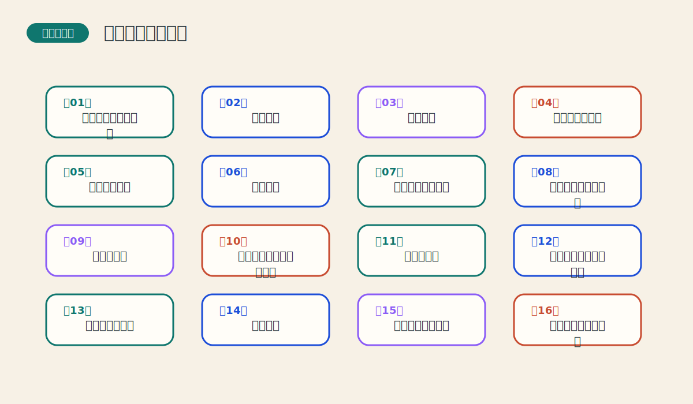

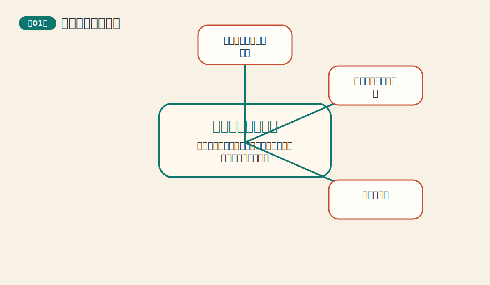

## 阅读方法说明

这份报告不是把原书改写成更短的摘抄，而是把它重组为一套更适合学习的知识结构。原书的核心价值，在于它不断提醒读者：技术分析既不是神秘学，也不是一套只适合短线投机的花招，而是一种围绕市场行为、趋势、结构、验证和风险控制展开的概率语言。

对完全不懂的读者来说，最重要的不是一下子掌握所有图形和指标，而是先建立一条稳定的认知顺序：先确定自己在看哪个时间尺度，再判断大方向，然后识别图形和结构，接着用量能与指标做验证，最后把所有结论放进风险管理框架。这条顺序几乎贯穿了全书所有章节。

作者写作本书时，既在讲工具，也在不断讲一种交易者的姿态：不要急着找神奇信号，不要把单一指标神化，不要把猜顶猜底当成聪明，不要把方向判断和资金管理拆开。正因为如此，这本书虽然写于更早时期，但方法论到今天仍然能成立。

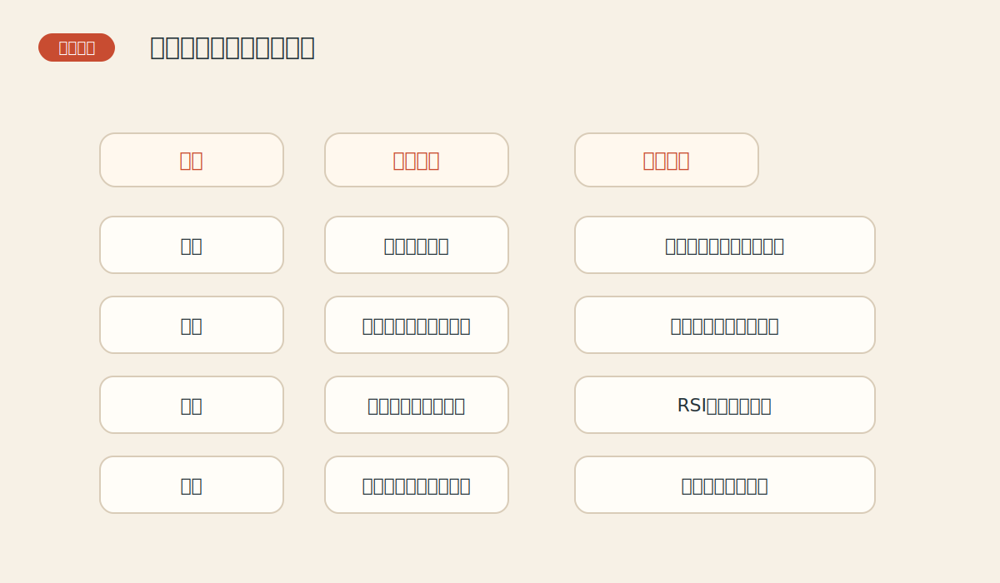

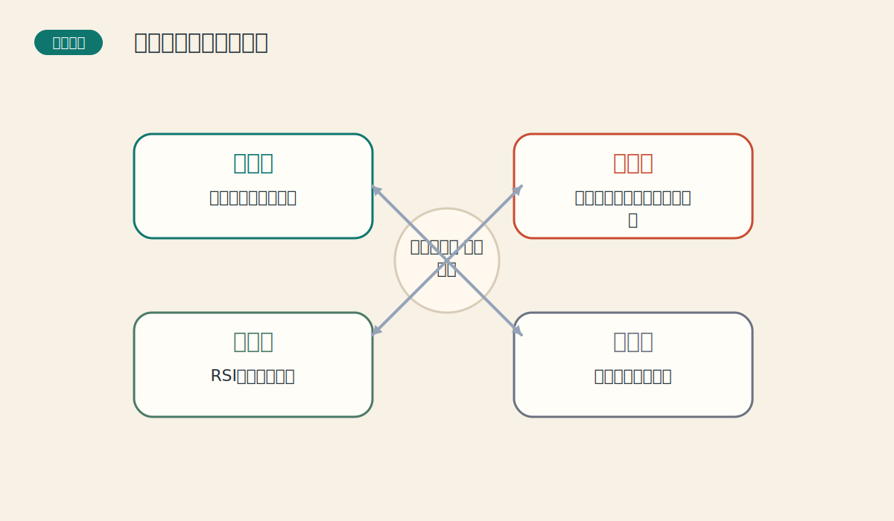

## 一、全书导论

本书把技术分析从零搭到能实际使用，重点不是教读者背图形名称，而是建立一种“先看市场证据、再做概率判断”的思维方式。对于零基础读者，最重要的不是一次记住全部指标，而是抓住作者不断重复的四个核心动作：先判趋势、再看结构、接着用量能与指标做验证，最后用风险管理保护自己。

这一部分不对应某一章，而是回答两个最基础的问题：这本书到底在训练什么能力，以及读者应该怎样安排自己的学习顺序。整本书可以看成一条从“会看图”到“会下计划”再到“会活下来”的学习路径。前半部建立市场语言，中部引入形态与指标，后半部开始转向规则、系统与资金管理。

如果只学前面的趋势和形态，不学后面的系统与资金管理，读者往往会落入一个常见误区：会描述市场，却不会组织交易。反过来，如果只迷恋系统与参数，而没有理解前面的趋势、形态和量价关系，系统又会变成一堆缺乏市场语义的按钮。作者真正希望读者建立的是一整套前后连通的能力。

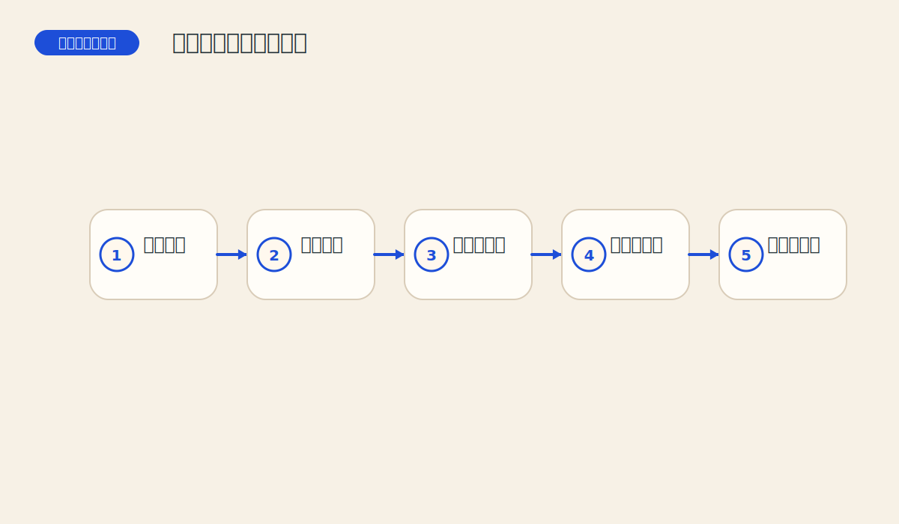

## 二、技术分析三大前提与方法论

这一部分解释技术分析为什么成立，以及趋势分析的祖先规则是什么。它决定整本书的地基是否稳固。

### 第一章 技术分析的理论基础（PDF页 4-19）

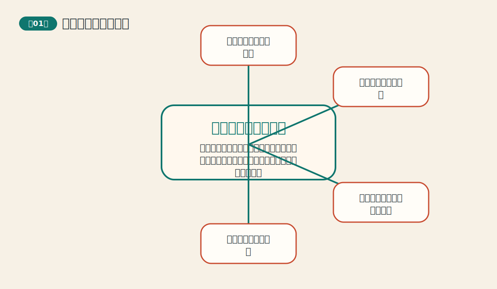

这一章决定读者后面看图、看指标时是机械背诵，还是能抓到一整套方法论的骨架。 从全书结构看，这一章承担的任务是：把 `技术分析的理论基础` 从一个术语，变成一套读图和决策的动作。它真正要教给读者的不是背答案，而是看到图表时先问什么、后问什么。

如果把这一章压缩成一句最好记的话，那就是：技术分析的核心不是神秘公式，而是从价格、交易量和持仓兴趣里读出市场已经留下的痕迹。 这句话看似简单，但背后实际上包含了作者反复强调的结构、确认和纪律三层意思。

本章的主线可以概括为：
- **市场行为包容消化一切**：政治、经济、供求、情绪和预期，最终都会通过买卖行为反映到价格上。 读图时应当记住“先看价格有没有提前转向，再去想消息是否只是把市场早已知道的东西说出来。”，同时警惕“把每次上涨都归结为单一新闻，忽略市场往往会提前行动。”。最后真正沉淀下来的能力，是“先读市场本身，而不是追着解释跑。”。
- **价格以趋势方式演变**：价格大多不是随机飘动，而是会沿某个方向持续一段时间。 读图时应当记住“关注一连串更高的高点和更高的低点，或更低的高点和更低的低点。”，同时警惕“只盯住一天的涨跌，用碎片判断整体方向。”。最后真正沉淀下来的能力，是“交易的首要任务不是预测拐点，而是识别当前方向。”。
- **历史会重演**：因为人性中的贪婪、恐惧、犹豫和从众不断重复，图形和行为也会不断重复。 读图时应当记住“把价格图形看成群体心理留下的痕迹，而不是抽象几何图案。”，同时警惕“以为图形有效是巧合，而不是群体行为反复出现的结果。”。最后真正沉淀下来的能力，是“看图，本质是在看人心。”。
- **技术分析和基本分析不是敌人**：基本分析解释为什么，技术分析告诉你市场已经怎么做、接下来更可能怎么走。 读图时应当记住“当消息和价格冲突时，先尊重价格，再等待信息慢慢跟上。”，同时警惕“以为看图就等于不要基本面。”。最后真正沉淀下来的能力，是“价格往往比解读消息更快。”。
- **技术分析是概率工具**：它不能保证每次都对，但能帮助交易者在不确定中提高胜率、改善时机和管理风险。 读图时应当记住“把技术信号当成证据叠加，而不是神谕。”，同时警惕“把技术分析当作永远正确的预言术。”。最后真正沉淀下来的能力，是“真正成熟的交易者追求的是优势，不是神准。”。

如果把这一章讲给完全不懂市场的人听，最好的入口通常不是图表术语，而是生活类比：像侦探看脚印。你没有亲眼看见事情发生，但地上的痕迹、门把手上的指纹、桌面的灰尘，会告诉你刚刚发生了什么。 当读者先抓住这个生活结构，再去看图上的线、形态或指标，就不容易陷入死背图样的状态。

从实战角度看，这一章最重要的收获不只是“会不会认”，更是“会不会用”。作者不断提醒读者，任何工具都必须回到流程里去使用，而不是脱离背景独自下命令。换句话说，真正成熟的技术分析，不是看到一个信号就兴奋，而是先把它放到时间尺度、趋势环境、验证条件和风险控制里再判断。

### 第二章 道氏理论（PDF页 20-27）

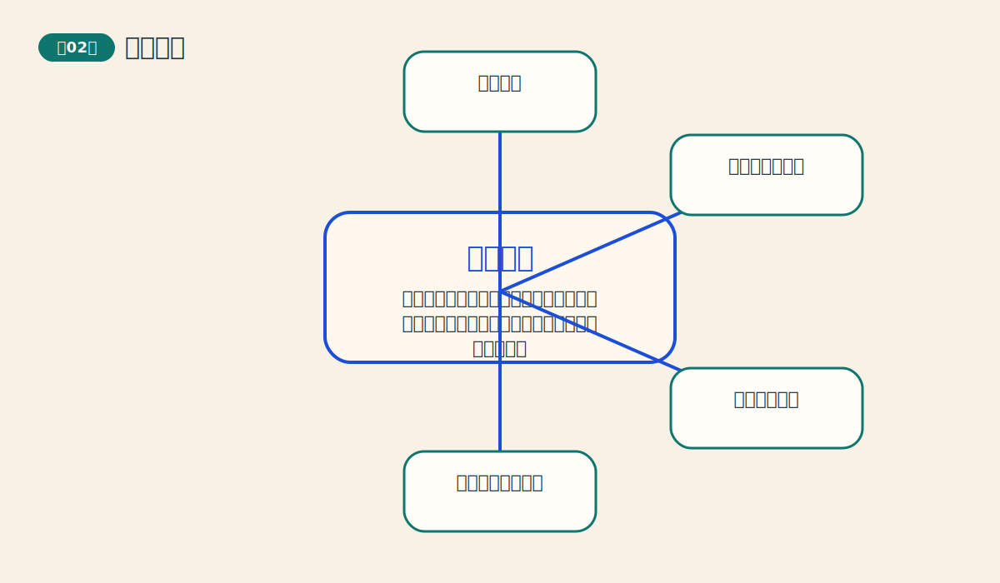

很多后来的趋势理论都站在道氏理论肩膀上。不懂它，后面的趋势分类和确认规则会显得零散。 从全书结构看，这一章承担的任务是：把 `道氏理论` 从一个术语，变成一套读图和决策的动作。它真正要教给读者的不是背答案，而是看到图表时先问什么、后问什么。

如果把这一章压缩成一句最好记的话，那就是：道氏理论像趋势分析的祖先，它教人先分清大浪、中浪和小浪，再决定自己到底在和谁交易。 这句话看似简单，但背后实际上包含了作者反复强调的结构、确认和纪律三层意思。

本章的主线可以概括为：
- **市场有三种趋势**：主要趋势像潮汐，次级趋势像浪，日常小波动像浪花。 读图时应当记住“先看自己交易的时间尺度，再决定应该参考哪一层趋势。”，同时警惕“把小波动误当作主要趋势反转。”。最后真正沉淀下来的能力，是“学会分层看市场，噪音会少很多。”。
- **主要趋势有阶段性**：牛市和熊市都不是一步完成的，通常会经历积累、扩散和狂热等不同阶段。 读图时应当记住“观察价格与市场情绪是否一起升温，判断趋势走到哪个阶段。”，同时警惕“只看方向，不看阶段，导致追在最热的位置。”。最后真正沉淀下来的能力，是“知道同样是上涨，早期和晚期的风险完全不同。”。
- **指数或平均数需要相互验证**：一个市场想法若是真的，相关指数之间通常会彼此呼应，而不是各说各话。 读图时应当记住“把“确认”理解为多路证据同时点头。”，同时警惕“只抓住一个强信号就下结论。”。最后真正沉淀下来的能力，是“确认的作用是降低误判率，不是制造完美答案。”。
- **交易量应当与趋势同向**：健康的上升趋势通常伴随放量上涨、缩量回落；下跌也有相反特征。 读图时应当记住“把交易量当成趋势的呼吸声，看它是否支持价格的动作。”，同时警惕“只看价格新高，不看量能是否跟上。”。最后真正沉淀下来的能力，是“没有量能配合的价格动作更容易虚弱。”。
- **趋势会持续，直到出现明确反转信号**：默认现有趋势继续，比频繁猜顶部和底部更有效。 读图时应当记住“没有足够反转证据前，先把调整看成调整。”，同时警惕“逢涨就猜顶，逢跌就猜底。”。最后真正沉淀下来的能力，是“顺势比抄顶抄底更符合大多数人的能力圈。”。

如果把这一章讲给完全不懂市场的人听，最好的入口通常不是图表术语，而是生活类比：像在海边看海。潮汐是大方向，海浪是中途起伏，浪花是噪音。你不能把每个浪花都当作海平面改变。 当读者先抓住这个生活结构，再去看图上的线、形态或指标，就不容易陷入死背图样的状态。

从实战角度看，这一章最重要的收获不只是“会不会认”，更是“会不会用”。作者不断提醒读者，任何工具都必须回到流程里去使用，而不是脱离背景独自下命令。换句话说，真正成熟的技术分析，不是看到一个信号就兴奋，而是先把它放到时间尺度、趋势环境、验证条件和风险控制里再判断。

## 三、图表与趋势体系

这一部分把“怎么看图、怎么看趋势、怎么看长期背景”讲清楚，是后续一切形态和指标的基础语言。

### 第三章 图表简介（PDF页 28-39）

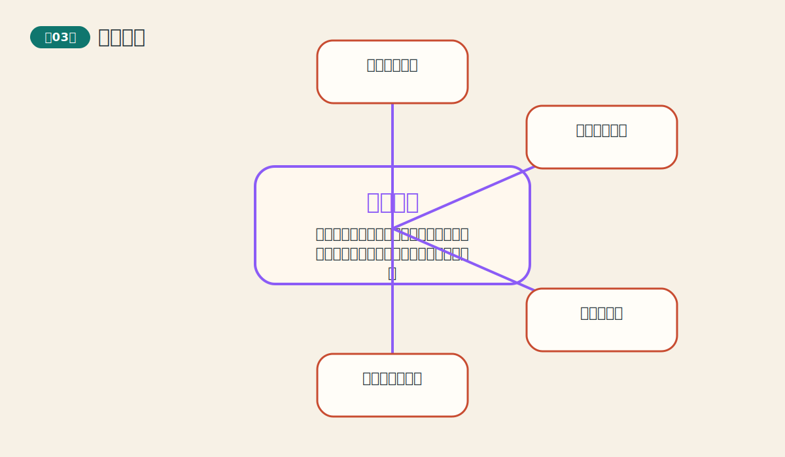

如果连图表的语言都没学会，后面的趋势线、形态和指标就像在陌生语法里背单词。 从全书结构看，这一章承担的任务是：把 `图表简介` 从一个术语，变成一套读图和决策的动作。它真正要教给读者的不是背答案，而是看到图表时先问什么、后问什么。

如果把这一章压缩成一句最好记的话，那就是：图表是把市场历史压缩成一张能被人快速阅读的地图，不同图表适合回答不同问题。 这句话看似简单，但背后实际上包含了作者反复强调的结构、确认和纪律三层意思。

本章的主线可以概括为：
- **图表是时间序列的可视化**：图表把历史价格排成有顺序的故事，让人一眼看到方向、速度和波动。 读图时应当记住“先分清横轴是时间，纵轴是价格，再看图形在讲什么故事。”，同时警惕“只把图表看成漂亮曲线，不知道它在压缩历史。”。最后真正沉淀下来的能力，是“你读的不是图，而是时间中的行为变化。”。
- **不同图表强调的信息不同**：线图看收盘价更简洁，条形图看高低开收更完整，点数图更强调价格结构。 读图时应当记住“先想自己想回答什么问题，再选图。”，同时警惕“用不适合的问题去逼一种图表给答案。”。最后真正沉淀下来的能力，是“工具和问题要匹配。”。
- **算术刻度和对数刻度会改变视觉感受**：同样的价格变化，在不同刻度下看起来会不一样，尤其是长期图。 读图时应当记住“长期比较涨跌幅时，对数刻度更公平。”，同时警惕“在长期图上用算术刻度比较不同阶段涨幅。”。最后真正沉淀下来的能力，是“先检查刻度，再做结论。”。
- **日线图不仅有价格，还有量与持仓兴趣**：价格告诉你方向，交易量告诉你热度，持仓兴趣提示参与结构。 读图时应当记住“把图表当作三维信息，而不是只有一条价格线。”，同时警惕“只盯价格，不看量价是否一致。”。最后真正沉淀下来的能力，是“完整图表比单一收盘价丰富得多。”。
- **图表的时间尺度会改变结论**：一分钟图、日线图和月线图看到的世界不同。 读图时应当记住“每次分析前先说清楚自己用的是哪个周期。”，同时警惕“拿短周期噪音去否定长周期趋势。”。最后真正沉淀下来的能力，是“周期先于结论，是所有分析的门口。”。

如果把这一章讲给完全不懂市场的人听，最好的入口通常不是图表术语，而是生活类比：像地图有地铁图、行政区图和地形图。它们都在说同一座城市，但强调的重点不同。 当读者先抓住这个生活结构，再去看图上的线、形态或指标，就不容易陷入死背图样的状态。

从实战角度看，这一章最重要的收获不只是“会不会认”，更是“会不会用”。作者不断提醒读者，任何工具都必须回到流程里去使用，而不是脱离背景独自下命令。换句话说，真正成熟的技术分析，不是看到一个信号就兴奋，而是先把它放到时间尺度、趋势环境、验证条件和风险控制里再判断。

### 第四章 趋势的基本概念（PDF页 40-79）

整本书的大多数工具都是为识别趋势服务的，这一章是全书最常用的基础动作课。 从全书结构看，这一章承担的任务是：把 `趋势的基本概念` 从一个术语，变成一套读图和决策的动作。它真正要教给读者的不是背答案，而是看到图表时先问什么、后问什么。

如果把这一章压缩成一句最好记的话，那就是：趋势不是模糊感觉，而是由一连串高点和低点构成的方向结构。 这句话看似简单，但背后实际上包含了作者反复强调的结构、确认和纪律三层意思。

本章的主线可以概括为：
- **趋势由峰和谷构成**：上升趋势是更高的高点和更高的低点，下降趋势则相反。 读图时应当记住“不要只看最新一根K线，而要看一串波峰和波谷的关系。”，同时警惕“把单次反弹看成趋势逆转。”。最后真正沉淀下来的能力，是“趋势的判断标准从此可以被说清楚。”。
- **趋势有三种方向**：上升、下降、横向盘整。横向不是空白，而是市场在重新分配力量。 读图时应当记住“盘整期多观察边界，不急着选方向。”，同时警惕“没有趋势时也强行做趋势交易。”。最后真正沉淀下来的能力，是“学会识别“该等”的时刻。”。
- **支撑与阻挡是心理关口**：支撑像地板，阻挡像天花板，反映的是买卖双方记忆和情绪。 读图时应当记住“看价格接近关键水平时，是被挡回去，还是带量突破。”，同时警惕“把水平位当成一条精确到点的线。”。最后真正沉淀下来的能力，是“关键区间比单一点位更重要。”。
- **趋势线和通道帮助你看方向与节奏**：趋势线给方向，通道给边界，两者一起能帮助判断趋势是否健康。 读图时应当记住“至少需要两个点画线，第三次触碰更值得重视。”，同时警惕“为了贴合自己的想法，任意连线。”。最后真正沉淀下来的能力，是“图上的线不是艺术涂鸦，而是纪律工具。”。
- **时间越长的趋势，影响越大**：同样一条线，在月线里比在分钟图里更有分量。 读图时应当记住“先从大级别定背景，再回到小级别找节奏。”，同时警惕“被短线波动吓得忘记大方向。”。最后真正沉淀下来的能力，是“先森林，后树木。”。

如果把这一章讲给完全不懂市场的人听，最好的入口通常不是图表术语，而是生活类比：像上楼梯。只要每一层台阶都比前一层高，哪怕中间停一下，整体仍然是在往上。 当读者先抓住这个生活结构，再去看图上的线、形态或指标，就不容易陷入死背图样的状态。

从实战角度看，这一章最重要的收获不只是“会不会认”，更是“会不会用”。作者不断提醒读者，任何工具都必须回到流程里去使用，而不是脱离背景独自下命令。换句话说，真正成熟的技术分析，不是看到一个信号就兴奋，而是先把它放到时间尺度、趋势环境、验证条件和风险控制里再判断。

### 第八章 长期图表和商品指数（PDF页 161-180）

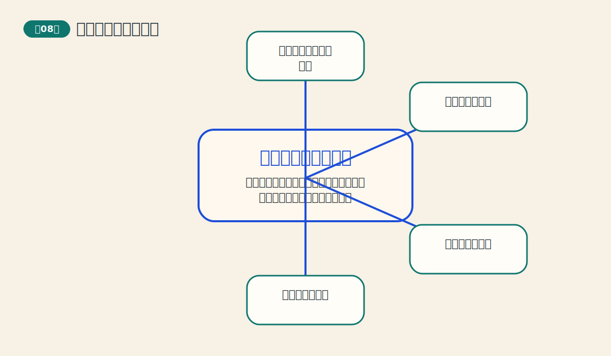

很多错误不是因为不会看图，而是把显微镜当望远镜。长期图表帮助读者回到更大的背景。 从全书结构看，这一章承担的任务是：把 `长期图表和商品指数` 从一个术语，变成一套读图和决策的动作。它真正要教给读者的不是背答案，而是看到图表时先问什么、后问什么。

如果把这一章压缩成一句最好记的话，那就是：长期图像从山顶往下看，能让人从短期噪音里抬头，看见真正的大地形。 这句话看似简单，但背后实际上包含了作者反复强调的结构、确认和纪律三层意思。

本章的主线可以概括为：
- **长期图能过滤噪音**：周线和月线会把日常杂讯压缩掉，保留更重要的方向信息。 读图时应当记住“先看长期图定背景，再到日线找执行节奏。”，同时警惕“只盯日线，在短期起伏里反复改主意。”。最后真正沉淀下来的能力，是“先大后小，心态会稳很多。”。
- **连续图表解决合约到期断裂问题**：单个期货合约寿命有限，连续图把多份合约接起来，才能研究长期趋势。 读图时应当记住“做长期分析时，优先看连续周线或连续月线。”，同时警惕“拿单一交割合约去讨论多年大趋势。”。最后真正沉淀下来的能力，是“连续图是长期分析的基本语法。”。
- **商品指数像市场温度计**：单一品种会被个别供需影响，指数更能反映一类商品或整体商品环境。 读图时应当记住“看指数能帮助判断当前是个别行情还是更广泛的主题行情。”，同时警惕“看到一个品种强就以为所有商品都强。”。最后真正沉淀下来的能力，是“局部与整体要互相校验。”。
- **长期支撑阻挡更有分量**：在月线图上反复被验证的区域，比日线上的小区间更值得尊重。 读图时应当记住“长期图上的关键位，是制定中长期计划的重要参考。”，同时警惕“用短期突破否定长期结构。”。最后真正沉淀下来的能力，是“越大的级别，越不该轻易忽略。”。
- **长期图帮助建立战略视角**：短线交易靠战术，长期图决定你站在哪支队伍里。 读图时应当记住“把长期趋势看作地图，再把短期波动看作路径选择。”，同时警惕“战术忙碌，却没有战略方向。”。最后真正沉淀下来的能力，是“先有大地图，再谈快走慢走。”。

如果把这一章讲给完全不懂市场的人听，最好的入口通常不是图表术语，而是生活类比：像登山。站在山脚只能看到脚边石头，爬高以后，整条山脉的走向才清楚。 当读者先抓住这个生活结构，再去看图上的线、形态或指标，就不容易陷入死背图样的状态。

从实战角度看，这一章最重要的收获不只是“会不会认”，更是“会不会用”。作者不断提醒读者，任何工具都必须回到流程里去使用，而不是脱离背景独自下命令。换句话说，真正成熟的技术分析，不是看到一个信号就兴奋，而是先把它放到时间尺度、趋势环境、验证条件和风险控制里再判断。

### 第十一章 日内点数图（PDF页 254-272）

这章引入了一种和普通时间序列图不一样的思考方式，有助于打破“图一定跟时间走”的固定印象。 从全书结构看，这一章承担的任务是：把 `日内点数图` 从一个术语，变成一套读图和决策的动作。它真正要教给读者的不是背答案，而是看到图表时先问什么、后问什么。

如果把这一章压缩成一句最好记的话，那就是：点数图把时间的噪音关小，把价格结构的骨头露出来，让买卖信号更清爽。 这句话看似简单，但背后实际上包含了作者反复强调的结构、确认和纪律三层意思。

本章的主线可以概括为：
- **点数图突出价格，不强调时间**：只有当价格移动到足够的幅度时，图上才会多一个格子。 读图时应当记住“把它看成价格结构图，而不是时间线图。”，同时警惕“拿点数图去解释时间节奏。”。最后真正沉淀下来的能力，是“不同图表对应不同问题。”。
- **X 列表示上涨，O 列表示下跌**：图表用最简洁的方式把多空推进过程记录下来。 读图时应当记住“列的切换本身就包含了方向变化信息。”，同时警惕“只看单个 X 或 O，不看整列结构。”。最后真正沉淀下来的能力，是“点数图更重视列与列之间的关系。”。
- **箱值决定灵敏度**：每个格子代表多大价格变动，会直接改变信号的频率与噪音水平。 读图时应当记住“箱值越小越灵敏，越大越稳重。”，同时警惕“不管市场波动特征，随便设一个箱值。”。最后真正沉淀下来的能力，是“参数是在平衡速度和稳定性。”。
- **转向规则决定什么时候换列**：价格逆向移动到一定幅度，图上才从 X 列切到 O 列，或反过来。 读图时应当记住“转向阈值越高，信号越少但更过滤噪音。”，同时警惕“不知道箱值和转向是两个不同旋钮。”。最后真正沉淀下来的能力，是“点数图的性格来自两个参数的组合。”。
- **点数图能更清楚地给出突破信号**：它通过结构突破来提示买卖方向，往往比普通图更规整。 读图时应当记住“重点盯前高前低是否被列结构有效越过。”，同时警惕“把点数图当成神奇捷径，不去理解其规则。”。最后真正沉淀下来的能力，是“规则越清楚，纪律越容易执行。”。

如果把这一章讲给完全不懂市场的人听，最好的入口通常不是图表术语，而是生活类比：像看人走路时只记他每次真正向前或向后的步幅，不去记录他原地晃了多少秒。 当读者先抓住这个生活结构，再去看图上的线、形态或指标，就不容易陷入死背图样的状态。

从实战角度看，这一章最重要的收获不只是“会不会认”，更是“会不会用”。作者不断提醒读者，任何工具都必须回到流程里去使用，而不是脱离背景独自下命令。换句话说，真正成熟的技术分析，不是看到一个信号就兴奋，而是先把它放到时间尺度、趋势环境、验证条件和风险控制里再判断。

### 第十二章 三点转向和优化点数图（PDF页 273-287）

这章把前一章的点数图从“会画”推进到“会调”，也让读者接触到系统化测试的味道。 从全书结构看，这一章承担的任务是：把 `三点转向和优化点数图` 从一个术语，变成一套读图和决策的动作。它真正要教给读者的不是背答案，而是看到图表时先问什么、后问什么。

如果把这一章压缩成一句最好记的话，那就是：三点转向法把点数图压缩得更实用，而优化思路则提醒我们：参数不是信仰，而是需要检验。 这句话看似简单，但背后实际上包含了作者反复强调的结构、确认和纪律三层意思。

本章的主线可以概括为：
- **三点转向法比一点转向更稳**：它要求价格逆向达到更大幅度才换列，因此过滤了更多小噪音。 读图时应当记住“把它理解为“慢一点，但更有把握”的版本。”，同时警惕“以为信号变少就是变差。”。最后真正沉淀下来的能力，是“信号少不代表价值低，关键看质量。”。
- **最高价与最低价足够完成很多图表工作**：三点转向法不再依赖完整日内逐笔资料，因此更容易普及。 读图时应当记住“点数图的实用化，很大程度上来自资料门槛的降低。”，同时警惕“认为没有逐笔数据就无法做结构分析。”。最后真正沉淀下来的能力，是“好工具还要能真正被使用。”。
- **点数图信号是参数驱动的**：箱值和转向规定不同，买卖点会明显不同。 读图时应当记住“先承认参数会改变结果，再谈比较与检验。”，同时警惕“把某套参数神圣化，忽略市场差异。”。最后真正沉淀下来的能力，是“任何规则系统都要面对参数敏感性。”。
- **优化的目标不是追求完美过去**：优化参数是为了找到更适合的平衡，而不是用历史过拟合出神话成绩单。 读图时应当记住“关注稳定性而不只是历史收益最大化。”，同时警惕“拿回测最好的一组参数当成未来必胜密码。”。最后真正沉淀下来的能力，是“参数好不好，要看稳不稳，而不是只看靓不靓。”。
- **优化之后仍要持续复核**：市场特性会变化，过去适合的设置未必永远适合。 读图时应当记住“把参数调整看成长期维护，而不是一次性封神。”，同时警惕“调完一次就永远照搬。”。最后真正沉淀下来的能力，是“系统和市场之间永远在对话。”。

如果把这一章讲给完全不懂市场的人听，最好的入口通常不是图表术语，而是生活类比：像调相机。焦距、快门和感光度不同，拍出来的画面风格就不同。点数图参数也是这样。 当读者先抓住这个生活结构，再去看图上的线、形态或指标，就不容易陷入死背图样的状态。

从实战角度看，这一章最重要的收获不只是“会不会认”，更是“会不会用”。作者不断提醒读者，任何工具都必须回到流程里去使用，而不是脱离背景独自下命令。换句话说，真正成熟的技术分析，不是看到一个信号就兴奋，而是先把它放到时间尺度、趋势环境、验证条件和风险控制里再判断。

### 第十四章 时间周期（PDF页 322-354）

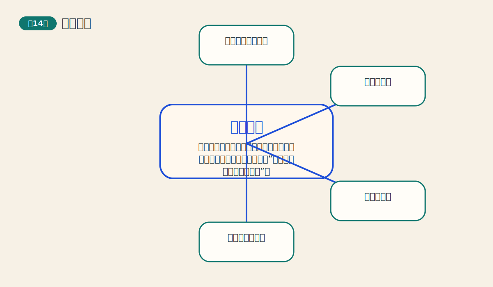

很多人只看价格，不看时间。这一章提醒读者：时间也是技术分析的重要维度。 从全书结构看，这一章承担的任务是：把 `时间周期` 从一个术语，变成一套读图和决策的动作。它真正要教给读者的不是背答案，而是看到图表时先问什么、后问什么。

如果把这一章压缩成一句最好记的话，那就是：市场不只在价格上有节奏，在时间上也可能有节奏；周期分析试图回答“什么时候更值得警惕变化”。 这句话看似简单，但背后实际上包含了作者反复强调的结构、确认和纪律三层意思。

本章的主线可以概括为：
- **图表本来就是时间-价格图**：纵轴是价格，横轴是时间，忽略时间只看一半信息。 读图时应当记住“价格目标和时间窗口应当一起考虑。”，同时警惕“只问会涨到哪里，不问大概什么时候更容易变化。”。最后真正沉淀下来的能力，是“时间不是背景布，而是变量本身。”。
- **周期强调重复的时间节奏**：某些高低点可能会以相对规律的时间间隔出现。 读图时应当记住“把周期理解为“更值得留意的窗口”，而不是定时闹钟。”，同时警惕“以为周期会像时钟一样分秒不差。”。最后真正沉淀下来的能力，是“周期是概率节奏，不是机械钟摆。”。
- **多个周期会互相叠加**：短周期和长周期像不同长度的波，同时作用会形成更复杂的节奏。 读图时应当记住“留意多个周期共振时，往往更值得关注。”，同时警惕“只抓住一个周期就想解释全部市场行为。”。最后真正沉淀下来的能力，是“复杂市场通常需要多层节奏一起看。”。
- **时间分析需要和价格结构配合**：光有时间窗口，没有价格确认，周期分析就容易变得神秘化。 读图时应当记住“先把周期当作提醒器，再用图形和趋势做最终确认。”，同时警惕“到时间了就机械下单。”。最后真正沉淀下来的能力，是“时间告诉你“留意”，价格告诉你“行动”。”。
- **长周期很有启发，但更要谦逊**：长期经济波动值得研究，但跨度越长，不确定性和解释空间越大。 读图时应当记住“对长波保持开放，同时保持审慎。”，同时警惕“拿宏大周期去替代具体交易决策。”。最后真正沉淀下来的能力，是“越宏观的工具，越适合定背景，不适合定按钮。”。

如果把这一章讲给完全不懂市场的人听，最好的入口通常不是图表术语，而是生活类比：像季节变化。春夏秋冬不会告诉你每天温度是多少，但会告诉你哪一段时间更容易发生哪类变化。 当读者先抓住这个生活结构，再去看图上的线、形态或指标，就不容易陷入死背图样的状态。

从实战角度看，这一章最重要的收获不只是“会不会认”，更是“会不会用”。作者不断提醒读者，任何工具都必须回到流程里去使用，而不是脱离背景独自下命令。换句话说，真正成熟的技术分析，不是看到一个信号就兴奋，而是先把它放到时间尺度、趋势环境、验证条件和风险控制里再判断。

## 四、指标与形态体系

这一部分展示市场会如何在图上留下反转、延续、量价和动能的证据，并补充更复杂的波浪框架。

### 第五章 主要反转形态（PDF页 80-104）

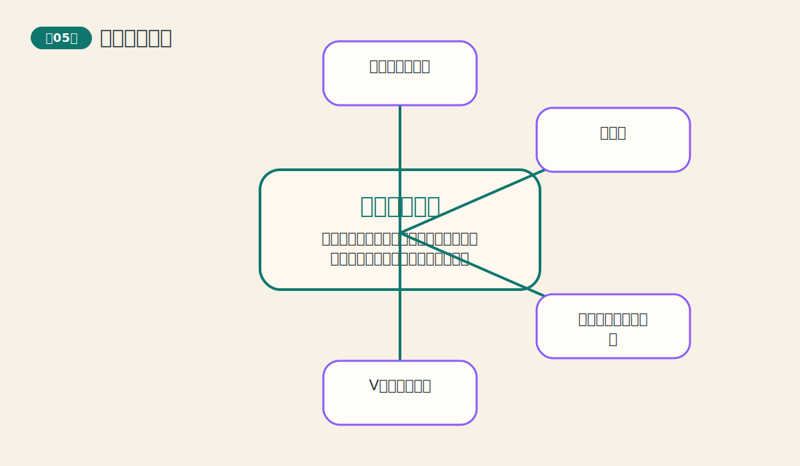

很多交易者最大的痛苦，就是把调整看成反转，或把反转当成调整。这一章就是学会分辨两者。 从全书结构看，这一章承担的任务是：把 `主要反转形态` 从一个术语，变成一套读图和决策的动作。它真正要教给读者的不是背答案，而是看到图表时先问什么、后问什么。

如果把这一章压缩成一句最好记的话，那就是：大趋势要转身，通常不会一瞬间完成，而会先在图上搭出可识别的反转舞台。 这句话看似简单，但背后实际上包含了作者反复强调的结构、确认和纪律三层意思。

本章的主线可以概括为：
- **反转前必须先有明确趋势**：如果前面没有趋势，后面就谈不上反转。 读图时应当记住“先看此前市场是否已经走出一段清晰方向。”，同时警惕“在杂乱横盘里硬找头肩顶。”。最后真正沉淀下来的能力，是“反转形态的上下文和图形本身一样重要。”。
- **头肩形是最典型的反转结构**：左肩、头部、右肩和颈线一起构成市场由强转弱的过程。 读图时应当记住“重点不是名字，而是高点抬不动、低点守不住这两个变化。”，同时警惕“只认图样，不看成交量和颈线突破。”。最后真正沉淀下来的能力，是“会用结构而不是图案记忆头肩形。”。
- **双重顶底是市场两次试探失败**：价格第二次冲顶或探底失败，说明原方向的力量开始枯竭。 读图时应当记住“等中间低点或高点被突破，形态才真正完成。”，同时警惕“第二个峰刚出来就提前宣布完成。”。最后真正沉淀下来的能力，是“完成比猜测更重要。”。
- **交易量是反转可信度的重要证据**：反转不是孤零零的图形，它常伴随量能和动能的变化。 读图时应当记住“突破颈线或关键位时，最好有量能配合。”，同时警惕“把没有确认的轮廓当成正式信号。”。最后真正沉淀下来的能力，是“图形与量能合看，误判会少很多。”。
- **反转形态通常还能估算目标位**：从形态高度推算目标位，是把形态变成交易计划的关键一步。 读图时应当记住“先确认突破，再做测量，不要本末倒置。”，同时警惕“只盯目标位，不做风险控制。”。最后真正沉淀下来的能力，是“目标位是参考，不是保证兑现的承诺书。”。

如果把这一章讲给完全不懂市场的人听，最好的入口通常不是图表术语，而是生活类比：像大船掉头。快艇可以猛打一把方向盘，但大船必须先减速、摆尾、再完成转向。 当读者先抓住这个生活结构，再去看图上的线、形态或指标，就不容易陷入死背图样的状态。

从实战角度看，这一章最重要的收获不只是“会不会认”，更是“会不会用”。作者不断提醒读者，任何工具都必须回到流程里去使用，而不是脱离背景独自下命令。换句话说，真正成熟的技术分析，不是看到一个信号就兴奋，而是先把它放到时间尺度、趋势环境、验证条件和风险控制里再判断。

### 第六章 持续形态（PDF页 105-136）

多数交易者害怕震荡，往往在真正趋势恢复前被甩下车。学会持续形态，就能把休息看成结构。 从全书结构看，这一章承担的任务是：把 `持续形态` 从一个术语，变成一套读图和决策的动作。它真正要教给读者的不是背答案，而是看到图表时先问什么、后问什么。

如果把这一章压缩成一句最好记的话，那就是：很多横盘不是转向，而是趋势中途喘口气；持续形态就是读懂这口气值不值得继续跟。 这句话看似简单，但背后实际上包含了作者反复强调的结构、确认和纪律三层意思。

本章的主线可以概括为：
- **持续形态是趋势的暂停键**：市场在前进途中会整理筹码、平衡情绪，随后再沿原方向延续。 读图时应当记住“先看前面有没有明显趋势，再判断这段横盘更像修整还是转身。”，同时警惕“把所有横盘都当成无意义噪音。”。最后真正沉淀下来的能力，是“震荡不一定可怕，关键看它依附在哪段趋势之后。”。
- **三角形是力量收敛的典型结构**：价格高点越来越低、低点越来越高，说明买卖双方都在压缩空间。 读图时应当记住“观察突破最终朝哪个方向发生，以及是否顺应前势。”，同时警惕“在三角形中间位置过早下注。”。最后真正沉淀下来的能力，是“等待接近末端的突破，比中途猜方向更稳。”。
- **旗形和三角旗形常出现在快趋势中**：它们通常时间短、斜率小，像一面被风吹斜的小旗。 读图时应当记住“先有急速上涨或下跌的旗杆，再看短暂整理是否延续原势。”，同时警惕“没有旗杆也硬把小通道叫旗形。”。最后真正沉淀下来的能力，是“结构背景决定图形身份。”。
- **矩形像市场在区间里来回试探**：价格反复撞击上边界和下边界，直到一边获胜。 读图时应当记住“区间突破比区间内部猜涨跌更有效。”，同时警惕“在矩形中央追涨杀跌。”。最后真正沉淀下来的能力，是“边界比中间更有信息量。”。
- **持续形态也有测算意义**：很多持续形态可以通过旗杆或形态高度估算后续空间。 读图时应当记住“把测算和原趋势方向结合，而不是单独使用。”，同时警惕“只因“有目标位”就忽略失败突破的风险。”。最后真正沉淀下来的能力，是“测算帮助规划，但不取消止损。”。

如果把这一章讲给完全不懂市场的人听，最好的入口通常不是图表术语，而是生活类比：像长跑运动员补一口气。停一停不是放弃比赛，而是为了跑得更远。 当读者先抓住这个生活结构，再去看图上的线、形态或指标，就不容易陷入死背图样的状态。

从实战角度看，这一章最重要的收获不只是“会不会认”，更是“会不会用”。作者不断提醒读者，任何工具都必须回到流程里去使用，而不是脱离背景独自下命令。换句话说，真正成熟的技术分析，不是看到一个信号就兴奋，而是先把它放到时间尺度、趋势环境、验证条件和风险控制里再判断。

### 第七章 交易量和持仓兴趣（PDF页 137-160）

这章把图表从二维提升到三维。很多模糊判断，正是在量与持仓兴趣的帮助下变清楚。 从全书结构看，这一章承担的任务是：把 `交易量和持仓兴趣` 从一个术语，变成一套读图和决策的动作。它真正要教给读者的不是背答案，而是看到图表时先问什么、后问什么。

如果把这一章压缩成一句最好记的话，那就是：价格是主角，交易量和持仓兴趣像两盏辅助照明灯，能让你看清趋势是否站得住。 这句话看似简单，但背后实际上包含了作者反复强调的结构、确认和纪律三层意思。

本章的主线可以概括为：
- **价格最重要，量和持仓是验证者**：价格负责给方向，交易量和持仓兴趣负责补充说明这个方向的质量。 读图时应当记住“先看价格结论，再看量与持仓是否同意。”，同时警惕“把辅助指标的地位抬得比价格还高。”。最后真正沉淀下来的能力，是“主次分清，分析才不会乱套。”。
- **交易量揭示趋势是否有力**：趋势顺行时放量、回撤时缩量，通常代表趋势更健康。 读图时应当记住“注意突破时量能是否放大，这是很多形态是否可靠的关键。”，同时警惕“只看价格突破，不看是否有成交支持。”。最后真正沉淀下来的能力，是“量像市场说话的音量。”。
- **持仓兴趣反映新资金是否进场**：持仓兴趣上升常代表新的参与者和新的承诺进入市场。 读图时应当记住“价格上涨时若持仓兴趣同步增加，通常更偏正面。”，同时警惕“把交易量和持仓兴趣当成同一个东西。”。最后真正沉淀下来的能力，是“一个看热闹，一个看真正留在场上的力量。”。
- **OBV 用累积方法追踪量价关系**：OBV 把上涨日量能加进去、下跌日量能减出去，用趋势看资金脚步。 读图时应当记住“重点看OBV方向与价格是否同步，尤其是背离。”，同时警惕“过分在意OBV的绝对数值大小。”。最后真正沉淀下来的能力，是“方向比数字本身更重要。”。
- **背离是预警，不是自动反转按钮**：量价背离或OBV背离说明结构开始不协调，但还需要价格确认。 读图时应当记住“把背离当作提高警惕、收紧风控的信号。”，同时警惕“一看到背离就立刻逆势出手。”。最后真正沉淀下来的能力，是“背离先是黄灯，不是红灯。”。

如果把这一章讲给完全不懂市场的人听，最好的入口通常不是图表术语，而是生活类比：像看一场拔河。绳子往哪边移动是价格，围观的人越来越多是交易量，真正还在场上用力的人数变化则像持仓兴趣。 当读者先抓住这个生活结构，再去看图上的线、形态或指标，就不容易陷入死背图样的状态。

从实战角度看，这一章最重要的收获不只是“会不会认”，更是“会不会用”。作者不断提醒读者，任何工具都必须回到流程里去使用，而不是脱离背景独自下命令。换句话说，真正成熟的技术分析，不是看到一个信号就兴奋，而是先把它放到时间尺度、趋势环境、验证条件和风险控制里再判断。

### 第九章 移动平均线（PDF页 181-212）

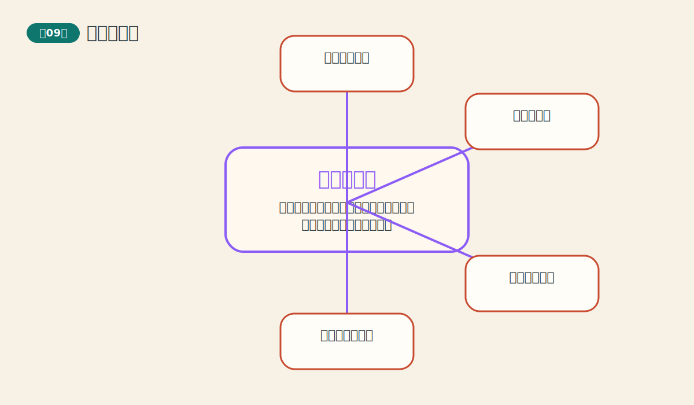

这是最容易量化、也最适合计算机化的趋势工具之一，是很多交易系统的骨架。 从全书结构看，这一章承担的任务是：把 `移动平均线` 从一个术语，变成一套读图和决策的动作。它真正要教给读者的不是背答案，而是看到图表时先问什么、后问什么。

如果把这一章压缩成一句最好记的话，那就是：移动平均线像给价格加了一个平滑滤镜，让趋势轮廓更容易被看清。 这句话看似简单，但背后实际上包含了作者反复强调的结构、确认和纪律三层意思。

本章的主线可以概括为：
- **移动平均线用过去价格做平滑**：它把若干日价格求平均，让曲线更顺，噪音更少。 读图时应当记住“平均线向上说明过去一段时间总体在变强，向下则相反。”，同时警惕“把均线看成会预测未来的神线。”。最后真正沉淀下来的能力，是“均线先是描述器，然后才是信号器。”。
- **平均线天生滞后**：因为它用的是过去的数据，所以趋势已经开始后它才逐步跟上。 读图时应当记住“用均线换来的是稳定感，不是最早入场权。”，同时警惕“又想要均线稳定，又嫌它不够早。”。最后真正沉淀下来的能力，是“工具的优点和代价总是绑在一起。”。
- **交叉信号把趋势变成规则**：短期均线上穿长期均线，代表近期力量可能更强；下穿则相反。 读图时应当记住“均线交叉更适合趋势明确的市场，横盘时容易来回打脸。”，同时警惕“不分市场环境，到处套用交叉系统。”。最后真正沉淀下来的能力，是“均线系统怕震荡，爱趋势。”。
- **均线也能当动态支撑与阻挡**：在趋势行情里，价格常围绕均线回撤后再启动。 读图时应当记住“观察价格是贴着均线健康前进，还是频繁跌破。”，同时警惕“把每次碰均线都当成必定反弹的机会。”。最后真正沉淀下来的能力，是“均线是参考轨道，不是弹簧床。”。
- **参数没有万能答案**：不同市场、不同周期、不同任务，适合的均线长度不同。 读图时应当记住“参数要服务于策略目的，而不是追求“神奇数字”。”，同时警惕“执着寻找放之四海而皆准的最佳均线。”。最后真正沉淀下来的能力，是“先定义任务，再选参数。”。

如果把这一章讲给完全不懂市场的人听，最好的入口通常不是图表术语，而是生活类比：像坐车时看路边风景。车窗很脏会看不清，平均线就是把飞快闪过的碎影擦平一点。 当读者先抓住这个生活结构，再去看图上的线、形态或指标，就不容易陷入死背图样的状态。

从实战角度看，这一章最重要的收获不只是“会不会认”，更是“会不会用”。作者不断提醒读者，任何工具都必须回到流程里去使用，而不是脱离背景独自下命令。换句话说，真正成熟的技术分析，不是看到一个信号就兴奋，而是先把它放到时间尺度、趋势环境、验证条件和风险控制里再判断。

### 第十章 摆动指数和相反意见理论（PDF页 213-253）

这章补上了趋势工具最怕的那一块：无趋势环境和末端衰竭信号。 从全书结构看，这一章承担的任务是：把 `摆动指数和相反意见理论` 从一个术语，变成一套读图和决策的动作。它真正要教给读者的不是背答案，而是看到图表时先问什么、后问什么。

如果把这一章压缩成一句最好记的话，那就是：当趋势工具在横盘里变钝时，摆动指标像速度表和情绪计，帮助你看见超买、超卖、背离和大众情绪的极端。 这句话看似简单，但背后实际上包含了作者反复强调的结构、确认和纪律三层意思。

本章的主线可以概括为：
- **摆动指标研究速度和极端状态**：它们测的是涨跌的力度、速度和位置，而不只是方向。 读图时应当记住“在横盘市场里，摆动指标往往比跟随趋势工具更有用。”，同时警惕“把摆动指标当成独立于趋势的万能工具。”。最后真正沉淀下来的能力，是“它是补充工具，不是替代全部分析的王者。”。
- **超买超卖只是警报，不是立刻反手**：市场可以在强趋势中长期保持超买或超卖。 读图时应当记住“极端读数出现后，先提高警惕，再等待结构和价格确认。”，同时警惕“指标一进超买区就做空，一进超卖区就做多。”。最后真正沉淀下来的能力，是“强趋势能把“过热”维持很久。”。
- **背离提示动能开始衰竭**：价格创新高而指标未创新高，或价格创新低而指标未创新低，说明内在力量不再同步。 读图时应当记住“把背离和趋势背景一起看，效果最好。”，同时警惕“仅凭一次背离就断言趋势结束。”。最后真正沉淀下来的能力，是“背离是提前警报，价格是最后裁判。”。
- **不同摆动指标各有语气**：动量、RSI、随机指标等都在看速度，但灵敏度和用途不同。 读图时应当记住“先理解指标在测什么，再讨论参数。”，同时警惕“同时上十个指标，最后互相打架。”。最后真正沉淀下来的能力，是“少而懂，比多而乱更有价值。”。
- **相反意见理论研究的是大众情绪极端**：当绝大多数人都站在同一边时，市场往往已接近拐点。 读图时应当记住“把情绪指标当作环境温度，不当作单独下单按钮。”，同时警惕“只要大众乐观就立刻做空，只要悲观就立刻做多。”。最后真正沉淀下来的能力，是“逆向不是逞强，而是等待拥挤达到极端。”。

如果把这一章讲给完全不懂市场的人听，最好的入口通常不是图表术语，而是生活类比：像开车。趋势工具告诉你车往哪儿开，摆动指标则告诉你油门踩得有多急、发动机是不是快顶不住了。 当读者先抓住这个生活结构，再去看图上的线、形态或指标，就不容易陷入死背图样的状态。

从实战角度看，这一章最重要的收获不只是“会不会认”，更是“会不会用”。作者不断提醒读者，任何工具都必须回到流程里去使用，而不是脱离背景独自下命令。换句话说，真正成熟的技术分析，不是看到一个信号就兴奋，而是先把它放到时间尺度、趋势环境、验证条件和风险控制里再判断。

### 第十三章 艾略特波浪理论（PDF页 288-321）

它是技术分析里最具吸引力也最容易让人着迷的一支。学会它的价值，同时也要知道它的边界。 从全书结构看，这一章承担的任务是：把 `艾略特波浪理论` 从一个术语，变成一套读图和决策的动作。它真正要教给读者的不是背答案，而是看到图表时先问什么、后问什么。

如果把这一章压缩成一句最好记的话，那就是：波浪理论试图把市场节奏写成一种层层嵌套的语法：推动五浪，调整三浪，大小级别不断重复。 这句话看似简单，但背后实际上包含了作者反复强调的结构、确认和纪律三层意思。

本章的主线可以概括为：
- **推动浪与调整浪构成基本骨架**：顺大方向的五浪推进，之后常跟着三浪调整。 读图时应当记住“先把它看作节奏框架，而不是精确预言机。”，同时警惕“刚看到两三段波动就急着完整编号。”。最后真正沉淀下来的能力，是“波浪最先提供的是结构感，不是神准标签。”。
- **波浪具有分形层级**：大浪里有小浪，小浪里还有更小的浪，不同级别结构相似。 读图时应当记住“编号前先说明自己在讨论哪个级别。”，同时警惕“把不同时间尺度的浪混在一起讲。”。最后真正沉淀下来的能力，是“没有级别意识，波浪就会越数越乱。”。
- **斐波那契比例常被用作测量工具**：很多波浪分析会用比例关系辅助判断回撤和延展空间。 读图时应当记住“把比例看作“常见区间”，不是绝对刻度。”，同时警惕“把任意一次回撤都硬套成黄金比率。”。最后真正沉淀下来的能力，是“比例是辅助，不是执法者。”。
- **波浪理论最强的地方是框架感**：它能帮助交易者把杂乱波动组织成更有层次的故事。 读图时应当记住“先用它理解市场处于推进还是调整，再考虑细节。”，同时警惕“沉迷细枝末节，忘了整体节奏。”。最后真正沉淀下来的能力，是“先讲主线，再修细节。”。
- **波浪理论最大的风险是主观性**：同一张图，不同分析者可能数出不同结果。 读图时应当记住“波浪分析要和趋势、形态、均线等其他证据互相印证。”，同时警惕“把任何分歧都解释成“市场太复杂”，却不做验证。”。最后真正沉淀下来的能力，是“越迷人的工具，越需要纪律约束。”。

如果把这一章讲给完全不懂市场的人听，最好的入口通常不是图表术语，而是生活类比：像音乐节拍。主旋律有大拍，小节里还有小拍，整首曲子会反复出现相似节奏。 当读者先抓住这个生活结构，再去看图上的线、形态或指标，就不容易陷入死背图样的状态。

从实战角度看，这一章最重要的收获不只是“会不会认”，更是“会不会用”。作者不断提醒读者，任何工具都必须回到流程里去使用，而不是脱离背景独自下命令。换句话说，真正成熟的技术分析，不是看到一个信号就兴奋，而是先把它放到时间尺度、趋势环境、验证条件和风险控制里再判断。

## 五、系统交易与资金管理

这一部分把分析落到规则、执行和生存上。技术分析如果不能转化为交易流程和风险控制，就只会停留在图上。

### 第十五章 计算机和交易系统（PDF页 355-379）

这章把图表分析推进到程序化思维：从“看懂”走向“写成规则、测试规则、执行规则”。 从全书结构看，这一章承担的任务是：把 `计算机和交易系统` 从一个术语，变成一套读图和决策的动作。它真正要教给读者的不是背答案，而是看到图表时先问什么、后问什么。

如果把这一章压缩成一句最好记的话，那就是：计算机能把规则执行得更快、更稳，但它不能替你决定一套坏规则会不会输钱。 这句话看似简单，但背后实际上包含了作者反复强调的结构、确认和纪律三层意思。

本章的主线可以概括为：
- **计算机擅长处理重复和计算**：它能快速刷新图表、计算指标、执行规则，极大提升效率。 读图时应当记住“把计算机当成加速器，而不是灵感来源。”，同时警惕“因为软件很复杂，就误以为自己已经掌握市场。”。最后真正沉淀下来的能力，是“效率工具不能自动变成判断能力。”。
- **交易系统是规则的集合**：系统要明确回答什么时候进、什么时候出、仓位多大、何时止损。 读图时应当记住“没有规则清单，就算不上真正的系统。”，同时警惕“只写入场，不写退出和资金管理。”。最后真正沉淀下来的能力，是“系统完整性比单个信号更重要。”。
- **回测是过滤幻想的第一道门**：如果一套规则连过去都说不清，拿去实盘通常更危险。 读图时应当记住“不仅看收益，还看回撤、稳定性、连败情况。”，同时警惕“只晒总收益，不看过程质量。”。最后真正沉淀下来的能力，是“好系统不是只会赢，而是输得也可承受。”。
- **参数越多，越容易自我欺骗**：复杂系统往往更容易被调得贴合历史，却失去未来适应性。 读图时应当记住“优先选择逻辑清晰、结构简洁的规则。”，同时警惕“把复杂度误当作高级感。”。最后真正沉淀下来的能力，是“简单到足够用，常比复杂到看不懂更强。”。
- **软件不会替你承担纪律**：即使系统有优势，交易者仍要面对执行、信任和承受回撤的问题。 读图时应当记住“真正难的不是写规则，而是长期按规则活着。”，同时警惕“系统一回撤就频繁改规则。”。最后真正沉淀下来的能力，是“纪律是系统的另一半。”。

如果把这一章讲给完全不懂市场的人听，最好的入口通常不是图表术语，而是生活类比：像给厨师一台高速搅拌机。机器能更快、更稳定地打发奶油，但配方错了，机器只会更快地把错误放大。 当读者先抓住这个生活结构，再去看图上的线、形态或指标，就不容易陷入死背图样的状态。

从实战角度看，这一章最重要的收获不只是“会不会认”，更是“会不会用”。作者不断提醒读者，任何工具都必须回到流程里去使用，而不是脱离背景独自下命令。换句话说，真正成熟的技术分析，不是看到一个信号就兴奋，而是先把它放到时间尺度、趋势环境、验证条件和风险控制里再判断。

### 第十六章 资金管理和交易策略（PDF页 380-426）

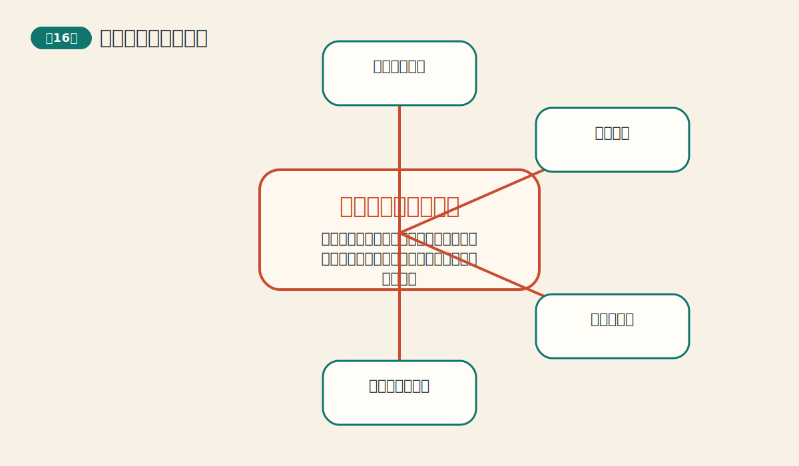

这是全书落地性最强的一章，它把前面所有技术工具拉回到真实交易的生存问题。 从全书结构看，这一章承担的任务是：把 `资金管理和交易策略` 从一个术语，变成一套读图和决策的动作。它真正要教给读者的不是背答案，而是看到图表时先问什么、后问什么。

如果把这一章压缩成一句最好记的话，那就是：预测方向只是交易三脚架的一条腿，另外两条腿是时机抉择和资金管理，少一条都站不稳。 这句话看似简单，但背后实际上包含了作者反复强调的结构、确认和纪律三层意思。

本章的主线可以概括为：
- **成功交易有三要素**：价格预测、时机抉择和资金管理缺一不可。 读图时应当记住“前面各章主要解决前两者，这一章把第三者补齐。”，同时警惕“以为方向判断对了，结果就会自动变好。”。最后真正沉淀下来的能力，是“看对方向不等于能把钱留下来。”。
- **止损是活下去的工具**：市场永远可能和你想的不一样，所以必须提前规定最坏情况。 读图时应当记住“止损应该写在进场之前，而不是亏损之后才临时决定。”，同时警惕“把止损看成失败的象征。”。最后真正沉淀下来的能力，是“止损不是认输，而是保命。”。
- **仓位大小决定你能否承受波动**：再好的方法，仓位过大都可能让人提前爆掉。 读图时应当记住“单笔风险应和账户承受力匹配，而不是和情绪匹配。”，同时警惕“在最有信心的时候把仓位放到无法承受。”。最后真正沉淀下来的能力，是“先活着，才有资格谈复利。”。
- **分散和相关性同样重要**：看似买了多个品种，若它们同涨同跌，风险并没有真正分散。 读图时应当记住“不仅看持仓数量，还看它们是否受相似因素驱动。”，同时警惕“把“多买几个”误以为就是分散。”。最后真正沉淀下来的能力，是“相关性会偷偷把分散变回集中。”。
- **策略整合需要一致性**：工具越多，越要有固定流程，不然容易临场挑自己喜欢的信号。 读图时应当记住“把趋势、形态、指标和资金管理串成固定决策顺序。”，同时警惕“今天用均线，明天用波浪，亏了再换一套。”。最后真正沉淀下来的能力，是“稳定流程比临场聪明更可靠。”。

如果把这一章讲给完全不懂市场的人听，最好的入口通常不是图表术语，而是生活类比：像远航。知道往哪开是方向，什么时候升帆是时机，船上带多少水和粮、遇风浪怎么减速，就是资金管理。 当读者先抓住这个生活结构，再去看图上的线、形态或指标，就不容易陷入死背图样的状态。

从实战角度看，这一章最重要的收获不只是“会不会认”，更是“会不会用”。作者不断提醒读者，任何工具都必须回到流程里去使用，而不是脱离背景独自下命令。换句话说，真正成熟的技术分析，不是看到一个信号就兴奋，而是先把它放到时间尺度、趋势环境、验证条件和风险控制里再判断。

## 六、全书综合收获与适用边界

这一部分收束全书：技术分析最擅长的是什么，最容易被误用的是什么，以及读者真正应该带走的长期能力是什么。

从全书综合来看，作者最强的主张有三条。第一，市场价格往往比解释它的新闻更快，因此应优先尊重市场留下的证据。第二，单一工具永远不够，趋势、形态、量价、动能和风险管理必须连成链条。第三，真正成熟的交易不是追求次次正确，而是在不确定环境中持续保持优势。

本书也有明显边界。许多图形和波浪判断都带有一定主观性；参数选择与系统优化存在过拟合风险；突发性事件和制度性变化并不会因为你画了趋势线就自动失效。因此，技术分析最适合作为“组织市场证据、帮助做概率判断”的框架，而不是“保证预测正确”的承诺。

对今天的读者来说，本书最大的收获并不是某个具体指标，而是四种长期有用的能力：一是先用多周期和大背景建立语境；二是把图形看成群体心理的行为结果；三是用验证和风控抑制主观冲动；四是把任何交易想法转化为可以复盘的规则。只要这四种能力建立起来，这本书的价值就真正落地了。

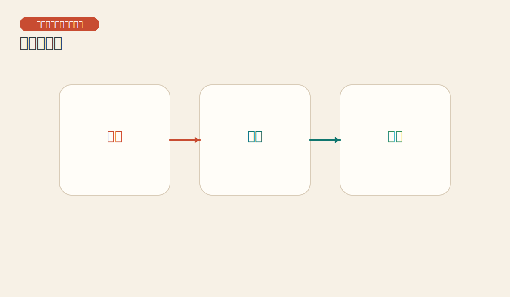
