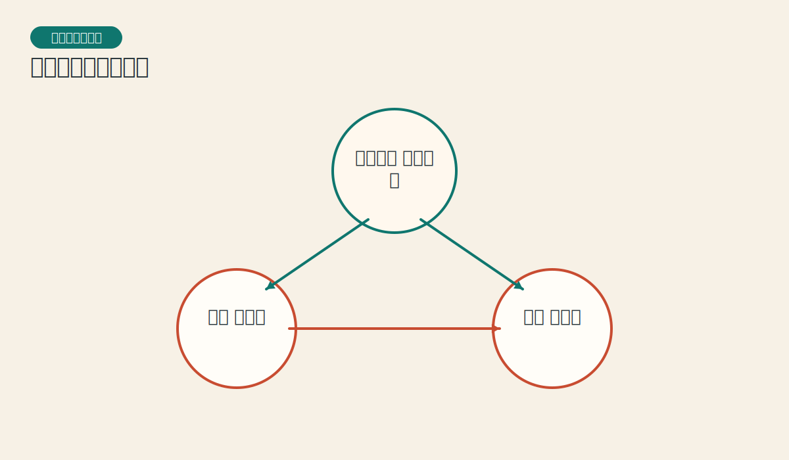
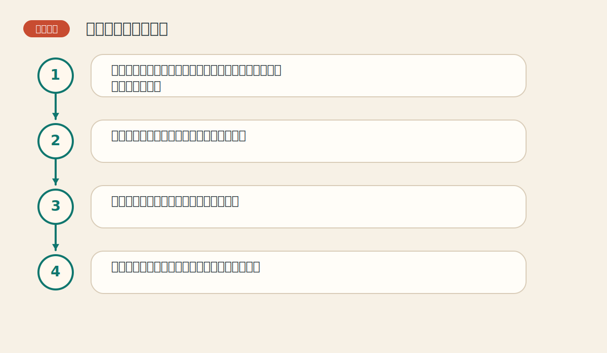

# 第一章 技术分析的理论基础

> PDF页范围：4-19。核心图示：三大前提三角形。

**一句话总纲**：技术分析的核心不是神秘公式，而是从价格、交易量和持仓兴趣里读出市场已经留下的痕迹。

## 这章到底在讲什么

这一章决定读者后面看图、看指标时是机械背诵，还是能抓到一整套方法论的骨架。 作者在这一章真正想训练的，不只是识别名词，而是把市场现象翻译成一套能重复使用的判断语言。

## 本章核心术语

- **市场行为**：价格、交易量和持仓兴趣这三类可观察信息。
- **趋势**：市场在一段时间里更偏向的方向。
- **随机行走**：认为价格无法从历史中找到有效线索的观点。
- **概率优势**：不是保证正确，而是长期上更有利的做法。

## 关键知识

### 关键知识 1：市场行为包容消化一切

政治、经济、供求、情绪和预期，最终都会通过买卖行为反映到价格上。 站在零基础读者角度，可以先把它理解成一句很朴素的话：市场在这里留下了一个可重复辨认的行为模式。

**怎么看**：先看价格有没有提前转向，再去想消息是否只是把市场早已知道的东西说出来。

**最容易错在哪里**：把每次上涨都归结为单一新闻，忽略市场往往会提前行动。

**真正能带走的收获**：先读市场本身，而不是追着解释跑。

### 关键知识 2：价格以趋势方式演变

价格大多不是随机飘动，而是会沿某个方向持续一段时间。 站在零基础读者角度，可以先把它理解成一句很朴素的话：市场在这里留下了一个可重复辨认的行为模式。

**怎么看**：关注一连串更高的高点和更高的低点，或更低的高点和更低的低点。

**最容易错在哪里**：只盯住一天的涨跌，用碎片判断整体方向。

**真正能带走的收获**：交易的首要任务不是预测拐点，而是识别当前方向。

### 关键知识 3：历史会重演

因为人性中的贪婪、恐惧、犹豫和从众不断重复，图形和行为也会不断重复。 站在零基础读者角度，可以先把它理解成一句很朴素的话：市场在这里留下了一个可重复辨认的行为模式。

**怎么看**：把价格图形看成群体心理留下的痕迹，而不是抽象几何图案。

**最容易错在哪里**：以为图形有效是巧合，而不是群体行为反复出现的结果。

**真正能带走的收获**：看图，本质是在看人心。

### 关键知识 4：技术分析和基本分析不是敌人

基本分析解释为什么，技术分析告诉你市场已经怎么做、接下来更可能怎么走。 站在零基础读者角度，可以先把它理解成一句很朴素的话：市场在这里留下了一个可重复辨认的行为模式。

**怎么看**：当消息和价格冲突时，先尊重价格，再等待信息慢慢跟上。

**最容易错在哪里**：以为看图就等于不要基本面。

**真正能带走的收获**：价格往往比解读消息更快。

### 关键知识 5：技术分析是概率工具

它不能保证每次都对，但能帮助交易者在不确定中提高胜率、改善时机和管理风险。 站在零基础读者角度，可以先把它理解成一句很朴素的话：市场在这里留下了一个可重复辨认的行为模式。

**怎么看**：把技术信号当成证据叠加，而不是神谕。

**最容易错在哪里**：把技术分析当作永远正确的预言术。

**真正能带走的收获**：真正成熟的交易者追求的是优势，不是神准。

## 直观比喻

像侦探看脚印。你没有亲眼看见事情发生，但地上的痕迹、门把手上的指纹、桌面的灰尘，会告诉你刚刚发生了什么。

## 典型图示怎么读

上面的核心图示并不是为了让你死记图样，而是帮你抓住 `三大前提三角形` 背后的结构关系。真正该记住的是：先看背景，再看结构，再看确认，最后才谈动作。

## 3 个最容易误解的问题

- **只看图是不是等于完全不看基本面？**
  答：不是。技术分析是假设基本面已经通过买卖反映在图上，所以先读结果，再理解原因。
- **技术分析是不是只适合短线？**
  答：不是。周线、月线同样可以用技术分析，很多长期判断反而更稳定。
- **图形反复出现是不是纯巧合？**
  答：作者认为不是，因为人类在风险面前常会重复相似的心理和行为模式。

## 本章收获清单

- 知道技术分析研究的对象不是神秘图形，而是市场行为。
- 理解三大前提是全书的地基。
- 能分清“解释市场”和“跟随市场”的区别。
- 知道技术分析的价值在于时机与概率优势。
- 学会用更谦逊的方式看待任何单一信号。

## 如果讲给完全不懂的人听

你可以这样概括这一章：技术分析的核心不是神秘公式，而是从价格、交易量和持仓兴趣里读出市场已经留下的痕迹。 先把这件事讲成一个生活故事，再回到图表上找对应证据，理解会快很多。
