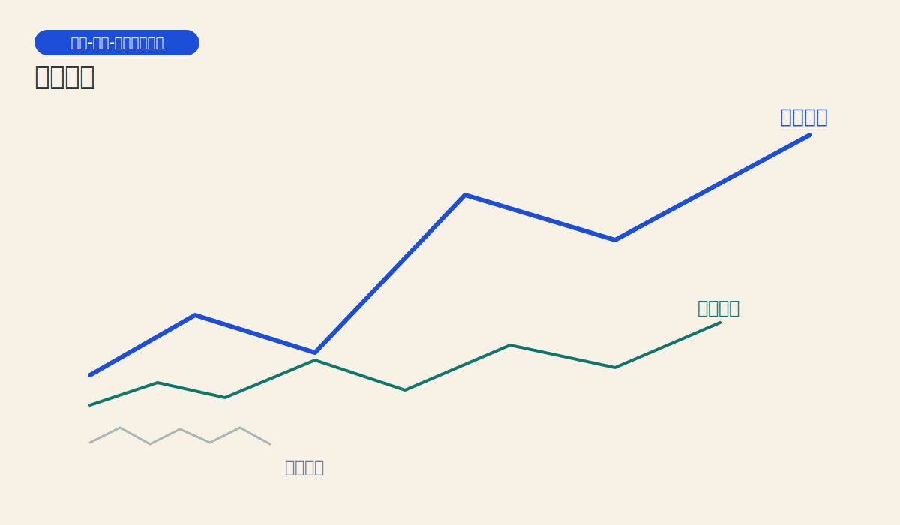
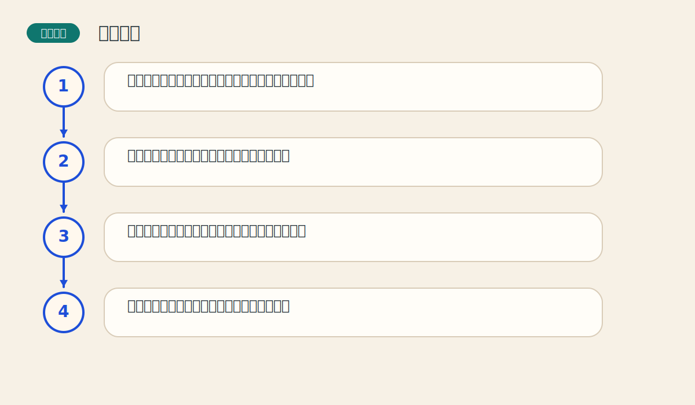

# 第二章 道氏理论

> PDF页范围：20-27。核心图示：潮汐-海浪-浪花三层趋势。

**一句话总纲**：道氏理论像趋势分析的祖先，它教人先分清大浪、中浪和小浪，再决定自己到底在和谁交易。

## 这章到底在讲什么

很多后来的趋势理论都站在道氏理论肩膀上。不懂它，后面的趋势分类和确认规则会显得零散。 作者在这一章真正想训练的，不只是识别名词，而是把市场现象翻译成一套能重复使用的判断语言。

## 本章核心术语

- **主要趋势**：持续时间最长、影响最大的方向。
- **次级趋势**：对主要趋势的中途修正，像大浪中的回撤。
- **确认**：多个相关证据对同一结论给出一致支持。
- **阶段**：趋势内部不同情绪和参与者结构对应的不同阶段。

## 关键知识

### 关键知识 1：市场有三种趋势

主要趋势像潮汐，次级趋势像浪，日常小波动像浪花。 站在零基础读者角度，可以先把它理解成一句很朴素的话：市场在这里留下了一个可重复辨认的行为模式。

**怎么看**：先看自己交易的时间尺度，再决定应该参考哪一层趋势。

**最容易错在哪里**：把小波动误当作主要趋势反转。

**真正能带走的收获**：学会分层看市场，噪音会少很多。

### 关键知识 2：主要趋势有阶段性

牛市和熊市都不是一步完成的，通常会经历积累、扩散和狂热等不同阶段。 站在零基础读者角度，可以先把它理解成一句很朴素的话：市场在这里留下了一个可重复辨认的行为模式。

**怎么看**：观察价格与市场情绪是否一起升温，判断趋势走到哪个阶段。

**最容易错在哪里**：只看方向，不看阶段，导致追在最热的位置。

**真正能带走的收获**：知道同样是上涨，早期和晚期的风险完全不同。

### 关键知识 3：指数或平均数需要相互验证

一个市场想法若是真的，相关指数之间通常会彼此呼应，而不是各说各话。 站在零基础读者角度，可以先把它理解成一句很朴素的话：市场在这里留下了一个可重复辨认的行为模式。

**怎么看**：把“确认”理解为多路证据同时点头。

**最容易错在哪里**：只抓住一个强信号就下结论。

**真正能带走的收获**：确认的作用是降低误判率，不是制造完美答案。

### 关键知识 4：交易量应当与趋势同向

健康的上升趋势通常伴随放量上涨、缩量回落；下跌也有相反特征。 站在零基础读者角度，可以先把它理解成一句很朴素的话：市场在这里留下了一个可重复辨认的行为模式。

**怎么看**：把交易量当成趋势的呼吸声，看它是否支持价格的动作。

**最容易错在哪里**：只看价格新高，不看量能是否跟上。

**真正能带走的收获**：没有量能配合的价格动作更容易虚弱。

### 关键知识 5：趋势会持续，直到出现明确反转信号

默认现有趋势继续，比频繁猜顶部和底部更有效。 站在零基础读者角度，可以先把它理解成一句很朴素的话：市场在这里留下了一个可重复辨认的行为模式。

**怎么看**：没有足够反转证据前，先把调整看成调整。

**最容易错在哪里**：逢涨就猜顶，逢跌就猜底。

**真正能带走的收获**：顺势比抄顶抄底更符合大多数人的能力圈。

## 直观比喻

像在海边看海。潮汐是大方向，海浪是中途起伏，浪花是噪音。你不能把每个浪花都当作海平面改变。

## 典型图示怎么读

上面的核心图示并不是为了让你死记图样，而是帮你抓住 `潮汐-海浪-浪花三层趋势` 背后的结构关系。真正该记住的是：先看背景，再看结构，再看确认，最后才谈动作。

## 3 个最容易误解的问题

- **道氏理论是不是只适合股票？**
  答：不是。它讲的是趋势的普遍规律，因此后来被广泛移植到期货和其他市场。
- **确认是不是越多越好？**
  答：确认太晚会错过前半段趋势，所以它是平衡速度和可靠性的工具。
- **调整一出现就说明趋势结束吗？**
  答：不一定。多数调整只是趋势中的呼吸，而不是方向翻转。

## 本章收获清单

- 学会把波动分层，而不是把所有起伏混成一锅。
- 知道趋势判断不仅看方向，还要看阶段与确认。
- 理解交易量在趋势中的辅助作用。
- 建立“默认趋势继续”的思维习惯。
- 减少在噪音中频繁换观点的冲动。

## 如果讲给完全不懂的人听

你可以这样概括这一章：道氏理论像趋势分析的祖先，它教人先分清大浪、中浪和小浪，再决定自己到底在和谁交易。 先把这件事讲成一个生活故事，再回到图表上找对应证据，理解会快很多。
