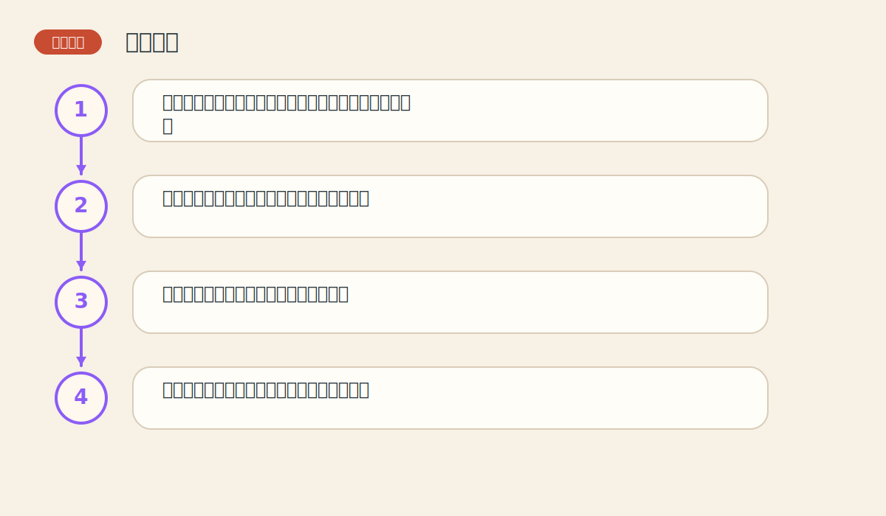

# 第三章 图表简介

> PDF页范围：28-39。核心图示：线图-条形图-点数图对照。

**一句话总纲**：图表是把市场历史压缩成一张能被人快速阅读的地图，不同图表适合回答不同问题。

## 这章到底在讲什么

如果连图表的语言都没学会，后面的趋势线、形态和指标就像在陌生语法里背单词。 作者在这一章真正想训练的，不只是识别名词，而是把市场现象翻译成一套能重复使用的判断语言。

## 本章核心术语

- **线图**：通常用收盘价连成的一条线，简洁清楚。
- **条形图**：包含高、低、开、收四个价格点。
- **点数图**：弱化时间、强化价格结构的图表方式。
- **对数刻度**：按百分比变化呈现距离，适合长期比较。

## 关键知识

### 关键知识 1：图表是时间序列的可视化

图表把历史价格排成有顺序的故事，让人一眼看到方向、速度和波动。 站在零基础读者角度，可以先把它理解成一句很朴素的话：市场在这里留下了一个可重复辨认的行为模式。

**怎么看**：先分清横轴是时间，纵轴是价格，再看图形在讲什么故事。

**最容易错在哪里**：只把图表看成漂亮曲线，不知道它在压缩历史。

**真正能带走的收获**：你读的不是图，而是时间中的行为变化。

### 关键知识 2：不同图表强调的信息不同

线图看收盘价更简洁，条形图看高低开收更完整，点数图更强调价格结构。 站在零基础读者角度，可以先把它理解成一句很朴素的话：市场在这里留下了一个可重复辨认的行为模式。

**怎么看**：先想自己想回答什么问题，再选图。

**最容易错在哪里**：用不适合的问题去逼一种图表给答案。

**真正能带走的收获**：工具和问题要匹配。

### 关键知识 3：算术刻度和对数刻度会改变视觉感受

同样的价格变化，在不同刻度下看起来会不一样，尤其是长期图。 站在零基础读者角度，可以先把它理解成一句很朴素的话：市场在这里留下了一个可重复辨认的行为模式。

**怎么看**：长期比较涨跌幅时，对数刻度更公平。

**最容易错在哪里**：在长期图上用算术刻度比较不同阶段涨幅。

**真正能带走的收获**：先检查刻度，再做结论。

### 关键知识 4：日线图不仅有价格，还有量与持仓兴趣

价格告诉你方向，交易量告诉你热度，持仓兴趣提示参与结构。 站在零基础读者角度，可以先把它理解成一句很朴素的话：市场在这里留下了一个可重复辨认的行为模式。

**怎么看**：把图表当作三维信息，而不是只有一条价格线。

**最容易错在哪里**：只盯价格，不看量价是否一致。

**真正能带走的收获**：完整图表比单一收盘价丰富得多。

### 关键知识 5：图表的时间尺度会改变结论

一分钟图、日线图和月线图看到的世界不同。 站在零基础读者角度，可以先把它理解成一句很朴素的话：市场在这里留下了一个可重复辨认的行为模式。

**怎么看**：每次分析前先说清楚自己用的是哪个周期。

**最容易错在哪里**：拿短周期噪音去否定长周期趋势。

**真正能带走的收获**：周期先于结论，是所有分析的门口。

## 直观比喻

像地图有地铁图、行政区图和地形图。它们都在说同一座城市，但强调的重点不同。

## 典型图示怎么读

上面的核心图示并不是为了让你死记图样，而是帮你抓住 `线图-条形图-点数图对照` 背后的结构关系。真正该记住的是：先看背景，再看结构，再看确认，最后才谈动作。

## 3 个最容易误解的问题

- **图表只要看一种就够了吗？**
  答：不一定。不同图表像不同镜头，组合看更全面。
- **长期图和短期图哪个更真实？**
  答：都真实，只是讲述层次不同。
- **点数图没有时间是不是少了重要信息？**
  答：它是故意弱化时间，以突出价格结构和买卖信号。

## 本章收获清单

- 知道图表是压缩历史的工具，不是装饰图形。
- 能分清线图、条形图和点数图的用法差别。
- 知道刻度会影响视觉判断。
- 理解周期与图表类型选择的重要性。
- 开始用更系统的方式读取市场信息。

## 如果讲给完全不懂的人听

你可以这样概括这一章：图表是把市场历史压缩成一张能被人快速阅读的地图，不同图表适合回答不同问题。 先把这件事讲成一个生活故事，再回到图表上找对应证据，理解会快很多。
