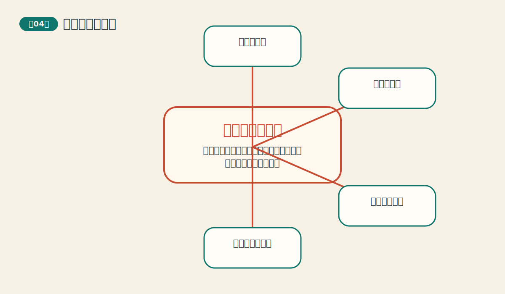
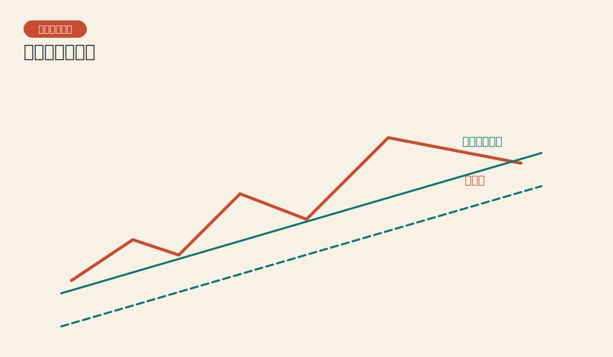
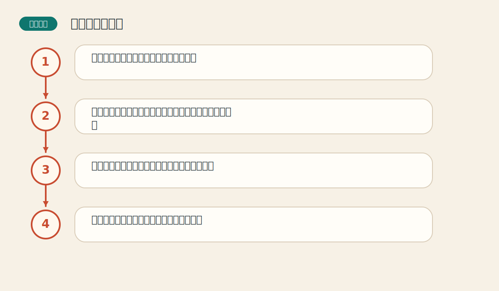

# 第四章 趋势的基本概念

> PDF页范围：40-79。核心图示：趋势线与通道。

**一句话总纲**：趋势不是模糊感觉，而是由一连串高点和低点构成的方向结构。

## 这章到底在讲什么

整本书的大多数工具都是为识别趋势服务的，这一章是全书最常用的基础动作课。 作者在这一章真正想训练的，不只是识别名词，而是把市场现象翻译成一套能重复使用的判断语言。

## 本章核心术语

- **上升趋势**：高点和低点依次抬高的结构。
- **支撑**：价格下落到某区域时更容易遇到买盘的位置。
- **阻挡**：价格上升到某区域时更容易遇到卖压的位置。
- **通道**：由趋势线及其平行线构成的价格运行走廊。

## 关键知识

### 关键知识 1：趋势由峰和谷构成

上升趋势是更高的高点和更高的低点，下降趋势则相反。 站在零基础读者角度，可以先把它理解成一句很朴素的话：市场在这里留下了一个可重复辨认的行为模式。

**怎么看**：不要只看最新一根K线，而要看一串波峰和波谷的关系。

**最容易错在哪里**：把单次反弹看成趋势逆转。

**真正能带走的收获**：趋势的判断标准从此可以被说清楚。

### 关键知识 2：趋势有三种方向

上升、下降、横向盘整。横向不是空白，而是市场在重新分配力量。 站在零基础读者角度，可以先把它理解成一句很朴素的话：市场在这里留下了一个可重复辨认的行为模式。

**怎么看**：盘整期多观察边界，不急着选方向。

**最容易错在哪里**：没有趋势时也强行做趋势交易。

**真正能带走的收获**：学会识别“该等”的时刻。

### 关键知识 3：支撑与阻挡是心理关口

支撑像地板，阻挡像天花板，反映的是买卖双方记忆和情绪。 站在零基础读者角度，可以先把它理解成一句很朴素的话：市场在这里留下了一个可重复辨认的行为模式。

**怎么看**：看价格接近关键水平时，是被挡回去，还是带量突破。

**最容易错在哪里**：把水平位当成一条精确到点的线。

**真正能带走的收获**：关键区间比单一点位更重要。

### 关键知识 4：趋势线和通道帮助你看方向与节奏

趋势线给方向，通道给边界，两者一起能帮助判断趋势是否健康。 站在零基础读者角度，可以先把它理解成一句很朴素的话：市场在这里留下了一个可重复辨认的行为模式。

**怎么看**：至少需要两个点画线，第三次触碰更值得重视。

**最容易错在哪里**：为了贴合自己的想法，任意连线。

**真正能带走的收获**：图上的线不是艺术涂鸦，而是纪律工具。

### 关键知识 5：时间越长的趋势，影响越大

同样一条线，在月线里比在分钟图里更有分量。 站在零基础读者角度，可以先把它理解成一句很朴素的话：市场在这里留下了一个可重复辨认的行为模式。

**怎么看**：先从大级别定背景，再回到小级别找节奏。

**最容易错在哪里**：被短线波动吓得忘记大方向。

**真正能带走的收获**：先森林，后树木。

## 直观比喻

像上楼梯。只要每一层台阶都比前一层高，哪怕中间停一下，整体仍然是在往上。

## 典型图示怎么读

上面的核心图示并不是为了让你死记图样，而是帮你抓住 `趋势线与通道` 背后的结构关系。真正该记住的是：先看背景，再看结构，再看确认，最后才谈动作。

## 3 个最容易误解的问题

- **趋势线是不是只要两点就绝对可靠？**
  答：两点能画线，但三次以上验证后才更值得信任。
- **支撑和阻挡会百分之百有效吗？**
  答：不会。它们是高概率区域，不是钢板和水泥墙。
- **盘整是不是完全没意义？**
  答：不是。盘整恰恰是在为下一段趋势储备力量。

## 本章收获清单

- 能用结构语言而不是感觉语言描述趋势。
- 知道横盘也是一种状态，不是分析空档。
- 理解支撑、阻挡和通道的实战意义。
- 知道趋势线需要验证而不是想当然。
- 建立多周期先后顺序的思维方式。

## 如果讲给完全不懂的人听

你可以这样概括这一章：趋势不是模糊感觉，而是由一连串高点和低点构成的方向结构。 先把这件事讲成一个生活故事，再回到图表上找对应证据，理解会快很多。
