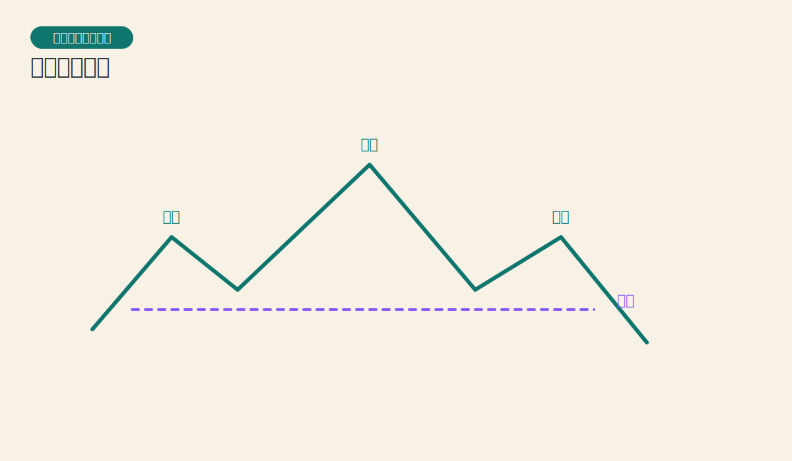
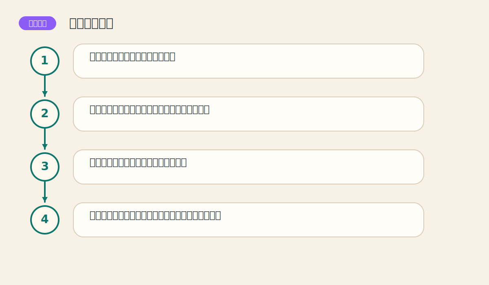

# 第五章 主要反转形态

> PDF页范围：80-104。核心图示：头肩顶与双重顶底。

**一句话总纲**：大趋势要转身，通常不会一瞬间完成，而会先在图上搭出可识别的反转舞台。

## 这章到底在讲什么

很多交易者最大的痛苦，就是把调整看成反转，或把反转当成调整。这一章就是学会分辨两者。 作者在这一章真正想训练的，不只是识别名词，而是把市场现象翻译成一套能重复使用的判断语言。

## 本章核心术语

- **反转形态**：提示原有趋势可能结束并转向的图表结构。
- **头肩顶/底**：最经典的顶部或底部反转结构。
- **颈线**：反转结构中的关键确认线。
- **测算目标**：通过形态高度推算的大致目标区间。

## 关键知识

### 关键知识 1：反转前必须先有明确趋势

如果前面没有趋势，后面就谈不上反转。 站在零基础读者角度，可以先把它理解成一句很朴素的话：市场在这里留下了一个可重复辨认的行为模式。

**怎么看**：先看此前市场是否已经走出一段清晰方向。

**最容易错在哪里**：在杂乱横盘里硬找头肩顶。

**真正能带走的收获**：反转形态的上下文和图形本身一样重要。

### 关键知识 2：头肩形是最典型的反转结构

左肩、头部、右肩和颈线一起构成市场由强转弱的过程。 站在零基础读者角度，可以先把它理解成一句很朴素的话：市场在这里留下了一个可重复辨认的行为模式。

**怎么看**：重点不是名字，而是高点抬不动、低点守不住这两个变化。

**最容易错在哪里**：只认图样，不看成交量和颈线突破。

**真正能带走的收获**：会用结构而不是图案记忆头肩形。

### 关键知识 3：双重顶底是市场两次试探失败

价格第二次冲顶或探底失败，说明原方向的力量开始枯竭。 站在零基础读者角度，可以先把它理解成一句很朴素的话：市场在这里留下了一个可重复辨认的行为模式。

**怎么看**：等中间低点或高点被突破，形态才真正完成。

**最容易错在哪里**：第二个峰刚出来就提前宣布完成。

**真正能带走的收获**：完成比猜测更重要。

### 关键知识 4：交易量是反转可信度的重要证据

反转不是孤零零的图形，它常伴随量能和动能的变化。 站在零基础读者角度，可以先把它理解成一句很朴素的话：市场在这里留下了一个可重复辨认的行为模式。

**怎么看**：突破颈线或关键位时，最好有量能配合。

**最容易错在哪里**：把没有确认的轮廓当成正式信号。

**真正能带走的收获**：图形与量能合看，误判会少很多。

### 关键知识 5：反转形态通常还能估算目标位

从形态高度推算目标位，是把形态变成交易计划的关键一步。 站在零基础读者角度，可以先把它理解成一句很朴素的话：市场在这里留下了一个可重复辨认的行为模式。

**怎么看**：先确认突破，再做测量，不要本末倒置。

**最容易错在哪里**：只盯目标位，不做风险控制。

**真正能带走的收获**：目标位是参考，不是保证兑现的承诺书。

## 直观比喻

像大船掉头。快艇可以猛打一把方向盘，但大船必须先减速、摆尾、再完成转向。

## 典型图示怎么读

上面的核心图示并不是为了让你死记图样，而是帮你抓住 `头肩顶与双重顶底` 背后的结构关系。真正该记住的是：先看背景，再看结构，再看确认，最后才谈动作。

## 3 个最容易误解的问题

- **长得像头肩顶就一定会跌吗？**
  答：不一定。必须等颈线被有效突破，且最好配合量能。
- **V形反转是不是最好做？**
  答：恰恰相反，它往往速度太快，最难提前准备。
- **目标位算出来就一定会到吗？**
  答：不是。目标位是预估区间，不是必中终点。

## 本章收获清单

- 知道反转要先有趋势这个前提。
- 能用结构语言识别头肩形和双重顶底。
- 理解量能在反转确认里的作用。
- 知道何时形态“像”，何时形态“成”。
- 开始把图形识别连到交易计划上。

## 如果讲给完全不懂的人听

你可以这样概括这一章：大趋势要转身，通常不会一瞬间完成，而会先在图上搭出可识别的反转舞台。 先把这件事讲成一个生活故事，再回到图表上找对应证据，理解会快很多。
