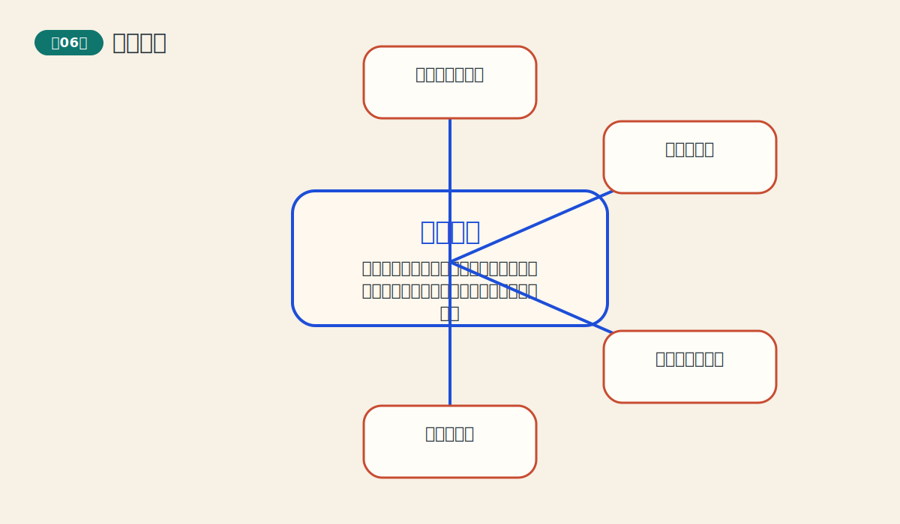
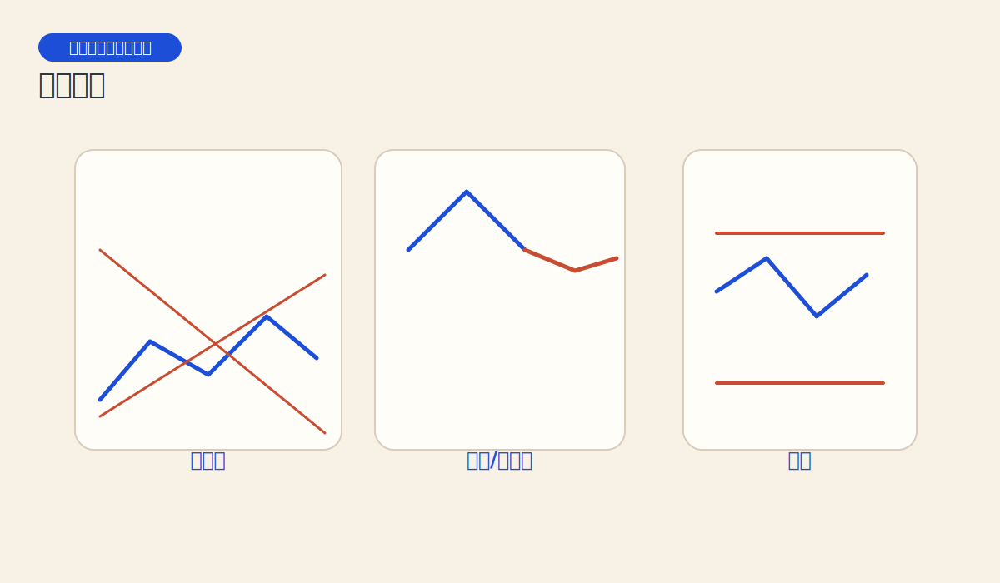
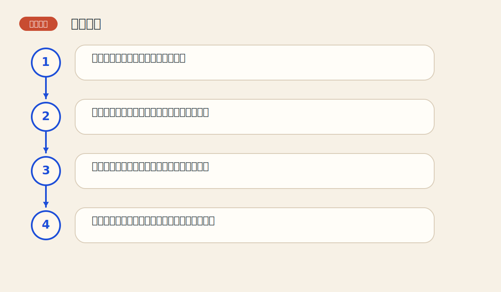

# 第六章 持续形态

> PDF页范围：105-136。核心图示：三角形、旗形与矩形。

**一句话总纲**：很多横盘不是转向，而是趋势中途喘口气；持续形态就是读懂这口气值不值得继续跟。

## 这章到底在讲什么

多数交易者害怕震荡，往往在真正趋势恢复前被甩下车。学会持续形态，就能把休息看成结构。 作者在这一章真正想训练的，不只是识别名词，而是把市场现象翻译成一套能重复使用的判断语言。

## 本章核心术语

- **持续形态**：提示原趋势更可能恢复而非反转的结构。
- **三角形**：价格波动空间不断收敛的整理结构。
- **旗形**：快速趋势后出现的短暂小通道整理。
- **突破**：价格有效离开整理边界并给出方向。

## 关键知识

### 关键知识 1：持续形态是趋势的暂停键

市场在前进途中会整理筹码、平衡情绪，随后再沿原方向延续。 站在零基础读者角度，可以先把它理解成一句很朴素的话：市场在这里留下了一个可重复辨认的行为模式。

**怎么看**：先看前面有没有明显趋势，再判断这段横盘更像修整还是转身。

**最容易错在哪里**：把所有横盘都当成无意义噪音。

**真正能带走的收获**：震荡不一定可怕，关键看它依附在哪段趋势之后。

### 关键知识 2：三角形是力量收敛的典型结构

价格高点越来越低、低点越来越高，说明买卖双方都在压缩空间。 站在零基础读者角度，可以先把它理解成一句很朴素的话：市场在这里留下了一个可重复辨认的行为模式。

**怎么看**：观察突破最终朝哪个方向发生，以及是否顺应前势。

**最容易错在哪里**：在三角形中间位置过早下注。

**真正能带走的收获**：等待接近末端的突破，比中途猜方向更稳。

### 关键知识 3：旗形和三角旗形常出现在快趋势中

它们通常时间短、斜率小，像一面被风吹斜的小旗。 站在零基础读者角度，可以先把它理解成一句很朴素的话：市场在这里留下了一个可重复辨认的行为模式。

**怎么看**：先有急速上涨或下跌的旗杆，再看短暂整理是否延续原势。

**最容易错在哪里**：没有旗杆也硬把小通道叫旗形。

**真正能带走的收获**：结构背景决定图形身份。

### 关键知识 4：矩形像市场在区间里来回试探

价格反复撞击上边界和下边界，直到一边获胜。 站在零基础读者角度，可以先把它理解成一句很朴素的话：市场在这里留下了一个可重复辨认的行为模式。

**怎么看**：区间突破比区间内部猜涨跌更有效。

**最容易错在哪里**：在矩形中央追涨杀跌。

**真正能带走的收获**：边界比中间更有信息量。

### 关键知识 5：持续形态也有测算意义

很多持续形态可以通过旗杆或形态高度估算后续空间。 站在零基础读者角度，可以先把它理解成一句很朴素的话：市场在这里留下了一个可重复辨认的行为模式。

**怎么看**：把测算和原趋势方向结合，而不是单独使用。

**最容易错在哪里**：只因“有目标位”就忽略失败突破的风险。

**真正能带走的收获**：测算帮助规划，但不取消止损。

## 直观比喻

像长跑运动员补一口气。停一停不是放弃比赛，而是为了跑得更远。

## 典型图示怎么读

上面的核心图示并不是为了让你死记图样，而是帮你抓住 `三角形、旗形与矩形` 背后的结构关系。真正该记住的是：先看背景，再看结构，再看确认，最后才谈动作。

## 3 个最容易误解的问题

- **三角形一出现就要立刻交易吗？**
  答：不。多数时候等待突破更合理。
- **整理越久越一定延续原趋势吗？**
  答：不一定。持续形态是高概率，不是绝对定律。
- **所有小通道都叫旗形吗？**
  答：不是。旗形强调前面必须先有强趋势作为旗杆。

## 本章收获清单

- 知道持续形态的本质是休整，而非随机停顿。
- 能分清三角形、旗形和矩形的不同语气。
- 知道为什么区间边界比中间更重要。
- 理解旗杆、突破和测算之间的关系。
- 学会在等待中寻找更高质量信号。

## 如果讲给完全不懂的人听

你可以这样概括这一章：很多横盘不是转向，而是趋势中途喘口气；持续形态就是读懂这口气值不值得继续跟。 先把这件事讲成一个生活故事，再回到图表上找对应证据，理解会快很多。
