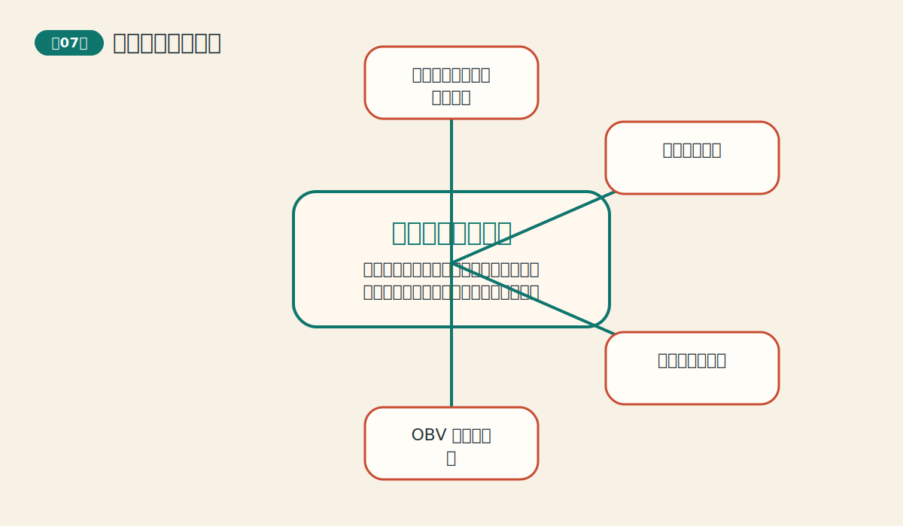
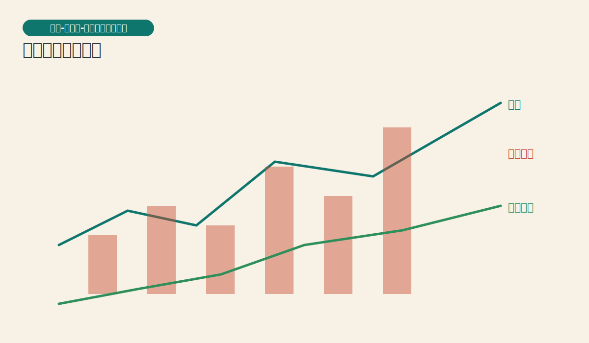
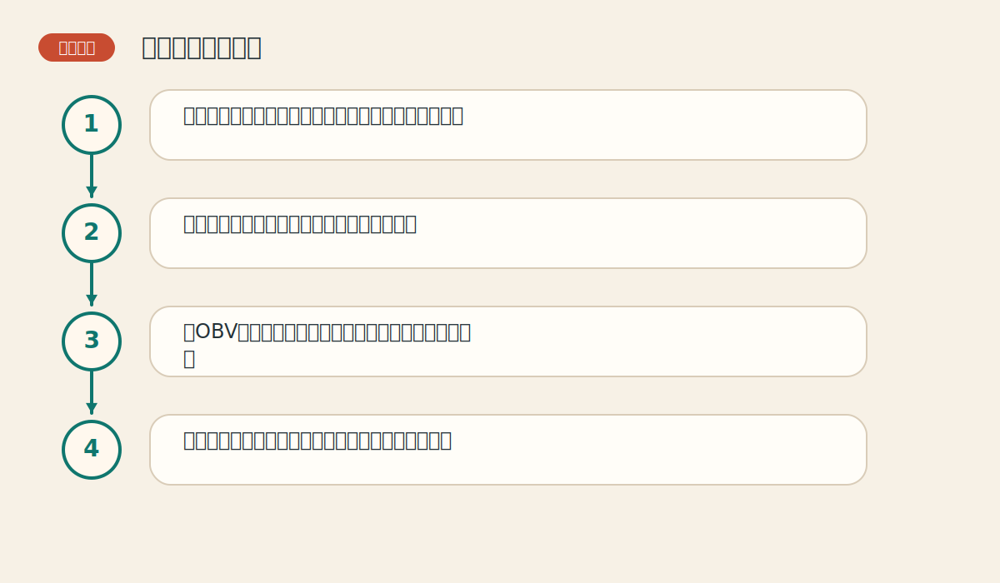

# 第七章 交易量和持仓兴趣

> PDF页范围：137-160。核心图示：价格-交易量-持仓兴趣三维关系。

**一句话总纲**：价格是主角，交易量和持仓兴趣像两盏辅助照明灯，能让你看清趋势是否站得住。

## 这章到底在讲什么

这章把图表从二维提升到三维。很多模糊判断，正是在量与持仓兴趣的帮助下变清楚。 作者在这一章真正想训练的，不只是识别名词，而是把市场现象翻译成一套能重复使用的判断语言。

## 本章核心术语

- **交易量**：一段时间内成交了多少合约。
- **持仓兴趣**：市场上仍然未平仓的合约总量。
- **OBV**：权衡交易量指标，用累积方式观察量能方向。
- **背离**：价格和辅助指标不再同步的现象。

## 关键知识

### 关键知识 1：价格最重要，量和持仓是验证者

价格负责给方向，交易量和持仓兴趣负责补充说明这个方向的质量。 站在零基础读者角度，可以先把它理解成一句很朴素的话：市场在这里留下了一个可重复辨认的行为模式。

**怎么看**：先看价格结论，再看量与持仓是否同意。

**最容易错在哪里**：把辅助指标的地位抬得比价格还高。

**真正能带走的收获**：主次分清，分析才不会乱套。

### 关键知识 2：交易量揭示趋势是否有力

趋势顺行时放量、回撤时缩量，通常代表趋势更健康。 站在零基础读者角度，可以先把它理解成一句很朴素的话：市场在这里留下了一个可重复辨认的行为模式。

**怎么看**：注意突破时量能是否放大，这是很多形态是否可靠的关键。

**最容易错在哪里**：只看价格突破，不看是否有成交支持。

**真正能带走的收获**：量像市场说话的音量。

### 关键知识 3：持仓兴趣反映新资金是否进场

持仓兴趣上升常代表新的参与者和新的承诺进入市场。 站在零基础读者角度，可以先把它理解成一句很朴素的话：市场在这里留下了一个可重复辨认的行为模式。

**怎么看**：价格上涨时若持仓兴趣同步增加，通常更偏正面。

**最容易错在哪里**：把交易量和持仓兴趣当成同一个东西。

**真正能带走的收获**：一个看热闹，一个看真正留在场上的力量。

### 关键知识 4：OBV 用累积方法追踪量价关系

OBV 把上涨日量能加进去、下跌日量能减出去，用趋势看资金脚步。 站在零基础读者角度，可以先把它理解成一句很朴素的话：市场在这里留下了一个可重复辨认的行为模式。

**怎么看**：重点看OBV方向与价格是否同步，尤其是背离。

**最容易错在哪里**：过分在意OBV的绝对数值大小。

**真正能带走的收获**：方向比数字本身更重要。

### 关键知识 5：背离是预警，不是自动反转按钮

量价背离或OBV背离说明结构开始不协调，但还需要价格确认。 站在零基础读者角度，可以先把它理解成一句很朴素的话：市场在这里留下了一个可重复辨认的行为模式。

**怎么看**：把背离当作提高警惕、收紧风控的信号。

**最容易错在哪里**：一看到背离就立刻逆势出手。

**真正能带走的收获**：背离先是黄灯，不是红灯。

## 直观比喻

像看一场拔河。绳子往哪边移动是价格，围观的人越来越多是交易量，真正还在场上用力的人数变化则像持仓兴趣。

## 典型图示怎么读

上面的核心图示并不是为了让你死记图样，而是帮你抓住 `价格-交易量-持仓兴趣三维关系` 背后的结构关系。真正该记住的是：先看背景，再看结构，再看确认，最后才谈动作。

## 3 个最容易误解的问题

- **放量就一定上涨吗？**
  答：不是。放量只表示动作大，方向还得结合价格判断。
- **持仓兴趣升高总是利多吗？**
  答：不是。它表示新资金进入，具体偏多还是偏空要结合价格方向看。
- **OBV 一背离就该立刻反手吗？**
  答：不。背离更像预警，价格确认后才更有行动基础。

## 本章收获清单

- 知道价格、交易量和持仓兴趣的主次关系。
- 理解量能对突破和趋势的验证作用。
- 能分清交易量和持仓兴趣的不同含义。
- 知道OBV看方向不看绝对值。
- 学会把背离当预警而不是命令。

## 如果讲给完全不懂的人听

你可以这样概括这一章：价格是主角，交易量和持仓兴趣像两盏辅助照明灯，能让你看清趋势是否站得住。 先把这件事讲成一个生活故事，再回到图表上找对应证据，理解会快很多。
