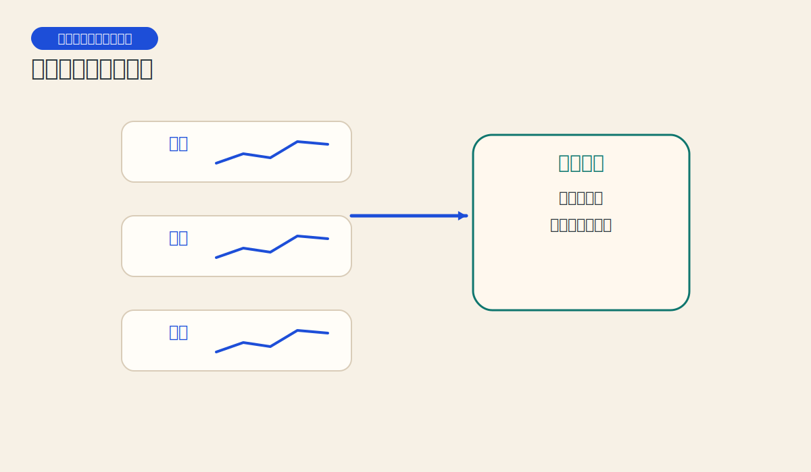
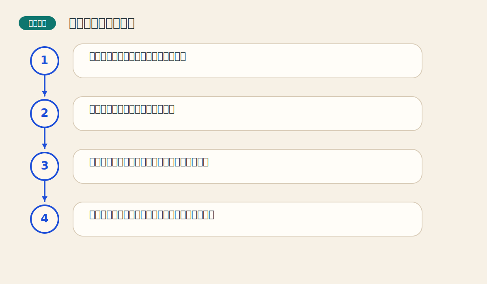

# 第八章 长期图表和商品指数

> PDF页范围：161-180。核心图示：长期图与商品指数视角。

**一句话总纲**：长期图像从山顶往下看，能让人从短期噪音里抬头，看见真正的大地形。

## 这章到底在讲什么

很多错误不是因为不会看图，而是把显微镜当望远镜。长期图表帮助读者回到更大的背景。 作者在这一章真正想训练的，不只是识别名词，而是把市场现象翻译成一套能重复使用的判断语言。

## 本章核心术语

- **周线图**：每根线代表一周价格行为的图表。
- **月线图**：每根线代表一个月价格行为的图表。
- **连续图**：把不同交割合约连接成可看长期趋势的图。
- **商品指数**：用一篮子商品构成的综合价格指标。

## 关键知识

### 关键知识 1：长期图能过滤噪音

周线和月线会把日常杂讯压缩掉，保留更重要的方向信息。 站在零基础读者角度，可以先把它理解成一句很朴素的话：市场在这里留下了一个可重复辨认的行为模式。

**怎么看**：先看长期图定背景，再到日线找执行节奏。

**最容易错在哪里**：只盯日线，在短期起伏里反复改主意。

**真正能带走的收获**：先大后小，心态会稳很多。

### 关键知识 2：连续图表解决合约到期断裂问题

单个期货合约寿命有限，连续图把多份合约接起来，才能研究长期趋势。 站在零基础读者角度，可以先把它理解成一句很朴素的话：市场在这里留下了一个可重复辨认的行为模式。

**怎么看**：做长期分析时，优先看连续周线或连续月线。

**最容易错在哪里**：拿单一交割合约去讨论多年大趋势。

**真正能带走的收获**：连续图是长期分析的基本语法。

### 关键知识 3：商品指数像市场温度计

单一品种会被个别供需影响，指数更能反映一类商品或整体商品环境。 站在零基础读者角度，可以先把它理解成一句很朴素的话：市场在这里留下了一个可重复辨认的行为模式。

**怎么看**：看指数能帮助判断当前是个别行情还是更广泛的主题行情。

**最容易错在哪里**：看到一个品种强就以为所有商品都强。

**真正能带走的收获**：局部与整体要互相校验。

### 关键知识 4：长期支撑阻挡更有分量

在月线图上反复被验证的区域，比日线上的小区间更值得尊重。 站在零基础读者角度，可以先把它理解成一句很朴素的话：市场在这里留下了一个可重复辨认的行为模式。

**怎么看**：长期图上的关键位，是制定中长期计划的重要参考。

**最容易错在哪里**：用短期突破否定长期结构。

**真正能带走的收获**：越大的级别，越不该轻易忽略。

### 关键知识 5：长期图帮助建立战略视角

短线交易靠战术，长期图决定你站在哪支队伍里。 站在零基础读者角度，可以先把它理解成一句很朴素的话：市场在这里留下了一个可重复辨认的行为模式。

**怎么看**：把长期趋势看作地图，再把短期波动看作路径选择。

**最容易错在哪里**：战术忙碌，却没有战略方向。

**真正能带走的收获**：先有大地图，再谈快走慢走。

## 直观比喻

像登山。站在山脚只能看到脚边石头，爬高以后，整条山脉的走向才清楚。

## 典型图示怎么读

上面的核心图示并不是为了让你死记图样，而是帮你抓住 `长期图与商品指数视角` 背后的结构关系。真正该记住的是：先看背景，再看结构，再看确认，最后才谈动作。

## 3 个最容易误解的问题

- **长期图会不会太慢，失去实用价值？**
  答：不会。它不是替代执行，而是提供背景。
- **只要长期看多，就能忽略短期风险吗？**
  答：不能。长期背景和短期执行必须配合。
- **指数强就代表每个成分都强吗？**
  答：不一定。指数反映平均温度，不代表每个角落都一样热。

## 本章收获清单

- 知道长期图的价值在于过滤噪音与建立背景。
- 理解连续图为何是期货长期分析必需品。
- 能把商品指数当作宏观温度计使用。
- 知道长期关键位在计划中的重要性。
- 开始建立战略先于战术的分析习惯。

## 如果讲给完全不懂的人听

你可以这样概括这一章：长期图像从山顶往下看，能让人从短期噪音里抬头，看见真正的大地形。 先把这件事讲成一个生活故事，再回到图表上找对应证据，理解会快很多。
