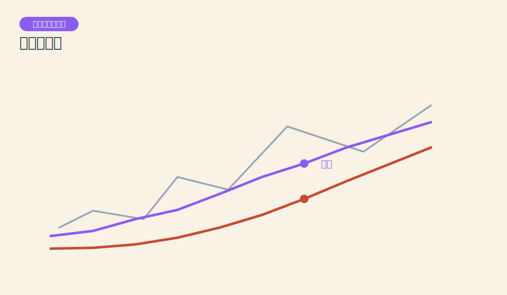
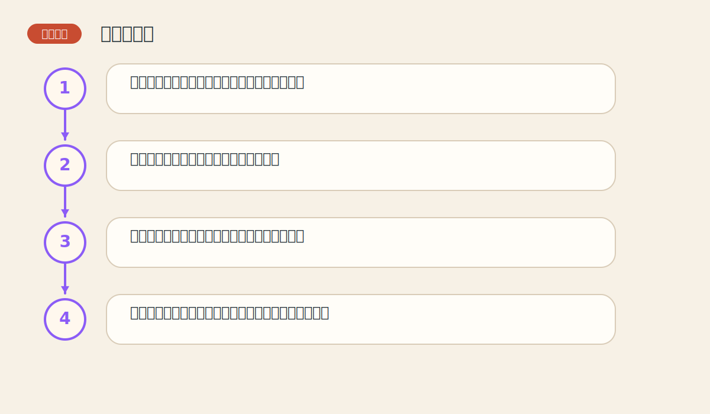

# 第九章 移动平均线

> PDF页范围：181-212。核心图示：均线平滑与交叉。

**一句话总纲**：移动平均线像给价格加了一个平滑滤镜，让趋势轮廓更容易被看清。

## 这章到底在讲什么

这是最容易量化、也最适合计算机化的趋势工具之一，是很多交易系统的骨架。 作者在这一章真正想训练的，不只是识别名词，而是把市场现象翻译成一套能重复使用的判断语言。

## 本章核心术语

- **移动平均线**：对一段时间价格做滚动平均形成的曲线。
- **滞后**：信号跟在价格之后出现的特性。
- **金叉/死叉**：短均线上穿或下穿长均线的交叉信号。
- **平滑**：把杂乱波动压缩成更容易看懂的趋势轮廓。

## 关键知识

### 关键知识 1：移动平均线用过去价格做平滑

它把若干日价格求平均，让曲线更顺，噪音更少。 站在零基础读者角度，可以先把它理解成一句很朴素的话：市场在这里留下了一个可重复辨认的行为模式。

**怎么看**：平均线向上说明过去一段时间总体在变强，向下则相反。

**最容易错在哪里**：把均线看成会预测未来的神线。

**真正能带走的收获**：均线先是描述器，然后才是信号器。

### 关键知识 2：平均线天生滞后

因为它用的是过去的数据，所以趋势已经开始后它才逐步跟上。 站在零基础读者角度，可以先把它理解成一句很朴素的话：市场在这里留下了一个可重复辨认的行为模式。

**怎么看**：用均线换来的是稳定感，不是最早入场权。

**最容易错在哪里**：又想要均线稳定，又嫌它不够早。

**真正能带走的收获**：工具的优点和代价总是绑在一起。

### 关键知识 3：交叉信号把趋势变成规则

短期均线上穿长期均线，代表近期力量可能更强；下穿则相反。 站在零基础读者角度，可以先把它理解成一句很朴素的话：市场在这里留下了一个可重复辨认的行为模式。

**怎么看**：均线交叉更适合趋势明确的市场，横盘时容易来回打脸。

**最容易错在哪里**：不分市场环境，到处套用交叉系统。

**真正能带走的收获**：均线系统怕震荡，爱趋势。

### 关键知识 4：均线也能当动态支撑与阻挡

在趋势行情里，价格常围绕均线回撤后再启动。 站在零基础读者角度，可以先把它理解成一句很朴素的话：市场在这里留下了一个可重复辨认的行为模式。

**怎么看**：观察价格是贴着均线健康前进，还是频繁跌破。

**最容易错在哪里**：把每次碰均线都当成必定反弹的机会。

**真正能带走的收获**：均线是参考轨道，不是弹簧床。

### 关键知识 5：参数没有万能答案

不同市场、不同周期、不同任务，适合的均线长度不同。 站在零基础读者角度，可以先把它理解成一句很朴素的话：市场在这里留下了一个可重复辨认的行为模式。

**怎么看**：参数要服务于策略目的，而不是追求“神奇数字”。

**最容易错在哪里**：执着寻找放之四海而皆准的最佳均线。

**真正能带走的收获**：先定义任务，再选参数。

## 直观比喻

像坐车时看路边风景。车窗很脏会看不清，平均线就是把飞快闪过的碎影擦平一点。

## 典型图示怎么读

上面的核心图示并不是为了让你死记图样，而是帮你抓住 `均线平滑与交叉` 背后的结构关系。真正该记住的是：先看背景，再看结构，再看确认，最后才谈动作。

## 3 个最容易误解的问题

- **均线是不是越多越好？**
  答：不是。线太多只会让判断更混乱。
- **金叉一定意味着大涨吗？**
  答：不一定。横盘环境里的交叉常常失效。
- **最好的均线参数有没有标准答案？**
  答：没有。参数应与市场性质和交易任务匹配。

## 本章收获清单

- 理解均线的本质是平滑过去数据。
- 接受均线一定会滞后的事实。
- 知道交叉系统适合趋势，不适合乱市。
- 会把均线当作轨道而不是神谕。
- 懂得参数选择必须服务于策略目标。

## 如果讲给完全不懂的人听

你可以这样概括这一章：移动平均线像给价格加了一个平滑滤镜，让趋势轮廓更容易被看清。 先把这件事讲成一个生活故事，再回到图表上找对应证据，理解会快很多。
