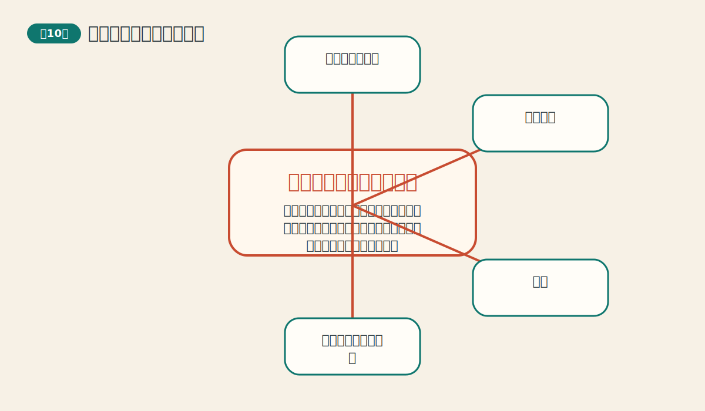
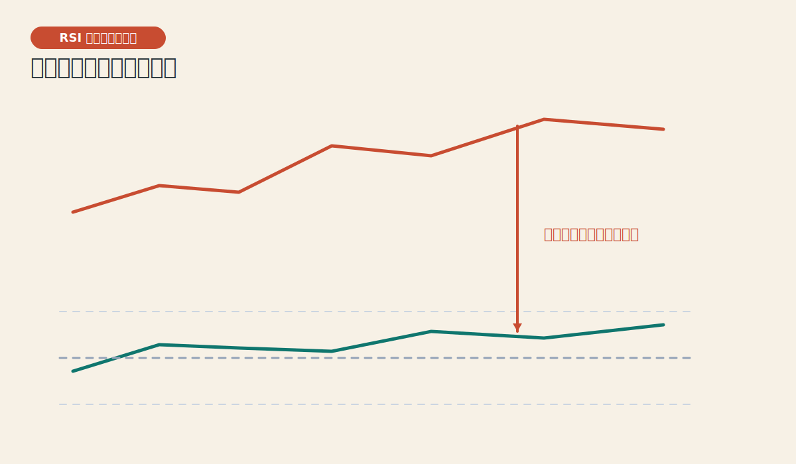
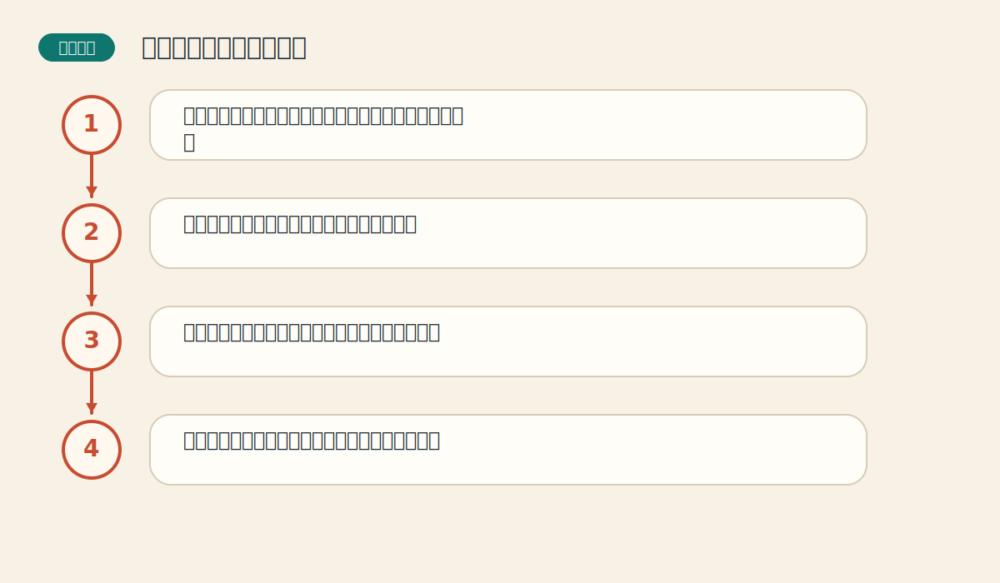

# 第十章 摆动指数和相反意见理论

> PDF页范围：213-253。核心图示：RSI 背离与情绪极端。

**一句话总纲**：当趋势工具在横盘里变钝时，摆动指标像速度表和情绪计，帮助你看见超买、超卖、背离和大众情绪的极端。

## 这章到底在讲什么

这章补上了趋势工具最怕的那一块：无趋势环境和末端衰竭信号。 作者在这一章真正想训练的，不只是识别名词，而是把市场现象翻译成一套能重复使用的判断语言。

## 本章核心术语

- **摆动指标**：用来测量市场速度、位置和极端状态的指标。
- **超买/超卖**：价格或动能处于相对极端区域的状态。
- **背离**：价格与指标不再同步创新高或创新低。
- **相反意见**：在大众情绪极端时逆向思考的方法。

## 关键知识

### 关键知识 1：摆动指标研究速度和极端状态

它们测的是涨跌的力度、速度和位置，而不只是方向。 站在零基础读者角度，可以先把它理解成一句很朴素的话：市场在这里留下了一个可重复辨认的行为模式。

**怎么看**：在横盘市场里，摆动指标往往比跟随趋势工具更有用。

**最容易错在哪里**：把摆动指标当成独立于趋势的万能工具。

**真正能带走的收获**：它是补充工具，不是替代全部分析的王者。

### 关键知识 2：超买超卖只是警报，不是立刻反手

市场可以在强趋势中长期保持超买或超卖。 站在零基础读者角度，可以先把它理解成一句很朴素的话：市场在这里留下了一个可重复辨认的行为模式。

**怎么看**：极端读数出现后，先提高警惕，再等待结构和价格确认。

**最容易错在哪里**：指标一进超买区就做空，一进超卖区就做多。

**真正能带走的收获**：强趋势能把“过热”维持很久。

### 关键知识 3：背离提示动能开始衰竭

价格创新高而指标未创新高，或价格创新低而指标未创新低，说明内在力量不再同步。 站在零基础读者角度，可以先把它理解成一句很朴素的话：市场在这里留下了一个可重复辨认的行为模式。

**怎么看**：把背离和趋势背景一起看，效果最好。

**最容易错在哪里**：仅凭一次背离就断言趋势结束。

**真正能带走的收获**：背离是提前警报，价格是最后裁判。

### 关键知识 4：不同摆动指标各有语气

动量、RSI、随机指标等都在看速度，但灵敏度和用途不同。 站在零基础读者角度，可以先把它理解成一句很朴素的话：市场在这里留下了一个可重复辨认的行为模式。

**怎么看**：先理解指标在测什么，再讨论参数。

**最容易错在哪里**：同时上十个指标，最后互相打架。

**真正能带走的收获**：少而懂，比多而乱更有价值。

### 关键知识 5：相反意见理论研究的是大众情绪极端

当绝大多数人都站在同一边时，市场往往已接近拐点。 站在零基础读者角度，可以先把它理解成一句很朴素的话：市场在这里留下了一个可重复辨认的行为模式。

**怎么看**：把情绪指标当作环境温度，不当作单独下单按钮。

**最容易错在哪里**：只要大众乐观就立刻做空，只要悲观就立刻做多。

**真正能带走的收获**：逆向不是逞强，而是等待拥挤达到极端。

## 直观比喻

像开车。趋势工具告诉你车往哪儿开，摆动指标则告诉你油门踩得有多急、发动机是不是快顶不住了。

## 典型图示怎么读

上面的核心图示并不是为了让你死记图样，而是帮你抓住 `RSI 背离与情绪极端` 背后的结构关系。真正该记住的是：先看背景，再看结构，再看确认，最后才谈动作。

## 3 个最容易误解的问题

- **RSI 到 70 就一定该卖吗？**
  答：不一定。强趋势里它可能在高位停留很久。
- **背离是不是一定会马上反转？**
  答：不是。它只是说明动力开始减弱，仍需价格确认。
- **逆向思维是不是永远和大多数人反着做？**
  答：不是。只有当共识极端拥挤时，逆向才更有意义。

## 本章收获清单

- 知道摆动指标补足的是速度与极端状态的信息。
- 理解超买超卖不是反手命令。
- 会把背离当作预警并等待价格确认。
- 懂得少数几个指标比一堆指标更有用。
- 理解逆向思维依赖的是情绪极端，而不是故意唱反调。

## 如果讲给完全不懂的人听

你可以这样概括这一章：当趋势工具在横盘里变钝时，摆动指标像速度表和情绪计，帮助你看见超买、超卖、背离和大众情绪的极端。 先把这件事讲成一个生活故事，再回到图表上找对应证据，理解会快很多。
