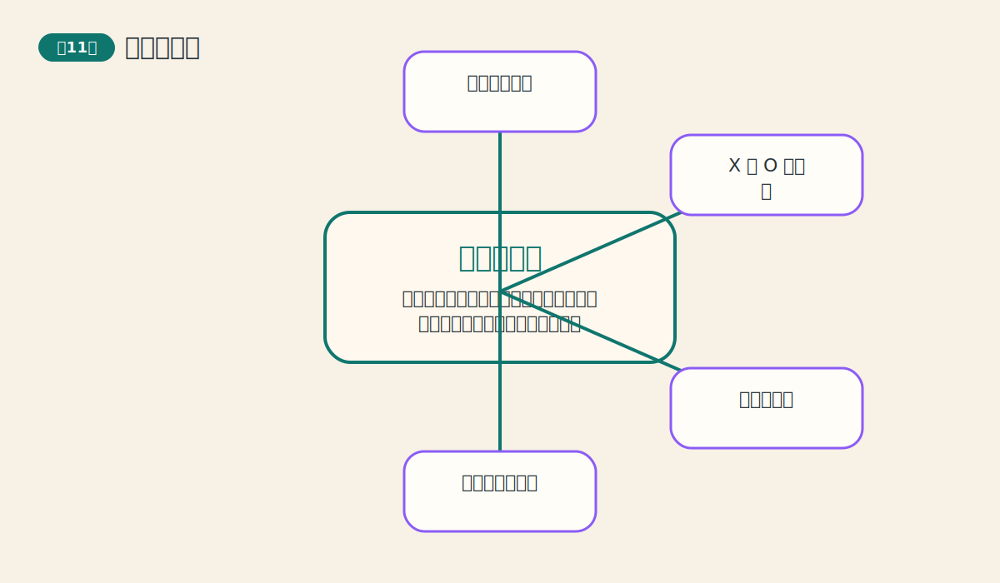
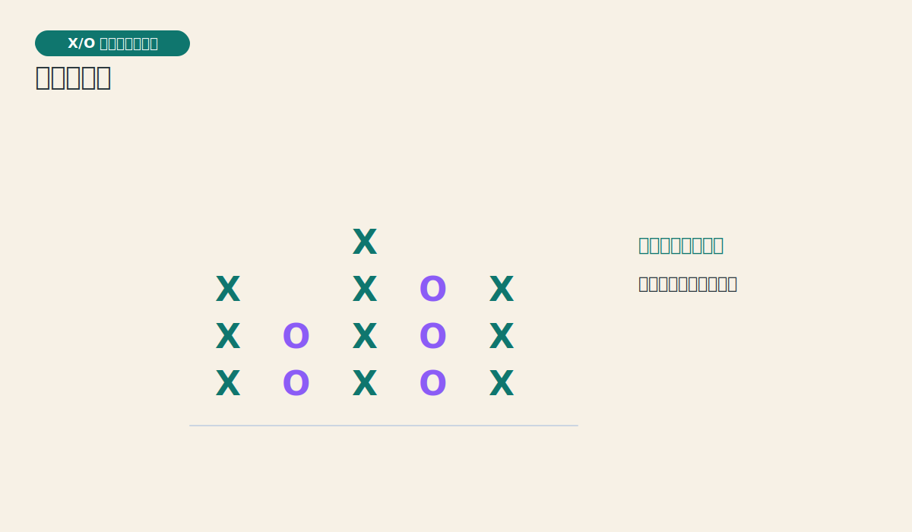
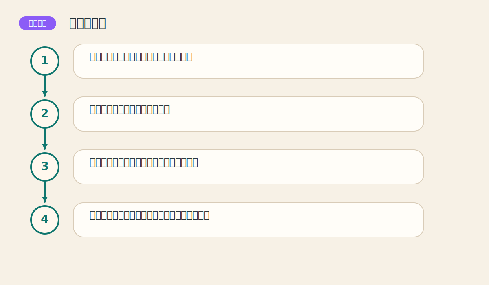

# 第十一章 日内点数图

> PDF页范围：254-272。核心图示：X/O 点数图基本结构。

**一句话总纲**：点数图把时间的噪音关小，把价格结构的骨头露出来，让买卖信号更清爽。

## 这章到底在讲什么

这章引入了一种和普通时间序列图不一样的思考方式，有助于打破“图一定跟时间走”的固定印象。 作者在这一章真正想训练的，不只是识别名词，而是把市场现象翻译成一套能重复使用的判断语言。

## 本章核心术语

- **点数图**：强调价格变化、弱化时间变化的图表。
- **箱值**：点数图中每个格子代表的价格幅度。
- **转向**：价格逆向达到规定幅度后从一列切换到另一列。
- **X/O 列**：点数图中分别记录上涨和下跌的列。

## 关键知识

### 关键知识 1：点数图突出价格，不强调时间

只有当价格移动到足够的幅度时，图上才会多一个格子。 站在零基础读者角度，可以先把它理解成一句很朴素的话：市场在这里留下了一个可重复辨认的行为模式。

**怎么看**：把它看成价格结构图，而不是时间线图。

**最容易错在哪里**：拿点数图去解释时间节奏。

**真正能带走的收获**：不同图表对应不同问题。

### 关键知识 2：X 列表示上涨，O 列表示下跌

图表用最简洁的方式把多空推进过程记录下来。 站在零基础读者角度，可以先把它理解成一句很朴素的话：市场在这里留下了一个可重复辨认的行为模式。

**怎么看**：列的切换本身就包含了方向变化信息。

**最容易错在哪里**：只看单个 X 或 O，不看整列结构。

**真正能带走的收获**：点数图更重视列与列之间的关系。

### 关键知识 3：箱值决定灵敏度

每个格子代表多大价格变动，会直接改变信号的频率与噪音水平。 站在零基础读者角度，可以先把它理解成一句很朴素的话：市场在这里留下了一个可重复辨认的行为模式。

**怎么看**：箱值越小越灵敏，越大越稳重。

**最容易错在哪里**：不管市场波动特征，随便设一个箱值。

**真正能带走的收获**：参数是在平衡速度和稳定性。

### 关键知识 4：转向规则决定什么时候换列

价格逆向移动到一定幅度，图上才从 X 列切到 O 列，或反过来。 站在零基础读者角度，可以先把它理解成一句很朴素的话：市场在这里留下了一个可重复辨认的行为模式。

**怎么看**：转向阈值越高，信号越少但更过滤噪音。

**最容易错在哪里**：不知道箱值和转向是两个不同旋钮。

**真正能带走的收获**：点数图的性格来自两个参数的组合。

### 关键知识 5：点数图能更清楚地给出突破信号

它通过结构突破来提示买卖方向，往往比普通图更规整。 站在零基础读者角度，可以先把它理解成一句很朴素的话：市场在这里留下了一个可重复辨认的行为模式。

**怎么看**：重点盯前高前低是否被列结构有效越过。

**最容易错在哪里**：把点数图当成神奇捷径，不去理解其规则。

**真正能带走的收获**：规则越清楚，纪律越容易执行。

## 直观比喻

像看人走路时只记他每次真正向前或向后的步幅，不去记录他原地晃了多少秒。

## 典型图示怎么读

上面的核心图示并不是为了让你死记图样，而是帮你抓住 `X/O 点数图基本结构` 背后的结构关系。真正该记住的是：先看背景，再看结构，再看确认，最后才谈动作。

## 3 个最容易误解的问题

- **点数图不用时间，是不是信息不完整？**
  答：它是故意舍弃一部分信息，以换取更清晰的价格结构。
- **箱值和转向是不是差不多？**
  答：不是。箱值管每格大小，转向管换列门槛。
- **点数图一定比普通图更好用吗？**
  答：不一定。它只是更适合某些结构判断。

## 本章收获清单

- 理解点数图为何要弱化时间。
- 能分清箱值和转向的不同角色。
- 知道 X/O 列在记录什么。
- 明白点数图的价值在于结构清晰。
- 学会把它当作特定任务工具，而非万能图。

## 如果讲给完全不懂的人听

你可以这样概括这一章：点数图把时间的噪音关小，把价格结构的骨头露出来，让买卖信号更清爽。 先把这件事讲成一个生活故事，再回到图表上找对应证据，理解会快很多。
