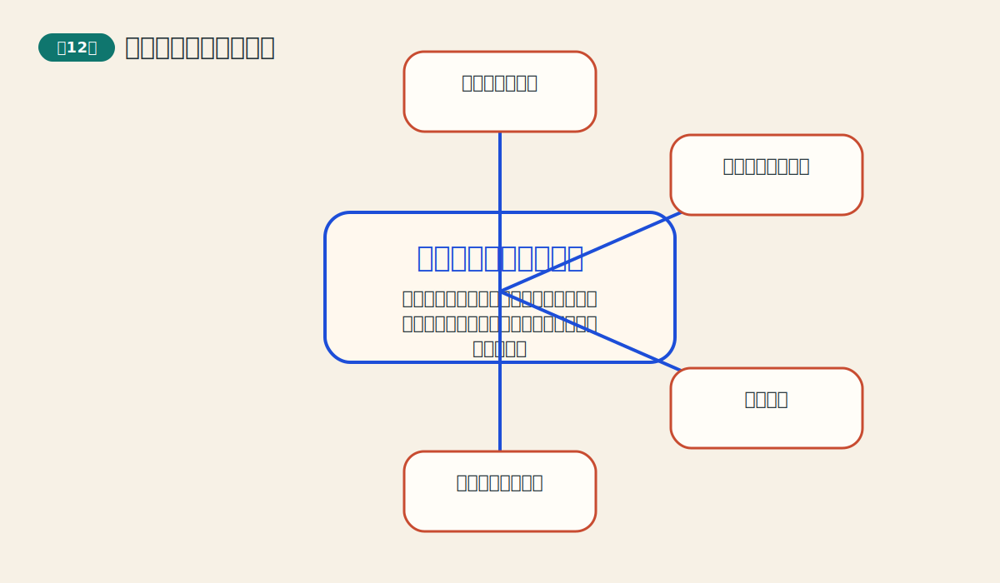
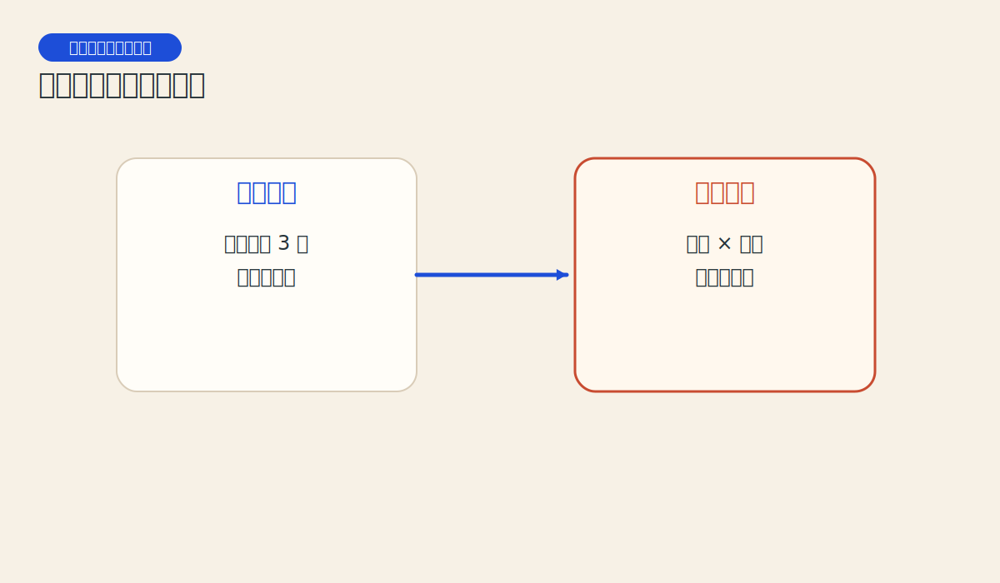
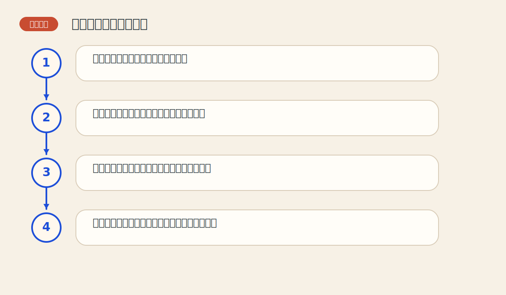

# 第十二章 三点转向和优化点数图

> PDF页范围：273-287。核心图示：三点转向与参数优化。

**一句话总纲**：三点转向法把点数图压缩得更实用，而优化思路则提醒我们：参数不是信仰，而是需要检验。

## 这章到底在讲什么

这章把前一章的点数图从“会画”推进到“会调”，也让读者接触到系统化测试的味道。 作者在这一章真正想训练的，不只是识别名词，而是把市场现象翻译成一套能重复使用的判断语言。

## 本章核心术语

- **三点转向**：价格逆向移动三格才换列的点数图规则。
- **优化**：通过测试比较不同参数效果的过程。
- **过拟合**：把规则调得太贴合历史，导致未来失灵。
- **稳定性**：一套参数在不同阶段表现是否均衡的特性。

## 关键知识

### 关键知识 1：三点转向法比一点转向更稳

它要求价格逆向达到更大幅度才换列，因此过滤了更多小噪音。 站在零基础读者角度，可以先把它理解成一句很朴素的话：市场在这里留下了一个可重复辨认的行为模式。

**怎么看**：把它理解为“慢一点，但更有把握”的版本。

**最容易错在哪里**：以为信号变少就是变差。

**真正能带走的收获**：信号少不代表价值低，关键看质量。

### 关键知识 2：最高价与最低价足够完成很多图表工作

三点转向法不再依赖完整日内逐笔资料，因此更容易普及。 站在零基础读者角度，可以先把它理解成一句很朴素的话：市场在这里留下了一个可重复辨认的行为模式。

**怎么看**：点数图的实用化，很大程度上来自资料门槛的降低。

**最容易错在哪里**：认为没有逐笔数据就无法做结构分析。

**真正能带走的收获**：好工具还要能真正被使用。

### 关键知识 3：点数图信号是参数驱动的

箱值和转向规定不同，买卖点会明显不同。 站在零基础读者角度，可以先把它理解成一句很朴素的话：市场在这里留下了一个可重复辨认的行为模式。

**怎么看**：先承认参数会改变结果，再谈比较与检验。

**最容易错在哪里**：把某套参数神圣化，忽略市场差异。

**真正能带走的收获**：任何规则系统都要面对参数敏感性。

### 关键知识 4：优化的目标不是追求完美过去

优化参数是为了找到更适合的平衡，而不是用历史过拟合出神话成绩单。 站在零基础读者角度，可以先把它理解成一句很朴素的话：市场在这里留下了一个可重复辨认的行为模式。

**怎么看**：关注稳定性而不只是历史收益最大化。

**最容易错在哪里**：拿回测最好的一组参数当成未来必胜密码。

**真正能带走的收获**：参数好不好，要看稳不稳，而不是只看靓不靓。

### 关键知识 5：优化之后仍要持续复核

市场特性会变化，过去适合的设置未必永远适合。 站在零基础读者角度，可以先把它理解成一句很朴素的话：市场在这里留下了一个可重复辨认的行为模式。

**怎么看**：把参数调整看成长期维护，而不是一次性封神。

**最容易错在哪里**：调完一次就永远照搬。

**真正能带走的收获**：系统和市场之间永远在对话。

## 直观比喻

像调相机。焦距、快门和感光度不同，拍出来的画面风格就不同。点数图参数也是这样。

## 典型图示怎么读

上面的核心图示并不是为了让你死记图样，而是帮你抓住 `三点转向与参数优化` 背后的结构关系。真正该记住的是：先看背景，再看结构，再看确认，最后才谈动作。

## 3 个最容易误解的问题

- **历史上最好的一组参数就是最好的未来参数吗？**
  答：不是，这往往是过拟合的开端。
- **信号变少是不是系统退步？**
  答：不一定。更少但更干净的信号可能更有价值。
- **优化一次就可以永远不用再管吗？**
  答：不能。市场环境会变，参数需要复核。

## 本章收获清单

- 理解三点转向为什么更稳健。
- 知道点数图可用更简单的数据完成。
- 接受参数会改变信号结果这一事实。
- 认识到优化最怕过拟合。
- 建立“持续复核”的系统意识。

## 如果讲给完全不懂的人听

你可以这样概括这一章：三点转向法把点数图压缩得更实用，而优化思路则提醒我们：参数不是信仰，而是需要检验。 先把这件事讲成一个生活故事，再回到图表上找对应证据，理解会快很多。
