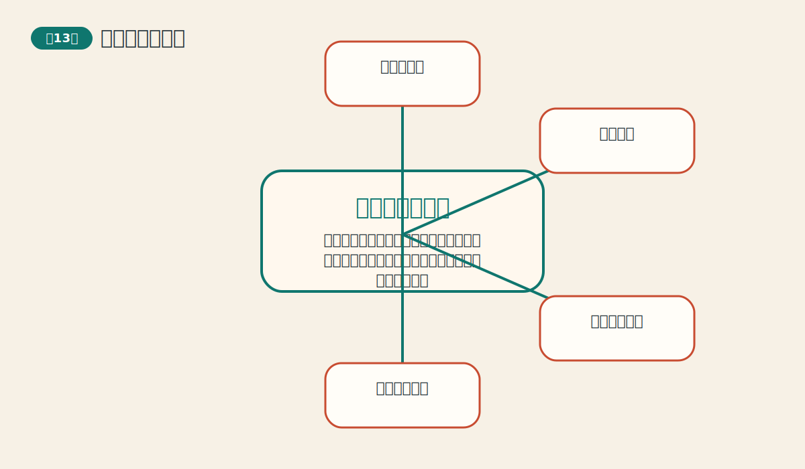
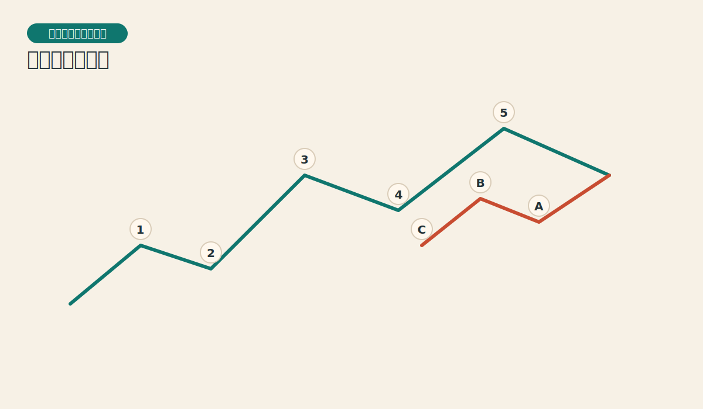
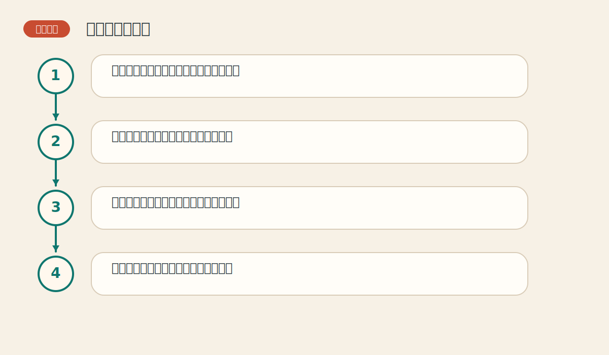

# 第十三章 艾略特波浪理论

> PDF页范围：288-321。核心图示：五浪推动与三浪调整。

**一句话总纲**：波浪理论试图把市场节奏写成一种层层嵌套的语法：推动五浪，调整三浪，大小级别不断重复。

## 这章到底在讲什么

它是技术分析里最具吸引力也最容易让人着迷的一支。学会它的价值，同时也要知道它的边界。 作者在这一章真正想训练的，不只是识别名词，而是把市场现象翻译成一套能重复使用的判断语言。

## 本章核心术语

- **推动浪**：顺主趋势推进的五浪结构。
- **调整浪**：对主趋势进行修正的三浪结构。
- **分形**：不同尺度上出现相似结构的特征。
- **斐波那契比例**：常用于估测回撤与延展幅度的比例关系。

## 关键知识

### 关键知识 1：推动浪与调整浪构成基本骨架

顺大方向的五浪推进，之后常跟着三浪调整。 站在零基础读者角度，可以先把它理解成一句很朴素的话：市场在这里留下了一个可重复辨认的行为模式。

**怎么看**：先把它看作节奏框架，而不是精确预言机。

**最容易错在哪里**：刚看到两三段波动就急着完整编号。

**真正能带走的收获**：波浪最先提供的是结构感，不是神准标签。

### 关键知识 2：波浪具有分形层级

大浪里有小浪，小浪里还有更小的浪，不同级别结构相似。 站在零基础读者角度，可以先把它理解成一句很朴素的话：市场在这里留下了一个可重复辨认的行为模式。

**怎么看**：编号前先说明自己在讨论哪个级别。

**最容易错在哪里**：把不同时间尺度的浪混在一起讲。

**真正能带走的收获**：没有级别意识，波浪就会越数越乱。

### 关键知识 3：斐波那契比例常被用作测量工具

很多波浪分析会用比例关系辅助判断回撤和延展空间。 站在零基础读者角度，可以先把它理解成一句很朴素的话：市场在这里留下了一个可重复辨认的行为模式。

**怎么看**：把比例看作“常见区间”，不是绝对刻度。

**最容易错在哪里**：把任意一次回撤都硬套成黄金比率。

**真正能带走的收获**：比例是辅助，不是执法者。

### 关键知识 4：波浪理论最强的地方是框架感

它能帮助交易者把杂乱波动组织成更有层次的故事。 站在零基础读者角度，可以先把它理解成一句很朴素的话：市场在这里留下了一个可重复辨认的行为模式。

**怎么看**：先用它理解市场处于推进还是调整，再考虑细节。

**最容易错在哪里**：沉迷细枝末节，忘了整体节奏。

**真正能带走的收获**：先讲主线，再修细节。

### 关键知识 5：波浪理论最大的风险是主观性

同一张图，不同分析者可能数出不同结果。 站在零基础读者角度，可以先把它理解成一句很朴素的话：市场在这里留下了一个可重复辨认的行为模式。

**怎么看**：波浪分析要和趋势、形态、均线等其他证据互相印证。

**最容易错在哪里**：把任何分歧都解释成“市场太复杂”，却不做验证。

**真正能带走的收获**：越迷人的工具，越需要纪律约束。

## 直观比喻

像音乐节拍。主旋律有大拍，小节里还有小拍，整首曲子会反复出现相似节奏。

## 典型图示怎么读

上面的核心图示并不是为了让你死记图样，而是帮你抓住 `五浪推动与三浪调整` 背后的结构关系。真正该记住的是：先看背景，再看结构，再看确认，最后才谈动作。

## 3 个最容易误解的问题

- **波浪理论能不能精确预测每一步？**
  答：不能。它更适合做结构框架，而不是精确算命。
- **是不是只要会数浪就够了？**
  答：不够。数浪必须结合趋势、形态和确认信号。
- **分歧很多是不是说明波浪理论没用？**
  答：也不是。它有价值，但要接受其主观性边界。

## 本章收获清单

- 知道五浪推进与三浪调整的基本框架。
- 理解波浪理论离不开级别概念。
- 会把斐波那契比例当作辅助工具。
- 认识到波浪的最大优点是组织结构。
- 也认识到它的最大风险是主观性。

## 如果讲给完全不懂的人听

你可以这样概括这一章：波浪理论试图把市场节奏写成一种层层嵌套的语法：推动五浪，调整三浪，大小级别不断重复。 先把这件事讲成一个生活故事，再回到图表上找对应证据，理解会快很多。
