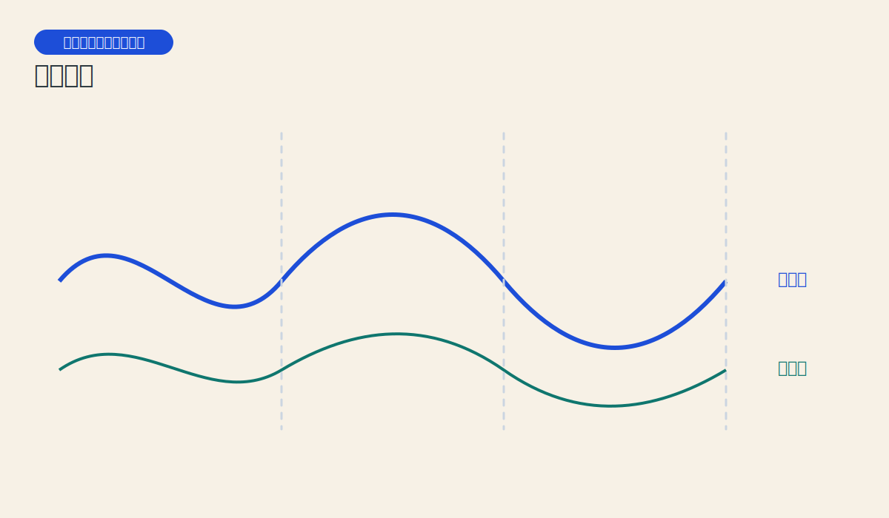
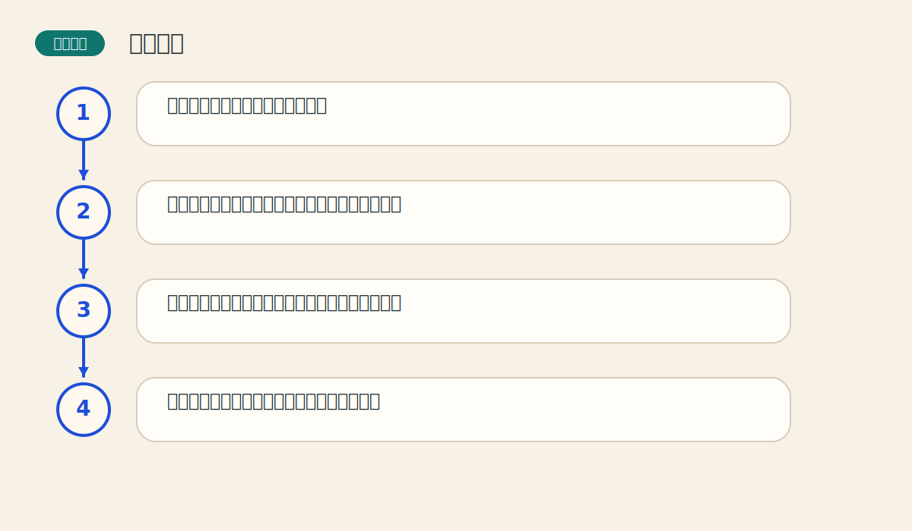

# 第十四章 时间周期

> PDF页范围：322-354。核心图示：多周期叠加与时间窗口。

**一句话总纲**：市场不只在价格上有节奏，在时间上也可能有节奏；周期分析试图回答“什么时候更值得警惕变化”。

## 这章到底在讲什么

很多人只看价格，不看时间。这一章提醒读者：时间也是技术分析的重要维度。 作者在这一章真正想训练的，不只是识别名词，而是把市场现象翻译成一套能重复使用的判断语言。

## 本章核心术语

- **周期**：市场在时间维度上可能重复出现的节奏。
- **共振**：多个周期在同一时间附近共同强化影响。
- **时间窗口**：更值得警惕变化的时间区域。
- **长波**：跨度很长的经济或市场周期。

## 关键知识

### 关键知识 1：图表本来就是时间-价格图

纵轴是价格，横轴是时间，忽略时间只看一半信息。 站在零基础读者角度，可以先把它理解成一句很朴素的话：市场在这里留下了一个可重复辨认的行为模式。

**怎么看**：价格目标和时间窗口应当一起考虑。

**最容易错在哪里**：只问会涨到哪里，不问大概什么时候更容易变化。

**真正能带走的收获**：时间不是背景布，而是变量本身。

### 关键知识 2：周期强调重复的时间节奏

某些高低点可能会以相对规律的时间间隔出现。 站在零基础读者角度，可以先把它理解成一句很朴素的话：市场在这里留下了一个可重复辨认的行为模式。

**怎么看**：把周期理解为“更值得留意的窗口”，而不是定时闹钟。

**最容易错在哪里**：以为周期会像时钟一样分秒不差。

**真正能带走的收获**：周期是概率节奏，不是机械钟摆。

### 关键知识 3：多个周期会互相叠加

短周期和长周期像不同长度的波，同时作用会形成更复杂的节奏。 站在零基础读者角度，可以先把它理解成一句很朴素的话：市场在这里留下了一个可重复辨认的行为模式。

**怎么看**：留意多个周期共振时，往往更值得关注。

**最容易错在哪里**：只抓住一个周期就想解释全部市场行为。

**真正能带走的收获**：复杂市场通常需要多层节奏一起看。

### 关键知识 4：时间分析需要和价格结构配合

光有时间窗口，没有价格确认，周期分析就容易变得神秘化。 站在零基础读者角度，可以先把它理解成一句很朴素的话：市场在这里留下了一个可重复辨认的行为模式。

**怎么看**：先把周期当作提醒器，再用图形和趋势做最终确认。

**最容易错在哪里**：到时间了就机械下单。

**真正能带走的收获**：时间告诉你“留意”，价格告诉你“行动”。

### 关键知识 5：长周期很有启发，但更要谦逊

长期经济波动值得研究，但跨度越长，不确定性和解释空间越大。 站在零基础读者角度，可以先把它理解成一句很朴素的话：市场在这里留下了一个可重复辨认的行为模式。

**怎么看**：对长波保持开放，同时保持审慎。

**最容易错在哪里**：拿宏大周期去替代具体交易决策。

**真正能带走的收获**：越宏观的工具，越适合定背景，不适合定按钮。

## 直观比喻

像季节变化。春夏秋冬不会告诉你每天温度是多少，但会告诉你哪一段时间更容易发生哪类变化。

## 典型图示怎么读

上面的核心图示并不是为了让你死记图样，而是帮你抓住 `多周期叠加与时间窗口` 背后的结构关系。真正该记住的是：先看背景，再看结构，再看确认，最后才谈动作。

## 3 个最容易误解的问题

- **周期是不是一定准时发生？**
  答：不是。周期更像天气预报，不像秒针。
- **到达时间窗口是不是必须立刻交易？**
  答：不。时间只提供关注点，行动仍需价格确认。
- **长周期是不是比短周期更可靠？**
  答：未必。周期越长，解释空间也越大。

## 本章收获清单

- 知道图表本来就是时间与价格的双轴。
- 理解周期更像概率节奏而非机械钟表。
- 知道多周期叠加会形成更复杂信号。
- 学会把时间窗口与价格确认结合。
- 对宏大周期保持兴趣，也保持克制。

## 如果讲给完全不懂的人听

你可以这样概括这一章：市场不只在价格上有节奏，在时间上也可能有节奏；周期分析试图回答“什么时候更值得警惕变化”。 先把这件事讲成一个生活故事，再回到图表上找对应证据，理解会快很多。
