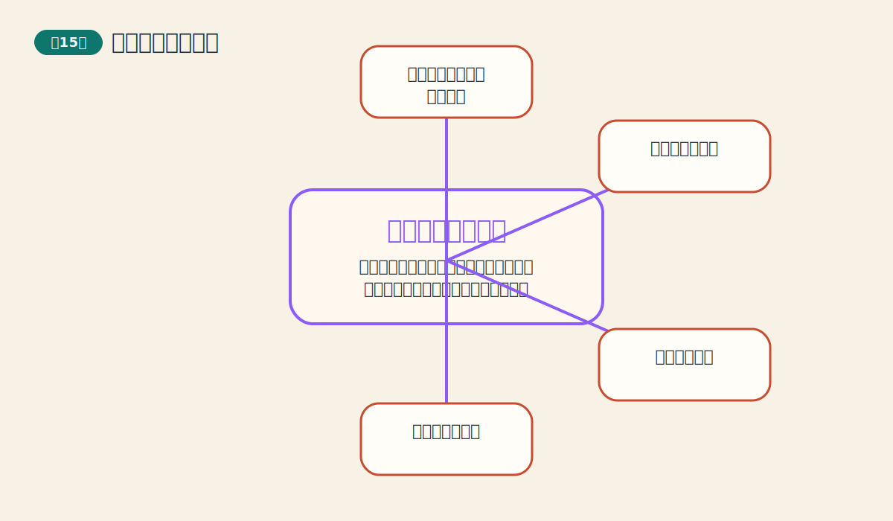
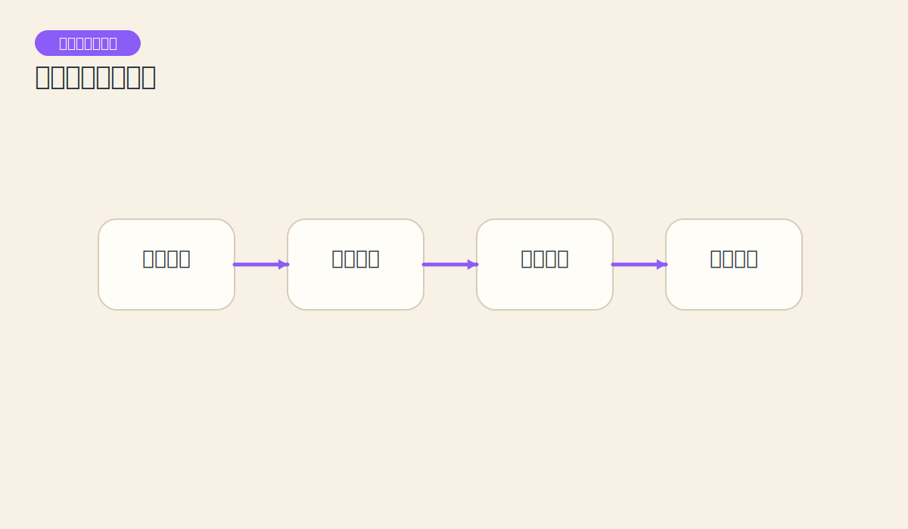
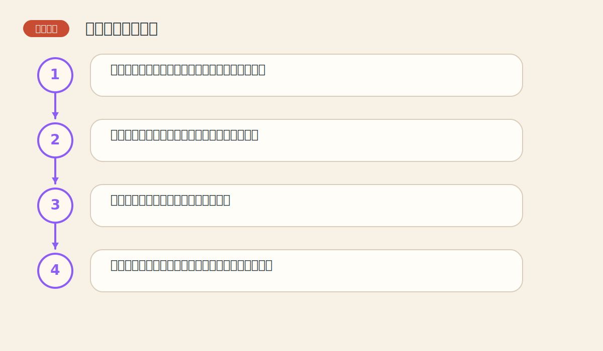

# 第十五章 计算机和交易系统

> PDF页范围：355-379。核心图示：交易系统流程图。

**一句话总纲**：计算机能把规则执行得更快、更稳，但它不能替你决定一套坏规则会不会输钱。

## 这章到底在讲什么

这章把图表分析推进到程序化思维：从“看懂”走向“写成规则、测试规则、执行规则”。 作者在这一章真正想训练的，不只是识别名词，而是把市场现象翻译成一套能重复使用的判断语言。

## 本章核心术语

- **交易系统**：一套可重复执行的进出场和风控规则。
- **回测**：用历史数据检验规则表现的过程。
- **回撤**：系统从高点到低点所经历的亏损幅度。
- **稳健性**：系统在不同环境下是否仍能保持相对稳定的能力。

## 关键知识

### 关键知识 1：计算机擅长处理重复和计算

它能快速刷新图表、计算指标、执行规则，极大提升效率。 站在零基础读者角度，可以先把它理解成一句很朴素的话：市场在这里留下了一个可重复辨认的行为模式。

**怎么看**：把计算机当成加速器，而不是灵感来源。

**最容易错在哪里**：因为软件很复杂，就误以为自己已经掌握市场。

**真正能带走的收获**：效率工具不能自动变成判断能力。

### 关键知识 2：交易系统是规则的集合

系统要明确回答什么时候进、什么时候出、仓位多大、何时止损。 站在零基础读者角度，可以先把它理解成一句很朴素的话：市场在这里留下了一个可重复辨认的行为模式。

**怎么看**：没有规则清单，就算不上真正的系统。

**最容易错在哪里**：只写入场，不写退出和资金管理。

**真正能带走的收获**：系统完整性比单个信号更重要。

### 关键知识 3：回测是过滤幻想的第一道门

如果一套规则连过去都说不清，拿去实盘通常更危险。 站在零基础读者角度，可以先把它理解成一句很朴素的话：市场在这里留下了一个可重复辨认的行为模式。

**怎么看**：不仅看收益，还看回撤、稳定性、连败情况。

**最容易错在哪里**：只晒总收益，不看过程质量。

**真正能带走的收获**：好系统不是只会赢，而是输得也可承受。

### 关键知识 4：参数越多，越容易自我欺骗

复杂系统往往更容易被调得贴合历史，却失去未来适应性。 站在零基础读者角度，可以先把它理解成一句很朴素的话：市场在这里留下了一个可重复辨认的行为模式。

**怎么看**：优先选择逻辑清晰、结构简洁的规则。

**最容易错在哪里**：把复杂度误当作高级感。

**真正能带走的收获**：简单到足够用，常比复杂到看不懂更强。

### 关键知识 5：软件不会替你承担纪律

即使系统有优势，交易者仍要面对执行、信任和承受回撤的问题。 站在零基础读者角度，可以先把它理解成一句很朴素的话：市场在这里留下了一个可重复辨认的行为模式。

**怎么看**：真正难的不是写规则，而是长期按规则活着。

**最容易错在哪里**：系统一回撤就频繁改规则。

**真正能带走的收获**：纪律是系统的另一半。

## 直观比喻

像给厨师一台高速搅拌机。机器能更快、更稳定地打发奶油，但配方错了，机器只会更快地把错误放大。

## 典型图示怎么读

上面的核心图示并不是为了让你死记图样，而是帮你抓住 `交易系统流程图` 背后的结构关系。真正该记住的是：先看背景，再看结构，再看确认，最后才谈动作。

## 3 个最容易误解的问题

- **软件越高级，系统就越赚钱？**
  答：不一定。工具强不等于规则好。
- **只要回测赚钱，就能放心实盘？**
  答：不能。还要看回撤、适应性和执行可行性。
- **复杂系统一定比简单系统更先进吗？**
  答：不一定。复杂度常常只是更方便过拟合。

## 本章收获清单

- 知道计算机擅长的是加速执行，不是替代判断。
- 理解完整交易系统必须覆盖进场、出场和资金管理。
- 学会用更全面指标评价回测。
- 认识到复杂度常常意味着更高的过拟合风险。
- 明白长期执行纪律才是系统真正的考验。

## 如果讲给完全不懂的人听

你可以这样概括这一章：计算机能把规则执行得更快、更稳，但它不能替你决定一套坏规则会不会输钱。 先把这件事讲成一个生活故事，再回到图表上找对应证据，理解会快很多。
