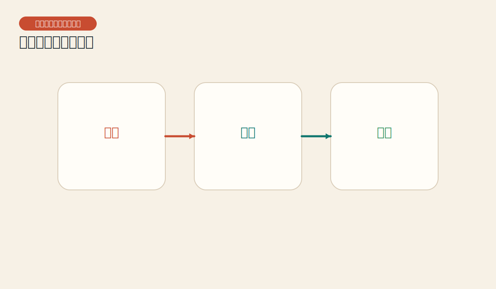
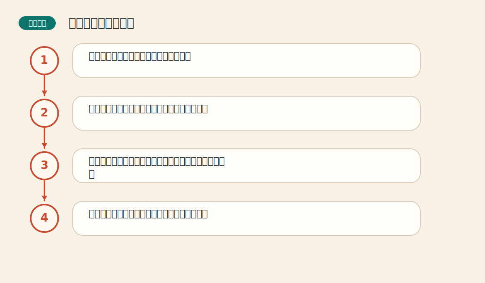

# 第十六章 资金管理和交易策略

> PDF页范围：380-426。核心图示：交易三脚架与风险控制。

**一句话总纲**：预测方向只是交易三脚架的一条腿，另外两条腿是时机抉择和资金管理，少一条都站不稳。

## 这章到底在讲什么

这是全书落地性最强的一章，它把前面所有技术工具拉回到真实交易的生存问题。 作者在这一章真正想训练的，不只是识别名词，而是把市场现象翻译成一套能重复使用的判断语言。

## 本章核心术语

- **时机抉择**：在正确方向上选择更合适的进出点。
- **止损**：当市场证明判断错误时主动离场的风险控制措施。
- **仓位**：一笔交易占总资金的规模。
- **相关性**：不同持仓是否会一起波动的关系。

## 关键知识

### 关键知识 1：成功交易有三要素

价格预测、时机抉择和资金管理缺一不可。 站在零基础读者角度，可以先把它理解成一句很朴素的话：市场在这里留下了一个可重复辨认的行为模式。

**怎么看**：前面各章主要解决前两者，这一章把第三者补齐。

**最容易错在哪里**：以为方向判断对了，结果就会自动变好。

**真正能带走的收获**：看对方向不等于能把钱留下来。

### 关键知识 2：止损是活下去的工具

市场永远可能和你想的不一样，所以必须提前规定最坏情况。 站在零基础读者角度，可以先把它理解成一句很朴素的话：市场在这里留下了一个可重复辨认的行为模式。

**怎么看**：止损应该写在进场之前，而不是亏损之后才临时决定。

**最容易错在哪里**：把止损看成失败的象征。

**真正能带走的收获**：止损不是认输，而是保命。

### 关键知识 3：仓位大小决定你能否承受波动

再好的方法，仓位过大都可能让人提前爆掉。 站在零基础读者角度，可以先把它理解成一句很朴素的话：市场在这里留下了一个可重复辨认的行为模式。

**怎么看**：单笔风险应和账户承受力匹配，而不是和情绪匹配。

**最容易错在哪里**：在最有信心的时候把仓位放到无法承受。

**真正能带走的收获**：先活着，才有资格谈复利。

### 关键知识 4：分散和相关性同样重要

看似买了多个品种，若它们同涨同跌，风险并没有真正分散。 站在零基础读者角度，可以先把它理解成一句很朴素的话：市场在这里留下了一个可重复辨认的行为模式。

**怎么看**：不仅看持仓数量，还看它们是否受相似因素驱动。

**最容易错在哪里**：把“多买几个”误以为就是分散。

**真正能带走的收获**：相关性会偷偷把分散变回集中。

### 关键知识 5：策略整合需要一致性

工具越多，越要有固定流程，不然容易临场挑自己喜欢的信号。 站在零基础读者角度，可以先把它理解成一句很朴素的话：市场在这里留下了一个可重复辨认的行为模式。

**怎么看**：把趋势、形态、指标和资金管理串成固定决策顺序。

**最容易错在哪里**：今天用均线，明天用波浪，亏了再换一套。

**真正能带走的收获**：稳定流程比临场聪明更可靠。

## 直观比喻

像远航。知道往哪开是方向，什么时候升帆是时机，船上带多少水和粮、遇风浪怎么减速，就是资金管理。

## 典型图示怎么读

上面的核心图示并不是为了让你死记图样，而是帮你抓住 `交易三脚架与风险控制` 背后的结构关系。真正该记住的是：先看背景，再看结构，再看确认，最后才谈动作。

## 3 个最容易误解的问题

- **只要方向看对，仓位大一点没关系？**
  答：错。仓位过大足以让一次普通波动变成灾难。
- **止损会不会把我经常洗出去？**
  答：会有成本，但没有止损的代价通常更大。
- **买很多品种就一定分散了吗？**
  答：不一定。如果它们高度相关，风险仍可能集中。

## 本章收获清单

- 明白交易不是只靠猜方向。
- 把止损和仓位放到与信号同等重要的位置。
- 知道相关性会影响所谓的分散效果。
- 学会把多种工具整合成固定流程。
- 真正把“先活下来”当成交易底线。

## 如果讲给完全不懂的人听

你可以这样概括这一章：预测方向只是交易三脚架的一条腿，另外两条腿是时机抉择和资金管理，少一条都站不稳。 先把这件事讲成一个生活故事，再回到图表上找对应证据，理解会快很多。
