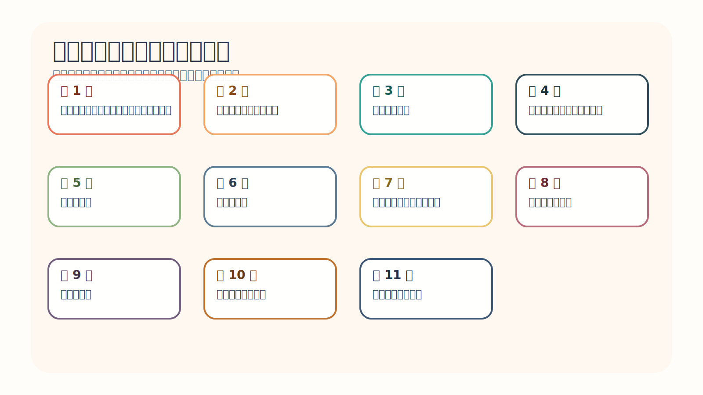
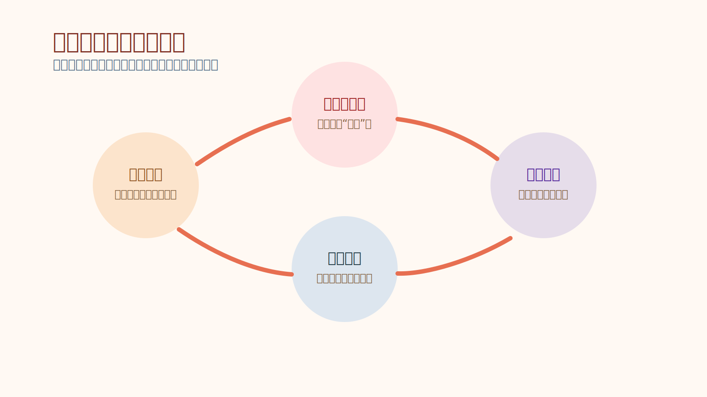
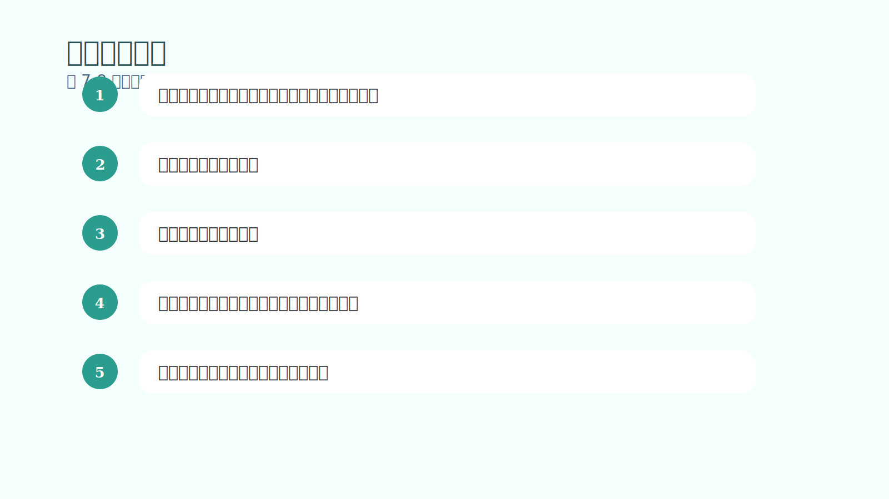
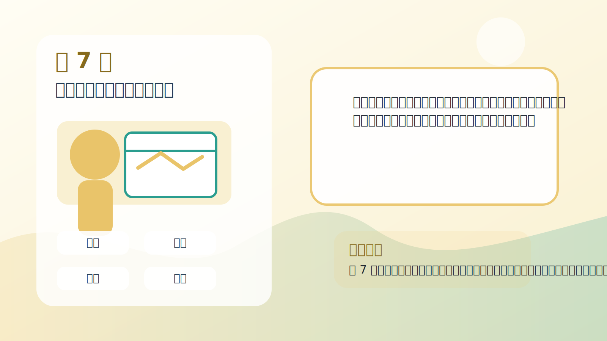
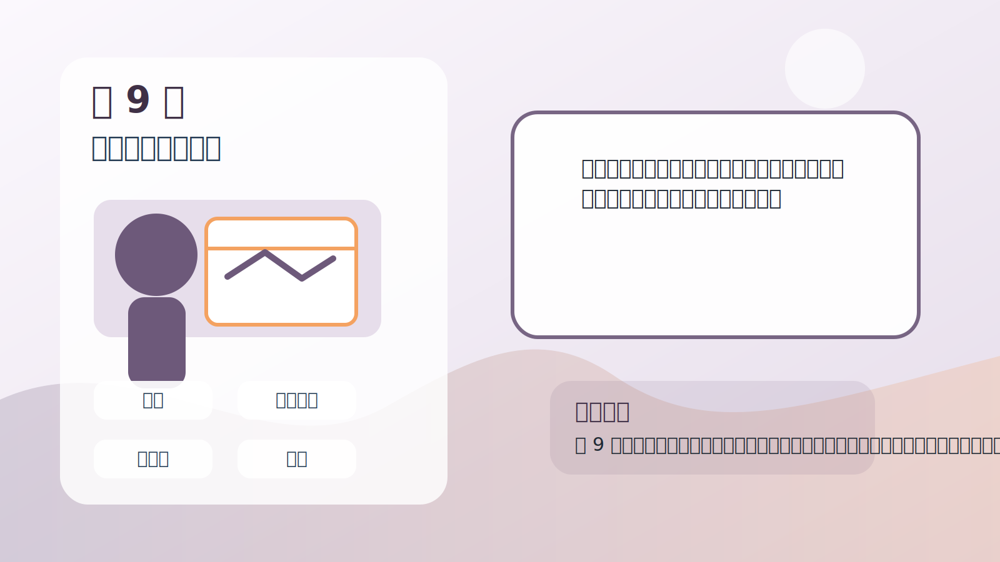
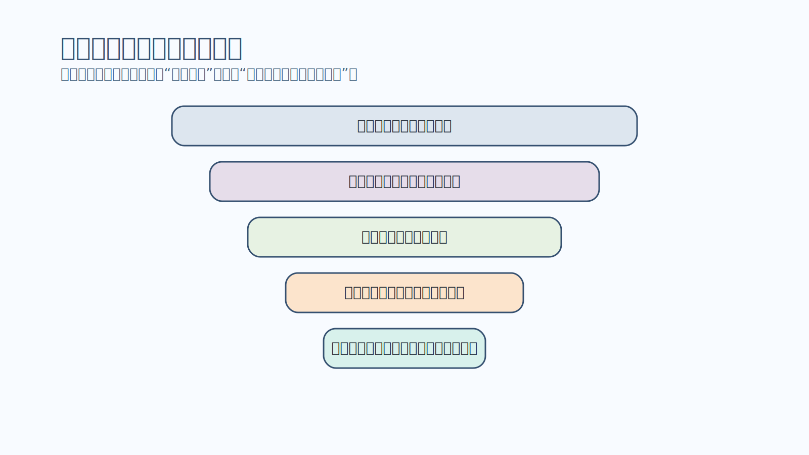

# 《交易心理分析》阅读报告

## 导论：这本书为什么值得做成一整套学习包

马克·道格拉斯写这本书时，真正想解决的并不是“哪一种指标更好”，也不是“怎样在下一次交易里精准押中方向”。他想回答的，是一个更深也更痛的问题：为什么很多聪明、勤奋、知识丰富、职业上很成功的人，一旦走进交易市场，却会反复输给自己？作者在前言和引子里不断强调，市场之所以让人挫败，不是因为机会太少，而是因为市场的运行方式和大多数人从小被训练出来的思考方式并不匹配。学校奖励确定答案，职场奖励可控推进，社交奖励说服与管理；市场却要求人接受不确定、允许亏损、把单笔结果看成样本，并在没有外部监督的情况下仍能执行规则。

从这个意义上说，《交易心理分析》并不是一本教人“猜涨跌”的书，而是一本教人重建认知与行为结构的书。它从基本面与技术面的争论切入，逐步把焦点挪到心理结构，再进一步进入概率思维、信念机制与行为训练，最后落到一种可以通过机械练习逐步安装的交易者心智。它真正挑战读者的，不是智力，而是旧有信念：我必须看对，我不能亏，我的判断应该被市场尊重，我只要更努力分析就会解决问题。作者几乎整本书都在拆这些信念，再把一套与市场现实更匹配的新信念装回去。

## 作者的问题意识：为什么技术问题最后会变成心理问题

作者先让读者看到一个常被忽略的事实：市场分析有价值，但分析能力并不能自动变成稳定盈利。基本面分析之所以难以直接转化为一致结果，是因为价格真正的推动者是人，而不是模型；技术分析之所以比基本面更接近实战，是因为它能读取市场参与者反复出现的行为模式；但仅有技术分析仍然不够，因为“看懂机会”和“执行机会”之间仍然隔着一层心理落差。很多人会在图上看见信号，却在真实下单时变形：该进不进、该损不损、该收不收、该停不停。这不是知识缺口，而是结构缺口。

作者的问题意识因此非常清晰：交易中的绝大多数持续痛苦，并不是来自市场本身，而是来自人把市场个人化、道德化、人格化之后产生的内在冲突。你越要求市场配合你的期待，越会痛；你越把单笔输赢和自我价值绑定，越会扭曲；你越想用日常社会里的控制技能去管理市场，越会发现这些技能在这里频频失灵。作者真正要教的，是怎样把自己从这种失配中解放出来。

## 全书总论点：稳定盈利来自一种与市场现实匹配的心智结构

全书的总论点可以压缩成一句话：稳定盈利并不首先来自更高明的预测，而来自一种与市场现实相匹配的心智结构。这种结构有几个基础特征。第一，它承认市场不确定，而且这种不确定不是缺点，而是环境特征。第二，它承认优势只意味着概率更高，而不是结果保证。第三，它接受亏损是经营成本，而不是人格羞辱。第四，它把单笔交易放回长期样本中理解，不要求每一笔都证明自己正确。第五，它愿意通过纪律和练习，把这些看似抽象的原则变成大脑的默认反应。

因此，这本书反复在做两件事：一件是拆除旧心智，另一件是安装新心智。拆除的对象包括对确定性的迷恋、对亏损的羞耻、对市场的对抗姿态、对随机奖励的上瘾，以及对自我形象的过度保护。安装的对象，则包括概率思维、样本意识、接受风险、去人格化、内部控制、规则执行和信念重塑。作者并不把这些当作鸡汤，而是当作一套可以被训练、被验证、被复盘的心理工程。

## 11 章论证链：作者如何一步步把读者带到“像交易者一样思考”

### 第 1 章：成功之路：基本面、技术面或思想分析？

这一章围绕“为什么很多人已经会看消息、会看图，却还是赚不到能留下来的钱”展开。作者先抛出一个让多数交易者不舒服的前提：问题很可能不在市场本身，而在你理解市场、理解风险和理解自己的方式。这是全书的总开关。作者用这一章告诉读者，交易不是“谁更会预测”，而是“谁更能在不确定中稳定行动”。如果这一层没看懂，后面所有关于纪律、概率、信念的训练都会被误解成技巧清单。

- **开始：基本面分析**：作者先回顾基本面分析曾被视为“正统”的时代。基本面会把利率、天气、报表、供需等因素全部纳入模型，试着推导未来价格该在哪里。但作者指出，价格真正的推动者是人，是人对未来的信念与情绪，不是模型本身。 这部分如果用孩子也能懂的话来翻译，就是：这就像老师用课程表告诉你今天应该上数学课，可全班同学突然冲出去看操场比赛，教室立刻就空了。计划没错，但现场真正发生什么，还是看人怎么动。 放回交易场景里，作者真正想逼读者看到的是：放在交易里，这意味着“逻辑正确”不等于“马上赚钱”。你可能长期方向判断没错，但短期波动已经大到把你甩出场。
- **转到技术分析**：接着作者说明为什么交易者逐渐转向技术分析。因为市场里的人会重复做相似的事，群体行为会留下可观察、可统计、可重复的模式。技术分析的价值，不在于神奇预测，而在于把重复出现的行为组织成可执行的机会地图。 这部分如果用孩子也能懂的话来翻译，就是：好比你发现学校食堂一到下课前五分钟就开始排长队。你不需要知道每个同学今天中午为什么饿，只要知道这个规律常常会出现，你就能提前行动。 放回交易场景里，作者真正想逼读者看到的是：这让交易者不再执着于“价格本来该去哪”，而是把注意力放到“现在的行为模式意味着什么概率更大”。
- **转到思想分析**：但作者马上指出，只会技术分析仍然不够。很多人明明能看出机会，却在该下单时犹豫、在该止损时抗拒、在该止盈时贪心。于是问题从市场分析转向自我分析：真正挡住稳定盈利的，是心理落差，而不是信息不够。 这部分如果用孩子也能懂的话来翻译，就是：就像你知道游泳动作怎么做，站在岸上讲得头头是道，可一跳进水里就紧张乱拍。不是你没学过，而是身体和脑子还没有真正适应水里的感觉。 放回交易场景里，作者真正想逼读者看到的是：这就是本书的起点：解决问题的关键不在于继续堆分析工具，而在于训练一种能承受不确定、能接受亏损、能执行优势的交易者心智。

这一章最后落到三个层面。第一，概念层面，作者把 “基本面分析”、“技术分析”、“思想分析” 等关键词重新定义；第二，行为层面，他提醒读者别再掉进 “只要分析得更深入，我迟早会自动变成稳定赢家。”、“市场会奖励逻辑最完美的人。”、“看懂图就等于会交易。” 这些看似合理却会持续伤害执行的误区；第三，训练层面，他给出的方向是：先分清“我在解释市场”还是“我在跟市场争论”。；每次做交易前，写下自己的优势来自哪里，而不是只写预测方向。。这意味着本章不是让读者多背一个概念，而是让读者换一种默认反应。

### 第 2 章：交易的诱惑（和危险）

这一章围绕“交易为什么看起来那么自由、那么迷人，却又让很多人越做越痛苦”展开。作者先抛出一个让多数交易者不舒服的前提：问题很可能不在市场本身，而在你理解市场、理解风险和理解自己的方式。很多人把失败归因于技术不好，作者却提醒：在交易中，问题常常发生在更前面。你是因为自由、刺激、证明自己、还是想快速翻身而来？动机如果混乱，规则就会被情绪吃掉。

- **吸引**：作者认为，交易真正的吸引力不只是赚钱，而是它提供了一种其他职业很少有的自由感：你可以随时开始、停止、加码、减仓，几乎没有人挡着你。对很多人来说，这种“我可以按自己的想法行动”的感觉极其迷人。 这部分如果用孩子也能懂的话来翻译，就是：就像到了一个巨大的游乐园，所有项目都不用排队，想先玩哪个就玩哪个。光是这种自由，就足以让人兴奋。 放回交易场景里，作者真正想逼读者看到的是：问题在于，越自由的环境，越需要内部规则。没有边界的市场会把一个人的冲动、贪心和证明欲全部放大出来。
- **危险**：危险不在自由本身，而在“无限可能 + 无限行动自由”的组合。市场几乎随时都能给你机会，也几乎随时都能让你受伤。如果一个人习惯了由外部制度约束自己，一进入这种环境，就很容易失去平衡。 这部分如果用孩子也能懂的话来翻译，就是：像一个孩子突然拿到整间糖果仓库的钥匙。如果没有人告诉他什么时候停、为什么停、停了也没关系，他很快就会肚子疼。 放回交易场景里，作者真正想逼读者看到的是：交易者需要的不是更强的控制别人能力，而是更强的自我界限感：什么可以做，什么时候必须停，为什么亏损不能被当成侮辱。
- **安全措施**：作者强调，真正的安全措施来自内在结构，而不是市场会变温柔。你必须建立一套心理护栏，把自由和自伤风险隔开。规则、仓位、亏损承受、执行流程，本质上都属于这个护栏系统。 这部分如果用孩子也能懂的话来翻译，就是：玩滑板时戴头盔不是因为你不想玩，而是因为你想玩得久一点。规则不是限制自由，而是保护自由。 放回交易场景里，作者真正想逼读者看到的是：如果没有这些护栏，市场每次波动都会直接撞到你的自尊、希望和恐惧，最后连一个好系统都执行不下去。
- **问题：不愿制定规则**：很多人喜欢交易，恰恰因为它不像学校考试，不像公司汇报，没有谁盯着你必须按流程做。于是他们享受自由，却抗拒规则，误以为规则会削弱机会。作者认为，这是交易者最早也最常见的自我破坏。 这部分如果用孩子也能懂的话来翻译，就是：有些小朋友喜欢搭积木，却不想先把地垫铺平。开始看着快，最后塔总是先倒。 放回交易场景里，作者真正想逼读者看到的是：不愿写规则的人，最后会被情绪写规则。那时做出的每个决定都像临场猜题，完全不能复制。
- **问题：不愿承担责任**：如果一个人不愿意承认“是我决定买的，是我决定不止损，是我决定赌这一把”，他就会把责任丢给消息、指标、老师、平台、庄家。这样做能暂时保护自尊，却永远学不会成长。 这部分如果用孩子也能懂的话来翻译，就是：像考试没考好就一直说卷子不好、座位不好、天气不好，却不肯看自己哪道题真的不会。 放回交易场景里，作者真正想逼读者看到的是：责任感不是自责，而是承认选择权在自己手里。只有这样，错误才可能转化成下一次的改进素材。
- **问题：对随机回报上瘾**：市场最危险的设计之一，是它会用随机的方式奖励人。你可能靠冲动乱做也赢一笔，也可能按规则做却先亏一笔。于是大脑会被“偶尔中大奖”的感觉绑住，开始追逐刺激，而不是训练优势。 这部分如果用孩子也能懂的话来翻译，就是：这像抓娃娃机。最麻烦的不是一直抓不到，而是偶尔真的抓到了，那会让你一直想再来一次。 放回交易场景里，作者真正想逼读者看到的是：交易者必须学会从“这次赢了没”转向“这次是不是按优势做了”。否则你训练的不是能力，而是上瘾。
- **问题：外部控制与内部控制**：作者最后把关键拉回控制感。外部控制是想改变市场、想证明自己判断正确；内部控制则是约束自己的风险、定义自己的行为、接受自己的成本。成熟交易者把力气花在后者。 这部分如果用孩子也能懂的话来翻译，就是：如果风很大，你拉不住风，但你可以把风筝线握稳、把脚站稳、知道什么时候该收线。 放回交易场景里，作者真正想逼读者看到的是：这章的底层结论是：你控制不了市场，你只能控制自己面对市场时怎样行动。所有职业化训练都从这里开始。

这一章最后落到三个层面。第一，概念层面，作者把 “自由表达”、“心理挑战”、“随机回报” 等关键词重新定义；第二，行为层面，他提醒读者别再掉进 “交易最棒的地方是没人管我，所以我可以随心所欲。”、“只要我很兴奋、很有感觉，就说明我找到了机会。”、“偶尔靠冲动赚到钱，说明这种做法也可以。” 这些看似合理却会持续伤害执行的误区；第三，训练层面，他给出的方向是：交易前先回答：我想要的是刺激，还是想做一门可重复的事业？；把入场、止损、止盈和停手条件写成固定句子。。这意味着本章不是让读者多背一个概念，而是让读者换一种默认反应。

### 第 3 章：自己承担责任

这一章围绕“为什么‘承担责任’听上去像大道理，却是交易者真正分层的地方”展开。作者先抛出一个让多数交易者不舒服的前提：问题很可能不在市场本身，而在你理解市场、理解风险和理解自己的方式。这是全书从“认识问题”走向“开始改造自己”的真正起点。作者认为，只要你还把市场当成对手、老师、审判官、伤害者，你就不可能形成稳定表现。

- **塑造思想环境**：作者指出，很多人在现实生活里通过影响别人、谈判、推动、说服来得到想要的结果，这些技能在职场很有用，但放进市场却常常失灵。市场不会因为你更聪明、更能争、更有理由就照着你想要的方向走。 这部分如果用孩子也能懂的话来翻译，就是：就像你可以说服朋友跟你一起玩，但你说服不了今天下不下雨。面对天气，你只能准备雨伞，而不是跟乌云吵架。 放回交易场景里，作者真正想逼读者看到的是：成熟交易者会改造自己的思想环境：不再试图压市场，而是训练自己更客观地看信息、更稳定地执行对自己长期有利的动作。
- **对亏损的反应**：亏损之所以难，不只是因为钱少了，还因为它会刺痛人对自我能力的想象。只要你把亏损解释成“我失败了”“市场在针对我”，你的大脑就会自动防御：否认、拖延、加仓、报复、冻结。 这部分如果用孩子也能懂的话来翻译，就是：这像小朋友搭积木倒了以后，不肯看哪一层搭歪了，只想马上再堆更高，结果第二次倒得更快。 放回交易场景里，作者真正想逼读者看到的是：承担责任的核心，是把亏损从人格攻击改写成信息反馈。亏损是某次行为的结果，不是对整个人价值的宣判。
- **赢家、输家、暴发者和崩溃者**：作者区分了几种常见交易者：持续赢家、长期输家、偶尔大赚却守不住的人。差别不在于他们有没有遇到机会，而在于他们有没有形成一套能吸收胜负、持续稳定输出的心理结构。 这部分如果用孩子也能懂的话来翻译，就是：有人拿到零花钱会慢慢存，有人一拿到就一下花光，还有人今天捡到很多明天又全弄丢。看上去都“得到过钱”，结果却完全不同。 放回交易场景里，作者真正想逼读者看到的是：真正的赢家不是从不波动的人，而是能让自己不被一两次输赢带走、能把行为保持在优势框架里的人。

这一章最后落到三个层面。第一，概念层面，作者把 “责任”、“心理环境”、“防御反应” 等关键词重新定义；第二，行为层面，他提醒读者别再掉进 “承担责任就是不停责怪自己。”、“只要我很想赢，我就能逼市场给我答案。”、“大赚过说明我已经是赢家。” 这些看似合理却会持续伤害执行的误区；第三，训练层面，他给出的方向是：复盘时把“市场害我”改写成“我当时做了什么选择”。；每次亏损后记录：我是在学习，还是在捍卫自尊？。这意味着本章不是让读者多背一个概念，而是让读者换一种默认反应。

### 第 4 章：持续一致性：一种思想状态

这一章围绕“持续一致性到底是一套方法，还是一种脑内状态”展开。作者先抛出一个让多数交易者不舒服的前提：问题很可能不在市场本身，而在你理解市场、理解风险和理解自己的方式。这一章把“稳定”从结果层拉回心理层。很多人总想靠更好的信号筛选来换来稳定，作者却要求先建立能真正接受风险、接受不确定、接受单次无意义的大脑框架。

- **思考交易**：作者提醒读者，最优秀的交易者和普通交易者最大的区别，不是动作更复杂，而是他们思考交易的方式不同。他们不把交易当成证明自己聪明的战场，而当成在概率中管理行为和风险的工作。 这部分如果用孩子也能懂的话来翻译，就是：像做投篮练习时，有人每投一个球都在想“别人会不会觉得我厉害”，有人只盯着站位、手型和节奏。后者更容易稳定。 放回交易场景里，作者真正想逼读者看到的是：如果你一直把交易理解成“我必须看对”，那你每次下单都在给情绪加压；如果理解成“我在执行一个有优势的样本”，动作会平稳很多。
- **真正理解风险**：很多人嘴上说自己知道风险，其实只是知道“可能会亏”。作者认为真正理解风险，意味着在交易前就完全接受这笔钱可能损失，不指望市场来安慰你，也不在进场后临时改口。 这部分如果用孩子也能懂的话来翻译，就是：这就像出门前你已经决定今天可以把一把伞借给别人，所以真的借出去时不会心里一直翻腾。 放回交易场景里，作者真正想逼读者看到的是：只有在风险被事先接受后，止损才会变成流程动作，而不是情绪割肉。否则你会总想拖一下、等等看、再给市场一个机会。
- **调整思想环境**：一致性最终来自环境对齐。作者要读者把自己的内在环境整理成支持稳定执行的样子：该相信什么、该放弃什么、怎样理解输赢、怎样让规则不再被自尊和希望随意改写。 这部分如果用孩子也能懂的话来翻译，就是：就像你想把房间收拾干净，不能只是说“我要整洁”，还要把玩具、书本、垃圾桶都放在正确的位置上。 放回交易场景里，作者真正想逼读者看到的是：交易里的环境对齐，就是让你的想法、计划、仓位、执行、复盘都指向同一件事：长期可重复，而不是短期证明。

这一章最后落到三个层面。第一，概念层面，作者把 “一致性”、“思想状态”、“真正理解风险” 等关键词重新定义；第二，行为层面，他提醒读者别再掉进 “持续一致性就是把胜率提高到几乎不亏。”、“我已经知道有风险了，所以我算接受风险。”、“只要我逼自己守纪律，心里怎么想不重要。” 这些看似合理却会持续伤害执行的误区；第三，训练层面，他给出的方向是：下单前问自己：如果这笔交易马上止损，我是否仍愿意承担？；把“我这次一定要对”改成“我这次只需要把样本做好”。。这意味着本章不是让读者多背一个概念，而是让读者换一种默认反应。

### 第 5 章：认知的动力

这一章围绕“为什么明明是同一张图、同一段行情，不同人看到的却像两个世界”展开。作者先抛出一个让多数交易者不舒服的前提：问题很可能不在市场本身，而在你理解市场、理解风险和理解自己的方式。如果不理解这一章，交易者就会永远以为是“市场很坏”“机会很少”“信号不清楚”。作者在这里等于告诉你：先检查镜头，再谈风景。

- **给思想软件除错**：作者用“软件除错”的比喻说明，大脑里有很多旧程序会自动运行。它们原本也许是为了保护你不受伤，但在交易里却会让你扭曲信息、错过信号、提前恐慌。问题往往不在于你不知道，而在于旧程序抢先解释了世界。 这部分如果用孩子也能懂的话来翻译，就是：像一台老旧平板电脑，总是自动弹出旧页面。你想打开新的学习软件，它却先跳到以前的游戏界面。 放回交易场景里，作者真正想逼读者看到的是：交易中的除错，不是把自己变成机器人，而是逐步发现哪些自动反应已经不适合当前环境，然后重写它们。
- **认知与学习**：作者指出，人只能看到自己准备好看到的东西。没学过的模式是看不见的，已经深信的解释会挡住新的信息。因此学习不是单纯加内容，而是扩展你的注意力边界，让新的可能性进入意识。 这部分如果用孩子也能懂的话来翻译，就是：就像第一次学乐谱时，你只看到一堆黑点；等你学会一点以后，同样的纸面突然开始有节奏、有层次。 放回交易场景里，作者真正想逼读者看到的是：很多人说“这个市场没机会”，其实常常只是自己的认知仓库里还没有装进足够多的模式，也还不愿承认原来的看法有限。
- **认知与风险**：风险并不只是客观数字，也是一种主观体验。只要某个图形、某段波动、某次震荡触发了你过去的痛苦记忆，你对当下风险的感受就会膨胀。于是你不是在应对当前行情，而是在躲避过去的阴影。 这部分如果用孩子也能懂的话来翻译，就是：这像曾经被狗吓到的孩子，后来哪怕遇到一只很温顺的小狗，也会先后退两步。 放回交易场景里，作者真正想逼读者看到的是：作者想让交易者看到：许多所谓“市场很危险”的时刻，危险的一部分其实来自你脑中的旧录像带。
- **联想的力量**：联想是第 5 章的关键。大脑会把眼前的刺激与过去相似的情境绑在一起，几乎瞬间就唤起旧情绪、旧期待和旧防御。因此当你在交易里突然特别兴奋、特别抗拒、特别想证明什么时，往往是联想系统已经接管。 这部分如果用孩子也能懂的话来翻译，就是：闻到某种味道，你会立刻想起小时候去外婆家的暑假。市场也会这样，只是它唤起的可能不是温暖，而是害怕和冲动。 放回交易场景里，作者真正想逼读者看到的是：理解联想后，你就知道为何客观看只是一次普通回撤，自己却突然变得异常紧绷。那不是当前行情本身有多特别，而是它碰到了你旧经验里的按钮。

这一章最后落到三个层面。第一，概念层面，作者把 “认知”、“心理软件”、“联想” 等关键词重新定义；第二，行为层面，他提醒读者别再掉进 “我看到的就是事实本身。”、“我之所以害怕，是因为市场现在真的特别危险。”、“学习就是收集更多知识点。” 这些看似合理却会持续伤害执行的误区；第三，训练层面，他给出的方向是：遇到强烈情绪时，先问：这是当前行情，还是旧经验在说话？；复盘时记录‘我当时看到了什么’，而不是只记录结果。。这意味着本章不是让读者多背一个概念，而是让读者换一种默认反应。

### 第 6 章：市场的角度

这一章围绕“如果站在市场自己的角度看，市场到底是什么样的东西”展开。作者先抛出一个让多数交易者不舒服的前提：问题很可能不在市场本身，而在你理解市场、理解风险和理解自己的方式。这一章是概率思维的地基。只有先承认市场天生不确定、且每个时刻都可能独特，你才可能停止把上一次输赢投射到下一次交易中。

- **“不确定”原则**：作者指出，普通交易者对风险的感受，往往被最近几笔结果严重影响。刚赢过就容易过度自信，刚亏过就容易过度谨慎。真正成熟的交易者则知道，下一笔交易并不会因为上一笔赢或输就自动改变概率。 这部分如果用孩子也能懂的话来翻译，就是：像抛硬币，前面连续三次正面，不等于下一次就“应该”反面；每次抛都还是新的。 放回交易场景里，作者真正想逼读者看到的是：这要求交易者把注意力从近期情绪中抽离，回到样本和优势本身。否则你实际上不是在交易当前机会，而是在交易上一笔的余震。
- **市场最基本的特点：几乎无限地表达自己**：第 6 章最重要的一句话就是：市场可以用几乎无限的方式表达自己。它不欠你重复，不欠你整齐，也不欠你一个好看的入场点。只要你忘了这一点，就会不断用“应该”去要求市场，进而制造失望与冲突。 这部分如果用孩子也能懂的话来翻译，就是：就像云朵每次都长得像云，但没有哪两片云完全一模一样。你可以认出‘这是云’，却不能要求它一定长成上次那只兔子的样子。 放回交易场景里，作者真正想逼读者看到的是：从市场角度理解市场，就是承认模式只能给你优势，不能给你保证；给你方向感，不能给你控制权。

这一章最后落到三个层面。第一，概念层面，作者把 “不确定原则”、“无限表达”、“独特时刻” 等关键词重新定义；第二，行为层面，他提醒读者别再掉进 “这次图形和上次很像，所以结果应该也一样。”、“我连输几笔，下一笔大概率该轮到我赢了。”、“市场故意针对我。” 这些看似合理却会持续伤害执行的误区；第三，训练层面，他给出的方向是：每次下单前把上一笔结果从脑中拿掉，只看当前优势是否成立。；遇到‘它应该涨/跌’的念头时，改写成‘如果优势成立，概率偏向哪里’。。这意味着本章不是让读者多背一个概念，而是让读者换一种默认反应。

### 第 7 章：交易者的优势：考虑概率

这一章围绕“单次结果明明不确定，为什么作者却说可以做出持续一致的结果”展开。作者先抛出一个让多数交易者不舒服的前提：问题很可能不在市场本身，而在你理解市场、理解风险和理解自己的方式。如果前 6 章是在清理地基，这一章就是搭起大楼的主梁。所谓‘像交易者一样思考’，本质上就是能把自己放进概率框架里生活，不再要求每一笔都证明你是对的。

- **概率悖论：随机结果，一致成果**：作者用赌场做比喻，是因为赌场最能说明概率思维：赌场不关心某一位顾客这把赢还是输，它关心的是成千上万把之后，规则给予自己的统计优势。交易也一样，单笔不确定不代表长期不可管理。 这部分如果用孩子也能懂的话来翻译，就是：像玩一个长期偏向你的游戏，偶尔会输一点，但如果规则真对你有利、你又一直按规则玩，最后总分会慢慢向你这边移动。 放回交易场景里，作者真正想逼读者看到的是：交易者真正该训练的，不是预测每一笔，而是相信优势在样本中的作用，并愿意给样本足够的展开空间。
- **活在当下交易**：作者反复强调‘当下’。一旦你把上一笔的挫败、上一周的连赢、对下一笔的幻想都带进当前交易，你就不在面对当下信息，而是在和自己的时间混音作战。 这部分如果用孩子也能懂的话来翻译，就是：就像投篮时，手里这一球最重要。你如果还在想上一个球没进，或者已经开始庆祝下一个球会进，动作就容易变形。 放回交易场景里，作者真正想逼读者看到的是：活在当下不是空话，而是把注意力固定到此刻的模式、风险和执行条件，不让过去的痛和未来的梦篡改现在的判断。
- **管理预期**：很多交易者受伤，不是因为市场太坏，而是因为自己对市场抱了错误期待：我已经看懂了，所以它应该马上走；我前面连输了，所以这次最好补回来。作者认为，这些预期本质上都在向市场索要保证。 这部分如果用孩子也能懂的话来翻译，就是：像你种下一颗种子，第二天就蹲在土边等它立刻长成树，等不到就生气。不是种子骗了你，是你的期待不合理。 放回交易场景里，作者真正想逼读者看到的是：正确的预期应该是：只要优势存在，我执行；至于单次结果如何，我接受。把期待从结果转向流程，情绪会轻很多。
- **消除情绪风险**：作者所谓的情绪风险，不只是害怕，而是任何会让你偏离优势的内在噪音。只要你在下单前没有完全接受风险，或者仍在追求‘我一定要对’，情绪风险就已经埋下了。 这部分如果用孩子也能懂的话来翻译，就是：像骑车时书包里装了一堆会晃的石头。路没有变，可你会因为这些石头东倒西歪。 放回交易场景里，作者真正想逼读者看到的是：消除情绪风险的关键，不是压抑感受，而是事先把风险、亏损、独立样本和优势执行都想清楚。想清楚以后，情绪自然没那么大力。

这一章最后落到三个层面。第一，概念层面，作者把 “优势”、“概率悖论”、“当下交易” 等关键词重新定义；第二，行为层面，他提醒读者别再掉进 “概率思维就是降低要求，不追求看准。”、“我已经有优势了，所以我应该常常赢。”、“情绪是交易的一部分，没法管。” 这些看似合理却会持续伤害执行的误区；第三，训练层面，他给出的方向是：把每笔交易编号，提醒自己它只是样本中的一个。；每天至少复盘一次：我是在执行优势，还是在索要确定性？。这意味着本章不是让读者多背一个概念，而是让读者换一种默认反应。

### 第 8 章：和信念一起工作

这一章围绕“知道概率思维很重要以后，怎样把它真正装进自己的信念系统里”展开。作者先抛出一个让多数交易者不舒服的前提：问题很可能不在市场本身，而在你理解市场、理解风险和理解自己的方式。如果前面只是让你点头，这一章开始要求你重建内在系统。它让抽象概念第一次变得可训练、可重复、可落地。

- **定义问题**：作者先重新定义问题：交易者不是单纯缺知识，而是缺一套和市场特性相匹配的信念。只要信念系统还在要求确定、要求每次都对、要求亏损不能发生，任何技巧都会被拖后腿。 这部分如果用孩子也能懂的话来翻译，就是：就像你想学滑冰，却穿着只能在草地上走路的鞋。不是你不努力，而是底层装备不对。 放回交易场景里，作者真正想逼读者看到的是：这意味着修正交易，不该只修表层动作，还要修底层认知框架，尤其是你对不确定、风险和自我价值的解释方式。
- **定义术语**：接着作者把关键概念讲清楚：什么叫优势，什么叫风险，什么叫接受，什么叫状态。很多交易者之所以反复混乱，是因为他们用口号式理解代替了可操作定义。 这部分如果用孩子也能懂的话来翻译，就是：像你说‘我要认真学习’，可如果不知道认真具体是坐多久、做什么、怎么检查，最后这句话就只是空气。 放回交易场景里，作者真正想逼读者看到的是：明确定义术语的作用，是让交易从模糊情绪转成可执行流程。概念越清楚，行为越不容易被临场感觉带偏。
- **五个基本事实与技巧的关系**：本章核心在于把五个基本事实连接到执行技巧上。事实告诉你市场本质是什么样，技巧负责把这些事实变成入场、持仓、止损、止盈和复盘时的实际动作。 这部分如果用孩子也能懂的话来翻译，就是：这像先明白雨天路滑是事实，再学会雨天应该慢走、穿防滑鞋、扶好栏杆。知道事实是一层，会根据事实行动是下一层。 放回交易场景里，作者真正想逼读者看到的是：作者想让读者明白：技巧不是和信念分开的。真正有用的技巧，必须建立在正确事实观之上，否则动作很快就会被旧习惯吞掉。
- **走向状态**：所谓‘状态’，在作者这里不是神秘体验，而是当你真的接受了市场的基本事实后，大脑不再和现实打架，于是出现的一种专注、轻松、清晰、没有多余内耗的工作状态。 这部分如果用孩子也能懂的话来翻译，就是：像你终于学会骑自行车以后，不再一边骑一边想着会不会摔，而是身体自然知道怎么平衡，路感也变得更清楚。 放回交易场景里，作者真正想逼读者看到的是：这不是放空，而是一种高质量在场。你能看见机会，也能接受没有机会；能执行，也能停手，不再靠情绪推动自己。

这一章最后落到三个层面。第一，概念层面，作者把 “五个基本事实”、“安装信念”、“技巧” 等关键词重新定义；第二，行为层面，他提醒读者别再掉进 “信念很抽象，交易主要还是看技巧。”、“状态是一种天赋，来了就有，不来就没有。”、“我已经同意这些道理，所以它们已经变成我的信念了。” 这些看似合理却会持续伤害执行的误区；第三，训练层面，他给出的方向是：把五个基本事实写成自己的语言，确认自己真的懂每一条。；检查常用规则背后是否有对应事实支撑，而不是只靠习惯复制。。这意味着本章不是让读者多背一个概念，而是让读者换一种默认反应。

### 第 9 章：信念的天性

这一章围绕“信念为什么会这么强大，甚至比新事实还更能左右人的行为”展开。作者先抛出一个让多数交易者不舒服的前提：问题很可能不在市场本身，而在你理解市场、理解风险和理解自己的方式。这一章让人真正明白，为什么成年人最难改变的不是技能，而是解释世界的方式。交易者若不研究信念，就很难理解自己为何总在同一类错误上打转。

- **信念的起源**：作者认为信念的形成，常常来自重复的经历与情绪浓度高的事件。小时候被夸一次、被羞辱一次、在某种行情里重伤一次，都可能把一句解释写进大脑，慢慢变成‘这就是世界的样子’。 这部分如果用孩子也能懂的话来翻译，就是：像一条草地小路，第一天只是有人踩过，踩的人多了以后，小路就越来越明显，后来大家都默认从那里走。 放回交易场景里，作者真正想逼读者看到的是：交易里的很多信念也这样形成：比如‘亏损很可怕’‘我只要再等一下就会回来’‘大行情一定不能错过’。它们往往不是逻辑推导出来的，而是经历写出来的。
- **信念对生活的影响**：一旦形成，信念会决定你看见什么、记住什么、怎么行动。它像过滤器一样工作，让符合它的证据更容易进入，让不符合它的证据被忽略、曲解或推开。 这部分如果用孩子也能懂的话来翻译，就是：如果一个孩子总觉得‘同学都不喜欢我’，那别人哪怕只是没听见他讲话，他也可能理解成‘果然讨厌我’。 放回交易场景里，作者真正想逼读者看到的是：交易者如果坚信‘止损总是把我洗出去’，他就会特别记住止损后反转的案例，却忽略更多止损保护了他的时刻。
- **信念与真相**：本章最重要的提醒，是信念和真相不是一回事。信念会给人一种强烈的真实感，好像它本来就等于事实。但作者要交易者学会怀疑这种自然感，因为许多痛苦并不是来自市场本身，而是来自你信念解释出来的市场。 这部分如果用孩子也能懂的话来翻译，就是：像你一直以为某种蔬菜很难吃，后来有一天换了做法才发现其实不错。原来难吃的不是蔬菜本身，而是你过去吃到的那一次体验。 放回交易场景里，作者真正想逼读者看到的是：这让交易者第一次有空间对自己说：我现在很确信，并不代表我现在就一定在接近真相。这个缝隙，就是改变的起点。

这一章最后落到三个层面。第一，概念层面，作者把 “信念起源”、“信念作用”、“信念与真相” 等关键词重新定义；第二，行为层面，他提醒读者别再掉进 “我都这么多年这样想了，说明它一定是事实。”、“我就是这种性格，所以没法改变。”、“只要听懂一个新道理，旧信念就会自动让路。” 这些看似合理却会持续伤害执行的误区；第三，训练层面，他给出的方向是：写下自己最常说的三句交易口头禅，看看它们背后藏着什么信念。；遇到强烈确定感时，补一句：‘这可能只是我现在的信念，不一定是全部真相。’。这意味着本章不是让读者多背一个概念，而是让读者换一种默认反应。

### 第 10 章：信念对交易的影响

这一章围绕“信念一旦进入交易，究竟会怎样改变你看到的信号、承受的压力和最后的动作”展开。作者先抛出一个让多数交易者不舒服的前提：问题很可能不在市场本身，而在你理解市场、理解风险和理解自己的方式。这章像是第 9 章的实战版。作者把抽象的信念问题重新落回交易桌，让读者看见信念不是哲学话题，而是每一笔买卖里的具体力量。

- **信念的主要特征**：作者强调，信念一旦形成，会像自带电流一样驱动知觉和行为。它不会每次都先征求你同意，而是自动替你选择信息、解释信息，然后把你推向某种熟悉动作。 这部分如果用孩子也能懂的话来翻译，就是：像自动门感应器，有人一走近它就开。信念也是这样，只要某个情景一出现，旧程序就会先反应。 放回交易场景里，作者真正想逼读者看到的是：在交易里，这意味着你不是每次都在自由选择。有时你只是被一个早已植入的解释系统带着走，所以第一步是看见它。
- **自我评估与交易**：作者特别提醒，自我评估会深刻影响交易表现。如果你把每一次盈亏都和自我价值绑在一起，交易就会从管理样本变成守护面子。那时你最在意的就不再是优势，而是自己看起来是不是聪明、是不是厉害、是不是没犯错。 这部分如果用孩子也能懂的话来翻译，就是：像一个小朋友画画时一直担心别人会不会夸自己，一旦有人说不像，他就不想继续画了。注意力从画本身，跑到了别人怎么评价他。 放回交易场景里，作者真正想逼读者看到的是：交易里最危险的自我评估，不只是自卑，也包括‘我应该很厉害’的自我形象。正面的自我故事一旦过强，也会让人无法平静接受错误和调整。

这一章最后落到三个层面。第一，概念层面，作者把 “信念特征”、“自我评估”、“机会可见性” 等关键词重新定义；第二，行为层面，他提醒读者别再掉进 “我下错单只是因为一时没看清图。”、“对自己评价高一点，总归是好事。”、“只要把规则贴在屏幕旁边，我就会照着做。” 这些看似合理却会持续伤害执行的误区；第三，训练层面，他给出的方向是：每次交易后分开写：这笔交易表现如何，我这个人并不因此被定义。；注意自己是否特别害怕‘看起来很蠢’；这常是止损拖延的隐形原因。。这意味着本章不是让读者多背一个概念，而是让读者换一种默认反应。

### 第 11 章：像交易者一样思考

这一章围绕“一本书读到最后，作者究竟希望你把什么样的思维方式真正装进日常交易里”展开。作者先抛出一个让多数交易者不舒服的前提：问题很可能不在市场本身，而在你理解市场、理解风险和理解自己的方式。前十章像在重建心智地基，第 11 章则把新房子真正住进去。它告诉读者：理解还不够，你需要通过有设计的练习，让新的思维方式在压力中也能自动工作。

- **机械阶段**：作者认为，新的交易心态在早期需要一个机械阶段。所谓机械，并不是变得僵硬，而是先把主观冲动降到最低，让自己在清晰的条件下重复执行优势，好让大脑重新学习‘这样做也是安全的’。 这部分如果用孩子也能懂的话来翻译，就是：像刚学钢琴时先练指法和节拍，不急着加很多即兴变化。先把手和脑子训练到会自动走正确路线。 放回交易场景里，作者真正想逼读者看到的是：机械阶段的意义，是帮交易者从旧习惯里脱身。没有这个阶段，很多人会一边说要改变，一边继续按旧感觉做事。
- **观察自己**：作者要求交易者像观察市场一样观察自己。你要看到自己的兴奋点、恐惧点、拖延点、报复点，看到在什么样的情境下自己最容易偏离规则。观察不是批判，而是收集行为数据。 这部分如果用孩子也能懂的话来翻译，就是：像体育老师让学生看自己的跑步录像，不是为了笑他跑姿奇怪，而是为了知道哪里该改。 放回交易场景里，作者真正想逼读者看到的是：很多成长停住，不是因为人不努力，而是因为他只看行情，不看自己。结果市场每天都在学，自己却没有学。
- **自律的作用**：自律在本章里被重新定义：它不是压迫自己，而是在新信念还没长稳之前，给它搭一个支架。你不是永远靠硬撑活着，而是先用纪律保护正确行为，直到它慢慢自然化。 这部分如果用孩子也能懂的话来翻译，就是：像小树刚种下时会绑支架。支架不是为了束缚它，而是为了防止它在风里长歪。 放回交易场景里，作者真正想逼读者看到的是：交易者如果讨厌自律，常常是因为把它理解成自我惩罚。其实更准确的理解应该是：自律是帮新系统活下来。
- **建立持续一致性的信念**：作者最终想安装的，不是‘我每次都能看对’，而是‘我可以长期稳定地执行一个有优势的过程’。这是一种更成熟、更职业也更轻盈的自我定义，它把价值感从单笔结果上挪开。 这部分如果用孩子也能懂的话来翻译，就是：像一个会长期练球的人，不再用某一天投进几个球定义自己，而是相信自己能持续把训练做好，成绩会慢慢跟上。 放回交易场景里，作者真正想逼读者看到的是：一旦这个信念被建立，交易就不再像不断参加审判，而更像持续经营一套系统。压力会明显下降，稳定性会上升。
- **练习：像赌场一样交易优势**：作者给出的练习，本质上是在训练大脑对单次随机与长期优势的接受度。你要选定一个清晰优势，在有限、明确、可复盘的规则下，持续执行一组样本，让自己亲眼看到：不需要每一笔都赢，系统也能工作。 这部分如果用孩子也能懂的话来翻译，就是：像做一个科学实验。你不是只看一次结果，而是照同样的方法做很多次，看整体趋势到底怎样。 放回交易场景里，作者真正想逼读者看到的是：这是全书最落地的部分。练习不是为了立刻暴利，而是为了把正确的交易思维从‘听懂’变成‘身体相信’。
- **最后的说明**：作者在最后提醒读者，改变不会因为读完一本书就自动完成。真正的挑战在于，当你再次面对真实资金、真实波动、真实痛感时，能否继续把这些原则带上场。于是，练习与重复变得必不可少。 这部分如果用孩子也能懂的话来翻译，就是：像学会一个新动作后，回家还是要每天练，不然身体会慢慢滑回旧习惯。 放回交易场景里，作者真正想逼读者看到的是：这也意味着，交易成长不是灵感型项目，而是长期训练项目。真正稳定的人，往往愿意接受这个慢过程。
- **态度调查**：书末的态度调查并不是考试，而是一面镜子。它帮助读者识别自己当前的交易思维究竟更靠近恐惧、控制、冲动，还是更靠近概率、接受与一致性。调查的意义，在于让你知道自己接下来该练什么。 这部分如果用孩子也能懂的话来翻译，就是：像体检不是为了给你贴好坏标签，而是让你知道哪里需要多运动、哪里需要休息。 放回交易场景里，作者真正想逼读者看到的是：真正成熟的交易者，会把这些问题当成长期自查工具，而不是一次性打分表。因为心智建设从来不是一劳永逸的。

这一章最后落到三个层面。第一，概念层面，作者把 “机械阶段”、“观察自己”、“自律” 等关键词重新定义；第二，行为层面，他提醒读者别再掉进 “像交易者一样思考，就是把自己训练成没有感觉的机器。”、“机械阶段太死板，会让我失去灵活性。”、“读懂这些道理以后，我应该很快就完全改变。” 这些看似合理却会持续伤害执行的误区；第三，训练层面，他给出的方向是：为自己的优势写出一份简洁、可检验、可重复的规则单。；做一组连续样本练习，中途不因单笔结果随意修改规则。。这意味着本章不是让读者多背一个概念，而是让读者换一种默认反应。

## 关键概念之间的关系：从“看懂市场”到“管理自己”

如果把全书当成一个完整模型，它至少包含四层。第一层是市场层，作者要求读者承认市场具有不确定、独特、无限表达的特性。第二层是认知层，人并不是直接看见市场，而是通过信念、记忆、联想和自我评估在看市场。第三层是行为层，一旦认知带着冲突，行为就会变形，表现为拖延止损、报复交易、过度期待、随意加减仓等。第四层是训练层，要想从不稳定走向一致，就必须通过规则、纪律、观察、样本练习和信念重塑，把新的理解安装成新的默认行为。

换句话说，作者想让交易者完成的，不是“更会分析市场”这一件事，而是“更会在分析之后不毁掉自己”。这也是为什么全书不断提醒：你不必知道下一步会发生什么，仍然可以赚钱；任何事情都可能发生；每个时刻都是独特的；优势只是一种偏向；长期结果来自一连串样本。只要这些事实没有真正进入你的行为系统，你就会在压力来时回到旧人格、旧防御和旧习惯。

## 可执行训练框架：把书里的思想变成可以练习的一周流程

作者在第 11 章给出机械阶段练习，其实可以整理成更现代的周训练框架。第一步，选择一个清晰、有限、可检验的优势，不同时改太多变量。第二步，在进场前写清楚风险、失效条件和退出条件，确保最坏结果已经被接受。第三步，连续执行一组样本，中途不因为单笔输赢随意改规则。第四步，复盘时同时看两张图：市场图和心理图。市场图看机会是否成立，心理图看自己是否因为恐惧、希望、自尊和冲动而偏离。第五步，每周只修正一两个最关键的行为偏差，而不是在情绪里整套系统推倒重来。

这种训练框架的重要意义在于，它把“改变自己”从模糊愿望变成一套可被重复的流程。你不再只是希望自己更冷静、更自律、更像高手，而是在每天的具体动作里一点点降低旧信念的控制权，增加新结构的存在感。久而久之，纪律会从外在支架慢慢变成自然反应，市场信息也会因为内部冲突减少而变得更清晰。

## 局限与误读提醒：这本书不是万能钥匙

这本书极有力量，但也容易被误读。第一种误读是把它当成“只要心态好就不需要系统”。作者其实明确假设你已经有某种优势，至少有一套可定义的模式识别方法；没有优势，心态再好也只是在稳定地乱做。第二种误读是把“接受风险”理解成对亏损麻木。作者要的不是麻木，而是事先清楚、事中不扭曲、事后能学习。第三种误读是把概率思维理解成“什么都无所谓”。恰恰相反，概率思维要求更严格的样本意识和更诚实的执行纪律。第四种误读是把“状态”神秘化。作者说的状态，本质上是当事实被接受、冲突被减少后，一种高质量、低内耗的专注工作状态，不是玄学，不是灵感附体。

## 结论：全书真正想改造的不是方法，而是身份

读完整本书会发现，作者真正想改造的不是一两条操作规则，而是交易者对自己的身份理解。普通交易者常把自己理解成一个必须不断证明自己正确的人，所以市场一旦不给面子，自尊、防御、报复和逃避就会一起出现。作者想建立的则是另一种身份：我是一个在不确定环境中经营优势、管理风险、长期训练自己的人。这个身份更谦逊，也更强大。它不靠每一笔都赢来维持体面，却能在长期里积累真正的稳定。

如果说这本书留下的最重要收获是什么，那大概就是：市场从来不是最难的部分，真正困难的是让自己变成一个配得上市场现实的人。只有当人停止向市场索要确定性，转而训练自己与不确定性合作，交易才会从一场不断受伤的个人战争，变成一门可以长期经营的专业工作。
