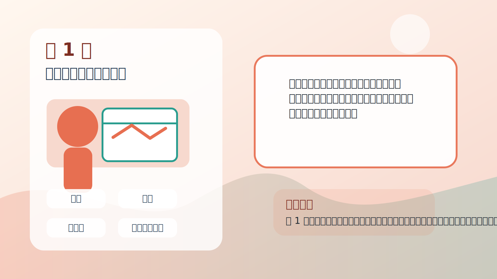
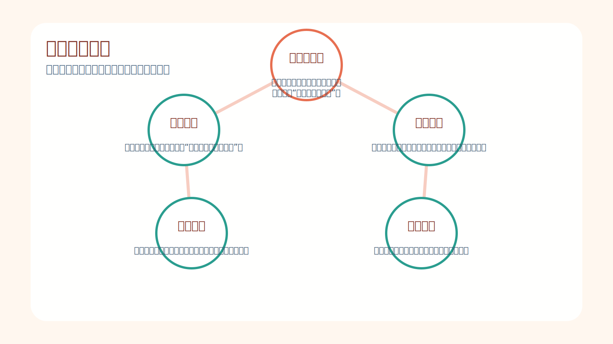
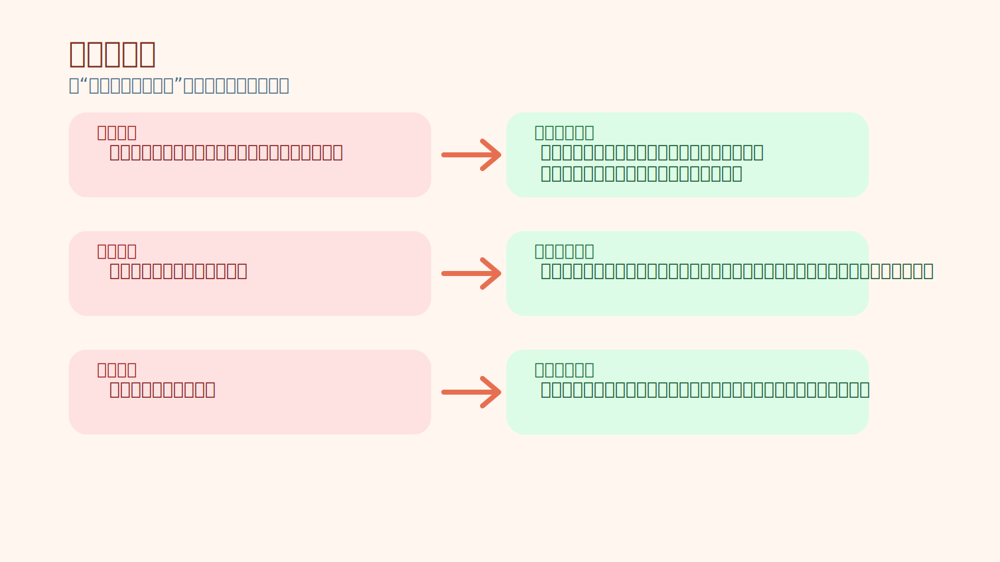
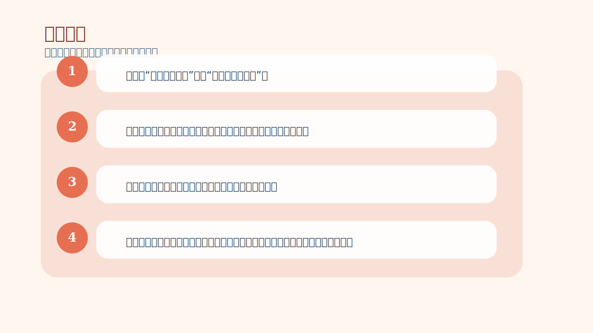

# 第 1 章｜成功之路：基本面、技术面或思想分析？

## 一句话主旨

第 1 章先把交易学习的路线摆出来：只看基本面，容易被现实打脸；只看技术面，容易懂了却做不到；真正决定结果的，是你怎样理解市场、风险和自己。

## 这章到底在解决什么问题

为什么很多人已经会看消息、会看图，却还是赚不到能留下来的钱？

为什么这章重要：
这是全书的总开关。作者用这一章告诉读者，交易不是“谁更会预测”，而是“谁更能在不确定中稳定行动”。如果这一层没看懂，后面所有关于纪律、概率、信念的训练都会被误解成技巧清单。

## 关键知识点

- **基本面分析**：研究消息、供需、利率和报表，试着判断“价格应该去哪里”。
- **技术分析**：观察价格和行为模式，判断“市场现在正在做什么”。
- **思想分析**：训练自己怎样面对不确定、怎样执行有优势的动作。
- **现实落差**：你认为市场应该怎样，与市场实际怎样之间的缝隙。
- **心理落差**：你明明看懂了，却还是没办法稳定做出来。

## 按章节内容展开

### 1. 开始：基本面分析

作者先回顾基本面分析曾被视为“正统”的时代。基本面会把利率、天气、报表、供需等因素全部纳入模型，试着推导未来价格该在哪里。但作者指出，价格真正的推动者是人，是人对未来的信念与情绪，不是模型本身。

孩子也能懂的说法：
这就像老师用课程表告诉你今天应该上数学课，可全班同学突然冲出去看操场比赛，教室立刻就空了。计划没错，但现场真正发生什么，还是看人怎么动。

放回交易里看：
放在交易里，这意味着“逻辑正确”不等于“马上赚钱”。你可能长期方向判断没错，但短期波动已经大到把你甩出场。

### 2. 转到技术分析

接着作者说明为什么交易者逐渐转向技术分析。因为市场里的人会重复做相似的事，群体行为会留下可观察、可统计、可重复的模式。技术分析的价值，不在于神奇预测，而在于把重复出现的行为组织成可执行的机会地图。

孩子也能懂的说法：
好比你发现学校食堂一到下课前五分钟就开始排长队。你不需要知道每个同学今天中午为什么饿，只要知道这个规律常常会出现，你就能提前行动。

放回交易里看：
这让交易者不再执着于“价格本来该去哪”，而是把注意力放到“现在的行为模式意味着什么概率更大”。

### 3. 转到思想分析

但作者马上指出，只会技术分析仍然不够。很多人明明能看出机会，却在该下单时犹豫、在该止损时抗拒、在该止盈时贪心。于是问题从市场分析转向自我分析：真正挡住稳定盈利的，是心理落差，而不是信息不够。

孩子也能懂的说法：
就像你知道游泳动作怎么做，站在岸上讲得头头是道，可一跳进水里就紧张乱拍。不是你没学过，而是身体和脑子还没有真正适应水里的感觉。

放回交易里看：
这就是本书的起点：解决问题的关键不在于继续堆分析工具，而在于训练一种能承受不确定、能接受亏损、能执行优势的交易者心智。

## 孩子也能记住的类比

**学骑车不是只看说明书**

你可以看很多骑车教程，知道刹车、转弯、加速分别是什么，也能分辨哪辆车更快。但真正上路以后，你还要学会平衡、学会摔倒了不慌、学会前面突然有人时立刻处理。这些才是“会骑”。

这个类比想说明：
交易也是一样。知识是车，方法是地图，心态和平衡能力才是你真正能不能到终点的原因。

## 常见错误

- 误区：只要分析得更深入，我迟早会自动变成稳定赢家。
- 修正：分析能力能带来理解，但不能自动带来执行力。真正让人成熟的是面对风险时的思考方式。
- 误区：市场会奖励逻辑最完美的人。
- 修正：市场只会不断流动。你可以逻辑正确，却依然因为波动、时机和心态问题赚不到钱。
- 误区：看懂图就等于会交易。
- 修正：看懂是认知层，做得稳是心理层。两者之间有一道必须跨过去的门槛。

## 记忆卡片

- 基本面告诉你世界为什么可能变，技术面告诉你大家已经怎么动，思想分析告诉你你能不能真的做出来。
- 现实落差来自市场不按“应该”走，心理落差来自你知道却做不到。
- 稳定盈利不是找到万能解释，而是培养能在不确定中稳定行动的脑子。

## 行动清单

- 先分清“我在解释市场”还是“我在跟市场争论”。
- 每次做交易前，写下自己的优势来自哪里，而不是只写预测方向。
- 把一次交易看成样本，不把单笔输赢当成能力判决书。
- 当你发现自己一直在补知识却没补执行力时，提醒自己问题可能已经转到心理层。
