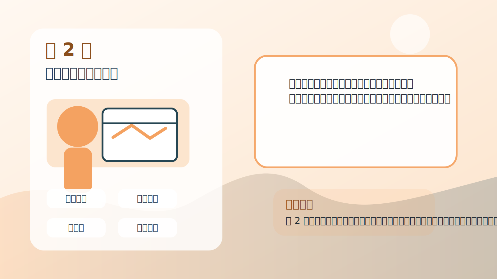
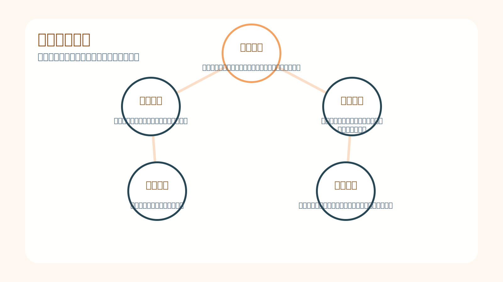
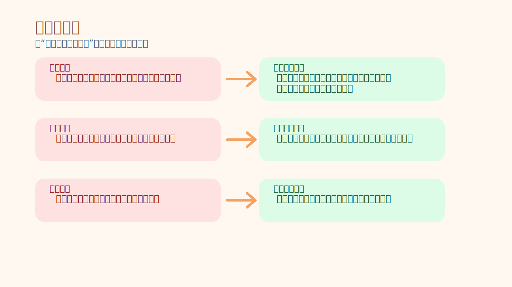
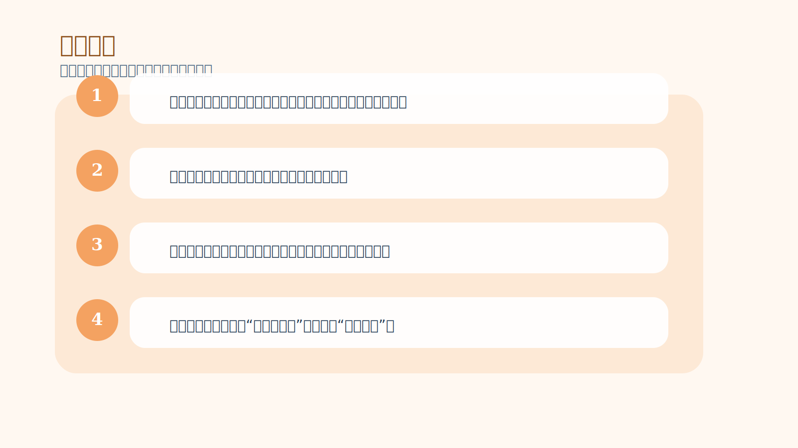

# 第 2 章｜交易的诱惑（和危险）

## 一句话主旨

第 2 章专门拆解交易最迷人的地方，也正是它最危险的地方：市场给了人几乎无限的表达自由，但大多数人并没有准备好在无边界的环境里为自己负责。

## 这章到底在解决什么问题

交易为什么看起来那么自由、那么迷人，却又让很多人越做越痛苦？

为什么这章重要：
很多人把失败归因于技术不好，作者却提醒：在交易中，问题常常发生在更前面。你是因为自由、刺激、证明自己、还是想快速翻身而来？动机如果混乱，规则就会被情绪吃掉。

## 关键知识点

- **自由表达**：交易允许你随时进出、随时改变主意、随时承担结果。
- **心理挑战**：没有外部边界时，人必须自己制造边界。
- **随机回报**：不是每次好行为都马上有好结果，这会让人上瘾。
- **外部控制**：总想让市场按自己的意愿走。
- **内部控制**：把注意力拉回自己能定义、能执行、能承担的事情。

## 按章节内容展开

### 1. 吸引

作者认为，交易真正的吸引力不只是赚钱，而是它提供了一种其他职业很少有的自由感：你可以随时开始、停止、加码、减仓，几乎没有人挡着你。对很多人来说，这种“我可以按自己的想法行动”的感觉极其迷人。

孩子也能懂的说法：
就像到了一个巨大的游乐园，所有项目都不用排队，想先玩哪个就玩哪个。光是这种自由，就足以让人兴奋。

放回交易里看：
问题在于，越自由的环境，越需要内部规则。没有边界的市场会把一个人的冲动、贪心和证明欲全部放大出来。

### 2. 危险

危险不在自由本身，而在“无限可能 + 无限行动自由”的组合。市场几乎随时都能给你机会，也几乎随时都能让你受伤。如果一个人习惯了由外部制度约束自己，一进入这种环境，就很容易失去平衡。

孩子也能懂的说法：
像一个孩子突然拿到整间糖果仓库的钥匙。如果没有人告诉他什么时候停、为什么停、停了也没关系，他很快就会肚子疼。

放回交易里看：
交易者需要的不是更强的控制别人能力，而是更强的自我界限感：什么可以做，什么时候必须停，为什么亏损不能被当成侮辱。

### 3. 安全措施

作者强调，真正的安全措施来自内在结构，而不是市场会变温柔。你必须建立一套心理护栏，把自由和自伤风险隔开。规则、仓位、亏损承受、执行流程，本质上都属于这个护栏系统。

孩子也能懂的说法：
玩滑板时戴头盔不是因为你不想玩，而是因为你想玩得久一点。规则不是限制自由，而是保护自由。

放回交易里看：
如果没有这些护栏，市场每次波动都会直接撞到你的自尊、希望和恐惧，最后连一个好系统都执行不下去。

### 4. 问题：不愿制定规则

很多人喜欢交易，恰恰因为它不像学校考试，不像公司汇报，没有谁盯着你必须按流程做。于是他们享受自由，却抗拒规则，误以为规则会削弱机会。作者认为，这是交易者最早也最常见的自我破坏。

孩子也能懂的说法：
有些小朋友喜欢搭积木，却不想先把地垫铺平。开始看着快，最后塔总是先倒。

放回交易里看：
不愿写规则的人，最后会被情绪写规则。那时做出的每个决定都像临场猜题，完全不能复制。

### 5. 问题：不愿承担责任

如果一个人不愿意承认“是我决定买的，是我决定不止损，是我决定赌这一把”，他就会把责任丢给消息、指标、老师、平台、庄家。这样做能暂时保护自尊，却永远学不会成长。

孩子也能懂的说法：
像考试没考好就一直说卷子不好、座位不好、天气不好，却不肯看自己哪道题真的不会。

放回交易里看：
责任感不是自责，而是承认选择权在自己手里。只有这样，错误才可能转化成下一次的改进素材。

### 6. 问题：对随机回报上瘾

市场最危险的设计之一，是它会用随机的方式奖励人。你可能靠冲动乱做也赢一笔，也可能按规则做却先亏一笔。于是大脑会被“偶尔中大奖”的感觉绑住，开始追逐刺激，而不是训练优势。

孩子也能懂的说法：
这像抓娃娃机。最麻烦的不是一直抓不到，而是偶尔真的抓到了，那会让你一直想再来一次。

放回交易里看：
交易者必须学会从“这次赢了没”转向“这次是不是按优势做了”。否则你训练的不是能力，而是上瘾。

### 7. 问题：外部控制与内部控制

作者最后把关键拉回控制感。外部控制是想改变市场、想证明自己判断正确；内部控制则是约束自己的风险、定义自己的行为、接受自己的成本。成熟交易者把力气花在后者。

孩子也能懂的说法：
如果风很大，你拉不住风，但你可以把风筝线握稳、把脚站稳、知道什么时候该收线。

放回交易里看：
这章的底层结论是：你控制不了市场，你只能控制自己面对市场时怎样行动。所有职业化训练都从这里开始。

## 孩子也能记住的类比

**没有红绿灯的路口**

想象一个很宽很空的十字路口，没有红绿灯，也没有交警。每个人都可以随时冲过去。刚开始大家都觉得真自由，可是车一多，危险马上就来了。最后真正安全的人，不是最敢冲的人，而是最会自己判断先后、最愿意守节奏的人。

这个类比想说明：
交易也是如此。自由不是随便做，而是你已经有能力在没有人提醒时，仍然做对自己负责的决定。

## 常见错误

- 误区：交易最棒的地方是没人管我，所以我可以随心所欲。
- 修正：没人管你并不等于你不需要规则。真正的高手，是把规则装进自己脑子里的人。
- 误区：只要我很兴奋、很有感觉，就说明我找到了机会。
- 修正：强烈情绪常常意味着你被诱惑了，而不是你真的有优势。
- 误区：偶尔靠冲动赚到钱，说明这种做法也可以。
- 修正：随机奖励最会骗人。它会把坏习惯伪装成天赋。

## 记忆卡片

- 交易最迷人的地方，是它让你几乎完全自由；交易最危险的地方，也是这个。
- 没有外部边界的环境，会逼人建立内部边界。
- 市场会随机奖励坏习惯，所以你必须用规则替大脑做筛选。

## 行动清单

- 交易前先回答：我想要的是刺激，还是想做一门可重复的事业？
- 把入场、止损、止盈和停手条件写成固定句子。
- 记录每次冲动单的触发原因，找出自己最常见的诱惑按钮。
- 每天复盘时优先评价“是否守规则”，再评价“是否赚钱”。
