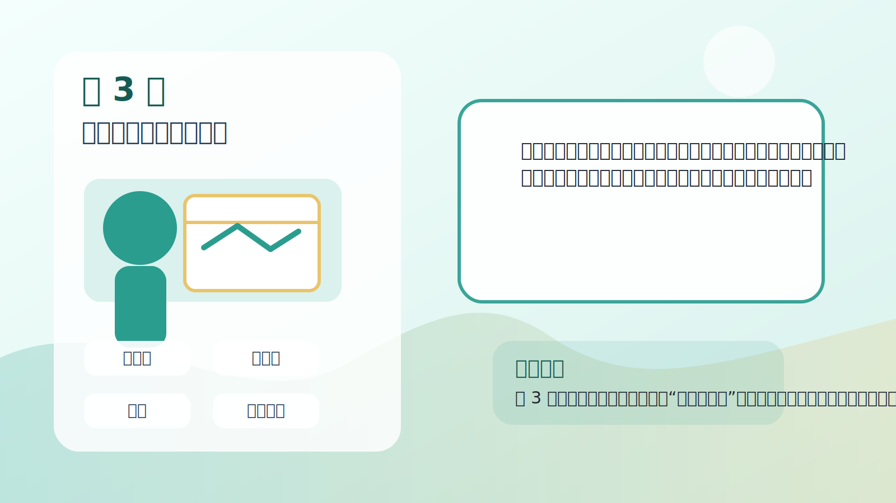
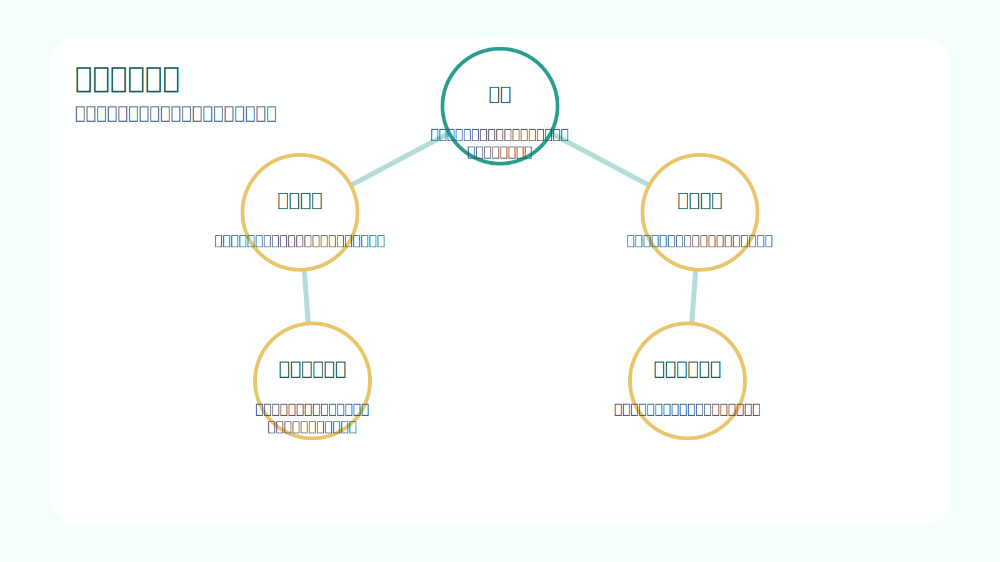
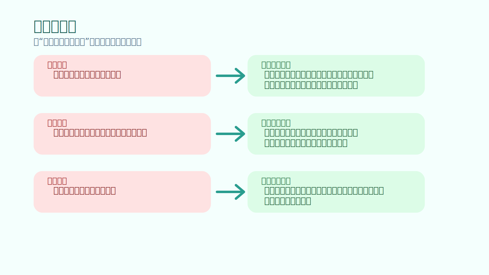
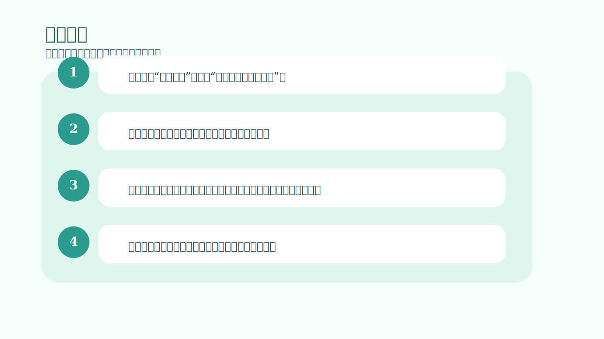

# 第 3 章｜自己承担责任

## 一句话主旨

第 3 章说明，责任不是嘴上承认“亏了是我的”，而是把自己的心理环境重新整理到一个能接受风险、能从结果里学习、而不是不断自我防御的状态。

## 这章到底在解决什么问题

为什么‘承担责任’听上去像大道理，却是交易者真正分层的地方？

为什么这章重要：
这是全书从“认识问题”走向“开始改造自己”的真正起点。作者认为，只要你还把市场当成对手、老师、审判官、伤害者，你就不可能形成稳定表现。

## 关键知识点

- **责任**：承认选择由自己完成，结果可被学习，而不是只被抱怨。
- **心理环境**：你怎样解释市场、亏损和自己行为的内部空间。
- **防御反应**：为了保护自我形象，自动回避痛苦信息。
- **赢家与崩溃者**：同样会赢，但有人靠结构累积，有人靠情绪失控后爆掉。
- **自我最佳利益**：不是当下舒服，而是长期对自己最有利。

## 按章节内容展开

### 1. 塑造思想环境

作者指出，很多人在现实生活里通过影响别人、谈判、推动、说服来得到想要的结果，这些技能在职场很有用，但放进市场却常常失灵。市场不会因为你更聪明、更能争、更有理由就照着你想要的方向走。

孩子也能懂的说法：
就像你可以说服朋友跟你一起玩，但你说服不了今天下不下雨。面对天气，你只能准备雨伞，而不是跟乌云吵架。

放回交易里看：
成熟交易者会改造自己的思想环境：不再试图压市场，而是训练自己更客观地看信息、更稳定地执行对自己长期有利的动作。

### 2. 对亏损的反应

亏损之所以难，不只是因为钱少了，还因为它会刺痛人对自我能力的想象。只要你把亏损解释成“我失败了”“市场在针对我”，你的大脑就会自动防御：否认、拖延、加仓、报复、冻结。

孩子也能懂的说法：
这像小朋友搭积木倒了以后，不肯看哪一层搭歪了，只想马上再堆更高，结果第二次倒得更快。

放回交易里看：
承担责任的核心，是把亏损从人格攻击改写成信息反馈。亏损是某次行为的结果，不是对整个人价值的宣判。

### 3. 赢家、输家、暴发者和崩溃者

作者区分了几种常见交易者：持续赢家、长期输家、偶尔大赚却守不住的人。差别不在于他们有没有遇到机会，而在于他们有没有形成一套能吸收胜负、持续稳定输出的心理结构。

孩子也能懂的说法：
有人拿到零花钱会慢慢存，有人一拿到就一下花光，还有人今天捡到很多明天又全弄丢。看上去都“得到过钱”，结果却完全不同。

放回交易里看：
真正的赢家不是从不波动的人，而是能让自己不被一两次输赢带走、能把行为保持在优势框架里的人。

## 孩子也能记住的类比

**照镜子与打镜子**

脸上有一块泥巴时，有人会照镜子然后去洗脸；也有人会觉得镜子让自己难看，生气地拍镜子。第一种人在解决问题，第二种人在跟反馈吵架。

这个类比想说明：
市场更像镜子，不像老师。它只是把结果照给你看。真正成长的人，不是讨厌镜子的人，而是会根据镜子修正动作的人。

## 常见错误

- 误区：承担责任就是不停责怪自己。
- 修正：责任的重点是拥有改进权，而不是制造羞耻感。自责会让你缩小，责任会让你开始修正。
- 误区：只要我很想赢，我就能逼市场给我答案。
- 修正：市场不回应意志力，它只回应群体行为。你真正能改变的是自己的反应系统。
- 误区：大赚过说明我已经是赢家。
- 修正：没有稳定结构的大赚，常常只是情绪放大的副产物，不能代表长期能力。

## 记忆卡片

- 责任不是背锅，而是把改变的钥匙拿回自己手里。
- 亏损最刺痛的不是钱包，而是自我形象；看懂这一点，才不会被防御反应牵走。
- 赢家和暴发者都可能赚过大钱，真正的区别在于谁有结构、谁只靠情绪。

## 行动清单

- 复盘时把“市场害我”改写成“我当时做了什么选择”。
- 每次亏损后记录：我是在学习，还是在捍卫自尊？
- 把一次交易拆成可控部分和不可控部分，避免把不可控结果人格化。
- 对大赚和大亏同样做流程复盘，防止把运气当实力。
