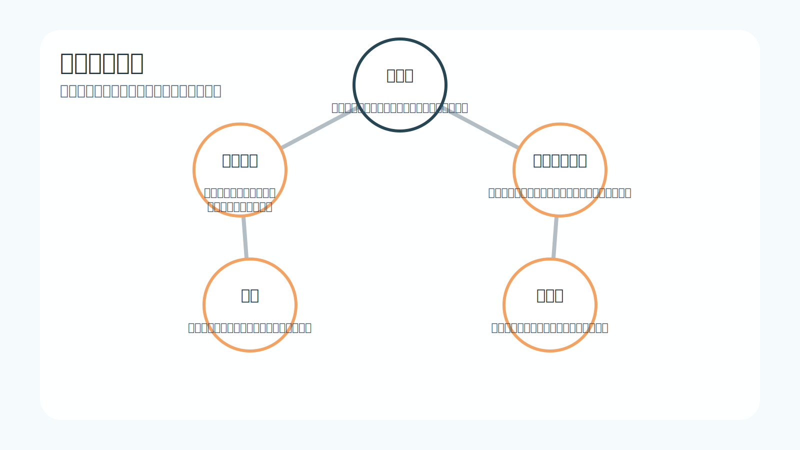
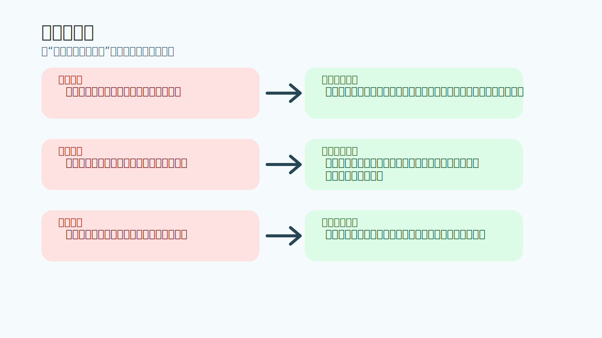
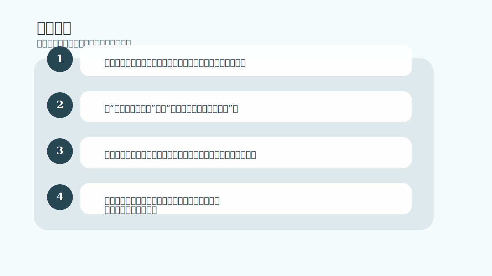

# 第 4 章｜持续一致性：一种思想状态

## 一句话主旨

第 4 章把作者的立场说得非常明确：稳定盈利先是一种思想状态，然后才表现为一系列看起来很有纪律的动作。没有合适的状态，再好的规则也会被你自己改坏。

## 这章到底在解决什么问题

持续一致性到底是一套方法，还是一种脑内状态？

为什么这章重要：
这一章把“稳定”从结果层拉回心理层。很多人总想靠更好的信号筛选来换来稳定，作者却要求先建立能真正接受风险、接受不确定、接受单次无意义的大脑框架。

## 关键知识点

- **一致性**：不是每次都赢，而是长期行为与优势保持一致。
- **思想状态**：一套稳定的信念与态度，让你在波动中不失真。
- **真正理解风险**：在下单前就把最坏结果纳入心理和资金承受范围。
- **对齐**：内在信念、交易计划和实际动作相互一致。
- **职业化**：把交易当成样本管理，而不是情绪冒险。

## 按章节内容展开

### 1. 思考交易

作者提醒读者，最优秀的交易者和普通交易者最大的区别，不是动作更复杂，而是他们思考交易的方式不同。他们不把交易当成证明自己聪明的战场，而当成在概率中管理行为和风险的工作。

孩子也能懂的说法：
像做投篮练习时，有人每投一个球都在想“别人会不会觉得我厉害”，有人只盯着站位、手型和节奏。后者更容易稳定。

放回交易里看：
如果你一直把交易理解成“我必须看对”，那你每次下单都在给情绪加压；如果理解成“我在执行一个有优势的样本”，动作会平稳很多。

### 2. 真正理解风险

很多人嘴上说自己知道风险，其实只是知道“可能会亏”。作者认为真正理解风险，意味着在交易前就完全接受这笔钱可能损失，不指望市场来安慰你，也不在进场后临时改口。

孩子也能懂的说法：
这就像出门前你已经决定今天可以把一把伞借给别人，所以真的借出去时不会心里一直翻腾。

放回交易里看：
只有在风险被事先接受后，止损才会变成流程动作，而不是情绪割肉。否则你会总想拖一下、等等看、再给市场一个机会。

### 3. 调整思想环境

一致性最终来自环境对齐。作者要读者把自己的内在环境整理成支持稳定执行的样子：该相信什么、该放弃什么、怎样理解输赢、怎样让规则不再被自尊和希望随意改写。

孩子也能懂的说法：
就像你想把房间收拾干净，不能只是说“我要整洁”，还要把玩具、书本、垃圾桶都放在正确的位置上。

放回交易里看：
交易里的环境对齐，就是让你的想法、计划、仓位、执行、复盘都指向同一件事：长期可重复，而不是短期证明。

## 孩子也能记住的类比

**走钢丝前先练平衡**

一个人在地面上练平衡木时，看起来动作很简单；可只要把木头抬高，他如果心里一直想着‘我千万不能掉下去’，身体就会越来越僵。真正稳定的人，不是不会紧张，而是已经练出一种能让身体回到平衡的位置感。

这个类比想说明：
交易一致性也是这样。你不是靠吓自己来稳住，而是靠事先建立好的风险观、信念和动作习惯回到中心。

## 常见错误

- 误区：持续一致性就是把胜率提高到几乎不亏。
- 修正：一致性不是消灭亏损，而是在亏损存在的情况下仍然能稳定执行优势。
- 误区：我已经知道有风险了，所以我算接受风险。
- 修正：知道和接受不是一回事。接受意味着亏损真正发生时，你的行为不会扭曲。
- 误区：只要我逼自己守纪律，心里怎么想不重要。
- 修正：没有配套信念的纪律只会短期有效，压力一大就会崩开。

## 记忆卡片

- 一致性先是一种内在秩序，后才会表现为漂亮的资金曲线。
- 真正接受风险的人，止损时会像关灯一样自然，而不是像割掉自己一块肉。
- 纪律是状态的外衣，不是状态的替代品。

## 行动清单

- 下单前问自己：如果这笔交易马上止损，我是否仍愿意承担？
- 把“我这次一定要对”改成“我这次只需要把样本做好”。
- 把一致性的目标从单笔结果，转向一周或一组交易后的流程质量。
- 找出自己最常见的内外不一致：例如计划写得稳，实际下单却放大仓位。
