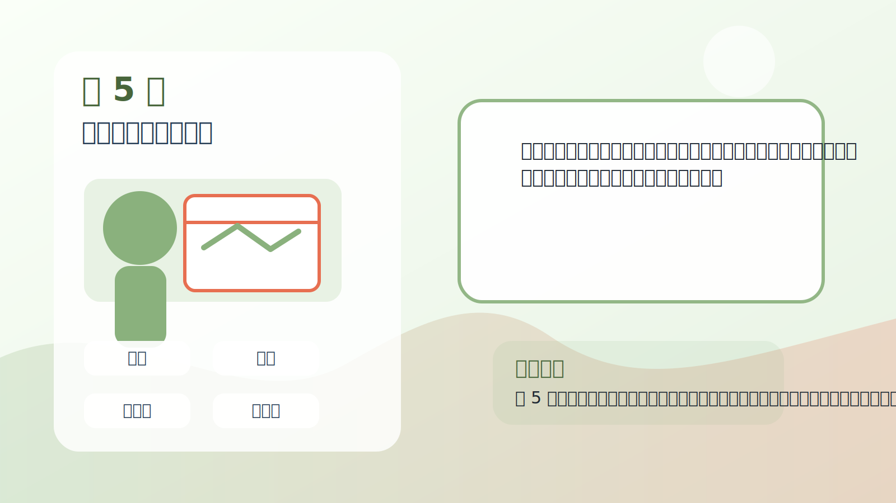
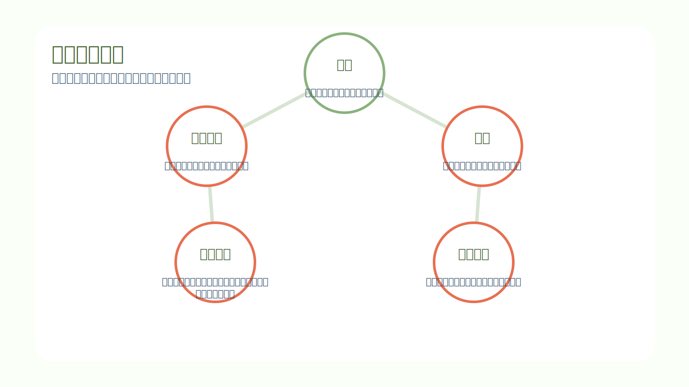
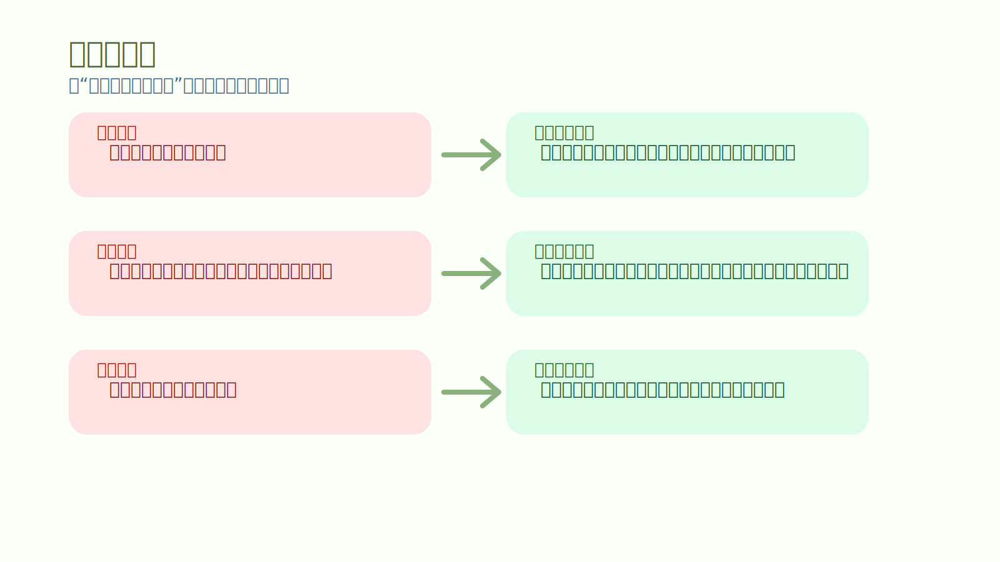
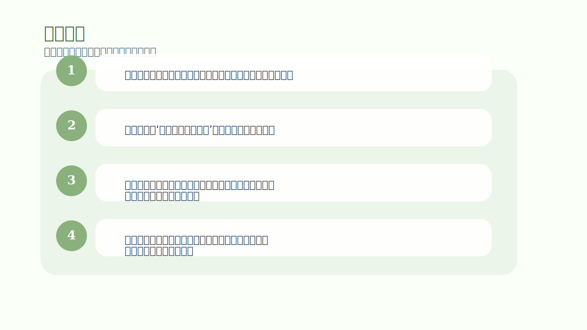

# 第 5 章｜认知的动力

## 一句话主旨

第 5 章解释了认知是怎样工作的。你看到的市场，从来不是纯粹客观的市场，而是被过往记忆、痛苦回避、联想系统过滤后的市场版本。很多交易错误不是技术错误，而是感知错误。

## 这章到底在解决什么问题

为什么明明是同一张图、同一段行情，不同人看到的却像两个世界？

为什么这章重要：
如果不理解这一章，交易者就会永远以为是“市场很坏”“机会很少”“信号不清楚”。作者在这里等于告诉你：先检查镜头，再谈风景。

## 关键知识点

- **认知**：你怎样选取、组织和解释信息。
- **心理软件**：由过去经验写进脑中的自动程序。
- **联想**：当前刺激触发旧记忆与旧情绪。
- **感知风险**：你以为危险有多大，常常取决于过去经历，而非当前事实。
- **开放学习**：让新信息进入，而不是只重复旧结论。

## 按章节内容展开

### 1. 给思想软件除错

作者用“软件除错”的比喻说明，大脑里有很多旧程序会自动运行。它们原本也许是为了保护你不受伤，但在交易里却会让你扭曲信息、错过信号、提前恐慌。问题往往不在于你不知道，而在于旧程序抢先解释了世界。

孩子也能懂的说法：
像一台老旧平板电脑，总是自动弹出旧页面。你想打开新的学习软件，它却先跳到以前的游戏界面。

放回交易里看：
交易中的除错，不是把自己变成机器人，而是逐步发现哪些自动反应已经不适合当前环境，然后重写它们。

### 2. 认知与学习

作者指出，人只能看到自己准备好看到的东西。没学过的模式是看不见的，已经深信的解释会挡住新的信息。因此学习不是单纯加内容，而是扩展你的注意力边界，让新的可能性进入意识。

孩子也能懂的说法：
就像第一次学乐谱时，你只看到一堆黑点；等你学会一点以后，同样的纸面突然开始有节奏、有层次。

放回交易里看：
很多人说“这个市场没机会”，其实常常只是自己的认知仓库里还没有装进足够多的模式，也还不愿承认原来的看法有限。

### 3. 认知与风险

风险并不只是客观数字，也是一种主观体验。只要某个图形、某段波动、某次震荡触发了你过去的痛苦记忆，你对当下风险的感受就会膨胀。于是你不是在应对当前行情，而是在躲避过去的阴影。

孩子也能懂的说法：
这像曾经被狗吓到的孩子，后来哪怕遇到一只很温顺的小狗，也会先后退两步。

放回交易里看：
作者想让交易者看到：许多所谓“市场很危险”的时刻，危险的一部分其实来自你脑中的旧录像带。

### 4. 联想的力量

联想是第 5 章的关键。大脑会把眼前的刺激与过去相似的情境绑在一起，几乎瞬间就唤起旧情绪、旧期待和旧防御。因此当你在交易里突然特别兴奋、特别抗拒、特别想证明什么时，往往是联想系统已经接管。

孩子也能懂的说法：
闻到某种味道，你会立刻想起小时候去外婆家的暑假。市场也会这样，只是它唤起的可能不是温暖，而是害怕和冲动。

放回交易里看：
理解联想后，你就知道为何客观看只是一次普通回撤，自己却突然变得异常紧绷。那不是当前行情本身有多特别，而是它碰到了你旧经验里的按钮。

## 孩子也能记住的类比

**不同颜色的眼镜**

三个人看同一片天空，一个戴红眼镜，一个戴蓝眼镜，一个没戴眼镜。他们争论得很厉害，都觉得自己看到的颜色才是真的。其实天空没有变，变的是他们眼前的镜片。

这个类比想说明：
交易里，镜片就是你的经验和信念。先承认自己戴着镜片，才有机会把镜片擦干净。

## 常见错误

- 误区：我看到的就是事实本身。
- 修正：你看到的是经过经验、信念和情绪过滤后的事实版本。
- 误区：我之所以害怕，是因为市场现在真的特别危险。
- 修正：有时危险来自当前价格，有时更大部分来自你过去的联想与记忆。
- 误区：学习就是收集更多知识点。
- 修正：真正的学习还包括松开旧结论，让新模式被你看见。

## 记忆卡片

- 你看到的市场，永远带着自己的滤镜。
- 感知错误比分析错误更隐蔽，因为你会误以为自己看到的是事实本身。
- 交易成长的一部分，就是把旧联想从方向盘旁边请下来。

## 行动清单

- 遇到强烈情绪时，先问：这是当前行情，还是旧经验在说话？
- 复盘时记录‘我当时看到了什么’，而不是只记录结果。
- 定期回看自己曾经完全看不懂、现在已经能看懂的图，提醒自己认知可以被扩展。
- 把常见触发词写出来：害怕、报复、证明、想翻本，找到它们背后的旧故事。
