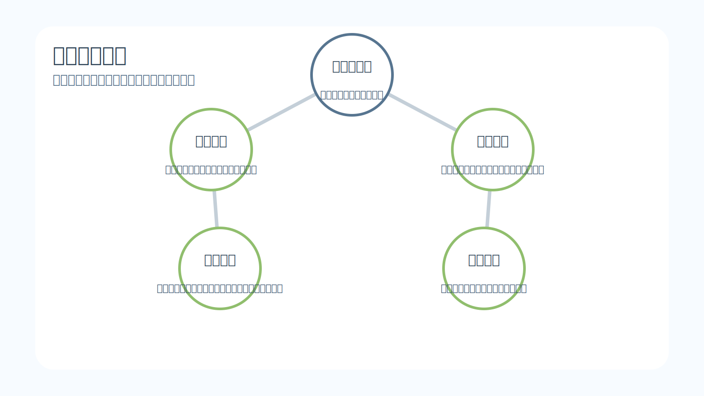
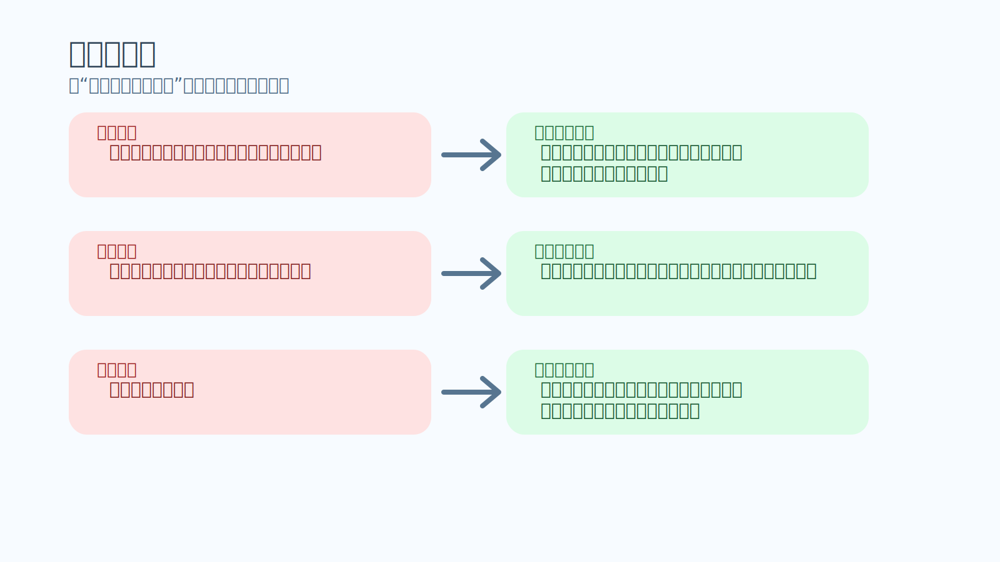
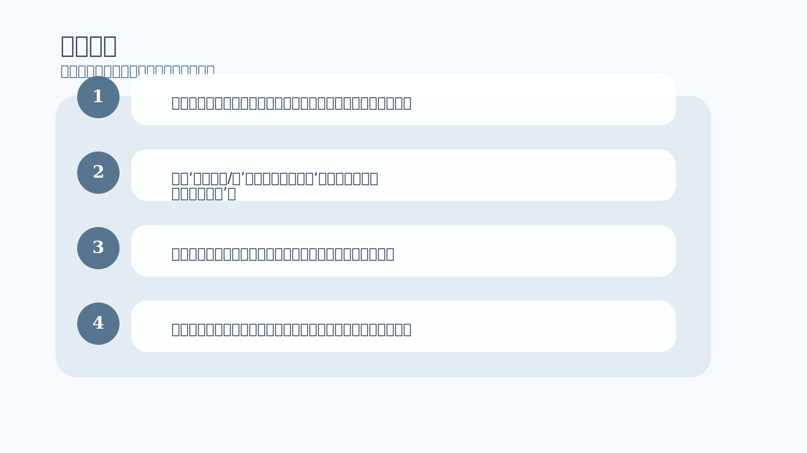

# 第 6 章｜市场的角度

## 一句话主旨

第 6 章逼读者从个人情绪里退一步，用市场的视角理解市场：市场没有义务延续你上一笔的结果，也没有义务配合你的期待。它唯一稳定的特点，就是它可以用几乎无限种方式表达自己。

## 这章到底在解决什么问题

如果站在市场自己的角度看，市场到底是什么样的东西？

为什么这章重要：
这一章是概率思维的地基。只有先承认市场天生不确定、且每个时刻都可能独特，你才可能停止把上一次输赢投射到下一次交易中。

## 关键知识点

- **不确定原则**：单次结果无法提前确定。
- **无限表达**：市场每一刻都可能以不同方式展开。
- **独特时刻**：即使图形相似，也不代表结果必然重复。
- **市场视角**：不从个人得失出发，而从系统特性出发理解波动。
- **去个体化**：不把市场的行为解释成针对自己。

## 按章节内容展开

### 1. “不确定”原则

作者指出，普通交易者对风险的感受，往往被最近几笔结果严重影响。刚赢过就容易过度自信，刚亏过就容易过度谨慎。真正成熟的交易者则知道，下一笔交易并不会因为上一笔赢或输就自动改变概率。

孩子也能懂的说法：
像抛硬币，前面连续三次正面，不等于下一次就“应该”反面；每次抛都还是新的。

放回交易里看：
这要求交易者把注意力从近期情绪中抽离，回到样本和优势本身。否则你实际上不是在交易当前机会，而是在交易上一笔的余震。

### 2. 市场最基本的特点：几乎无限地表达自己

第 6 章最重要的一句话就是：市场可以用几乎无限的方式表达自己。它不欠你重复，不欠你整齐，也不欠你一个好看的入场点。只要你忘了这一点，就会不断用“应该”去要求市场，进而制造失望与冲突。

孩子也能懂的说法：
就像云朵每次都长得像云，但没有哪两片云完全一模一样。你可以认出‘这是云’，却不能要求它一定长成上次那只兔子的样子。

放回交易里看：
从市场角度理解市场，就是承认模式只能给你优势，不能给你保证；给你方向感，不能给你控制权。

## 孩子也能记住的类比

**看河流而不是命令河流**

河水不会因为你昨天顺利过河，今天就自动变慢；也不会因为你今天着急，就专门给你让出一条直线。聪明的人会先看水深、流速和石头位置，然后决定怎么走。

这个类比想说明：
交易也是同样的道理。理解市场视角，不是让你消极，而是让你别再把自己的希望误当成市场义务。

## 常见错误

- 误区：这次图形和上次很像，所以结果应该也一样。
- 修正：相似只意味着有优势，不意味着结果复制。市场每个时刻仍然是新的。
- 误区：我连输几笔，下一笔大概率该轮到我赢了。
- 修正：市场不会因为安慰你而调概率，单笔结果仍是独立展开的。
- 误区：市场故意针对我。
- 修正：市场没有人格，没有情绪，它只是在流动。把它个人化，只会放大你的痛苦。

## 记忆卡片

- 市场最稳定的特点，就是它不保证重复。
- 概率不是承诺书，只是方向感。
- 你越把市场看成自然现象，越能减少与它的无谓冲突。

## 行动清单

- 每次下单前把上一笔结果从脑中拿掉，只看当前优势是否成立。
- 遇到‘它应该涨/跌’的念头时，改写成‘如果优势成立，概率偏向哪里’。
- 把最近三笔输赢和当前决策分开记录，训练独立样本思维。
- 看到市场异常时，先描述它正在做什么，不先判断它该做什么。
