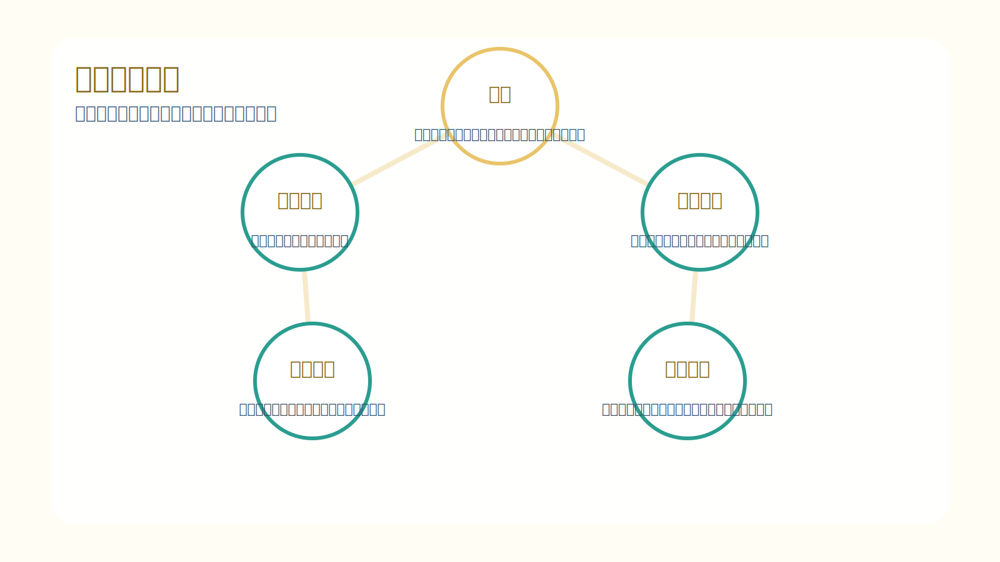
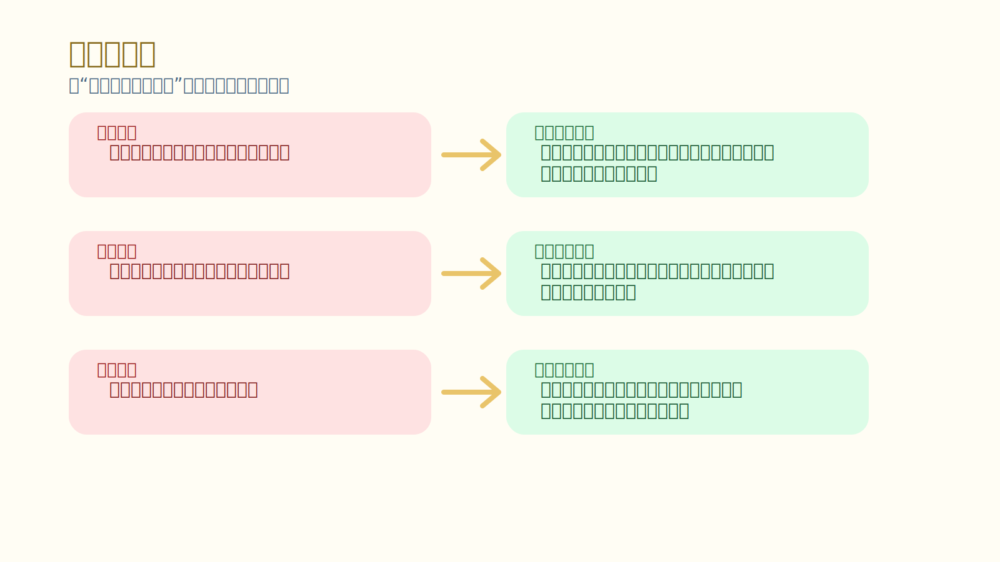
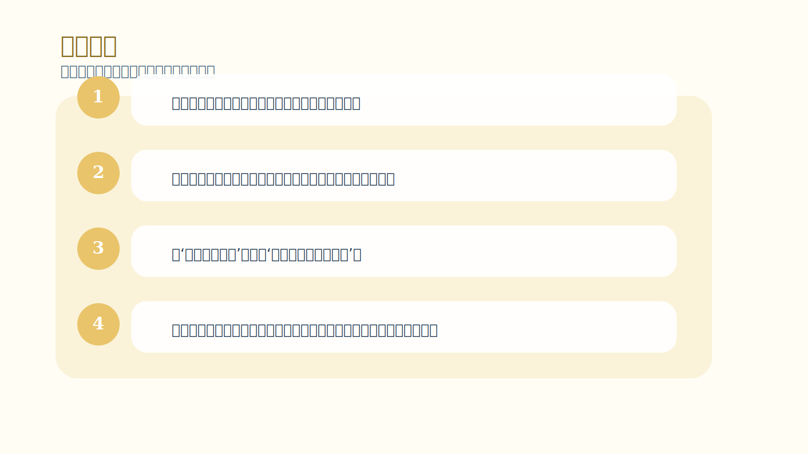

# 第 7 章｜交易者的优势：考虑概率

## 一句话主旨

第 7 章是全书的核心。作者借赌场的例子说明：单笔结果可以随机，但只要你真正拥有优势，并且持续执行，长期结果就会稳定向优势倾斜。问题不是市场不给你答案，而是你常常在样本还没积累前就被情绪改写了规则。

## 这章到底在解决什么问题

单次结果明明不确定，为什么作者却说可以做出持续一致的结果？

为什么这章重要：
如果前 6 章是在清理地基，这一章就是搭起大楼的主梁。所谓‘像交易者一样思考’，本质上就是能把自己放进概率框架里生活，不再要求每一笔都证明你是对的。

## 关键知识点

- **优势**：在足够多样本中，让某种结果概率更高的条件。
- **概率悖论**：单次随机，却能长期稳定。
- **当下交易**：不把过去和未来的情绪塞进当前决策。
- **预期管理**：只期待执行优势，不期待单笔一定成功。
- **情绪风险**：不是市场波动本身，而是你对波动的心理扭曲。

## 按章节内容展开

### 1. 概率悖论：随机结果，一致成果

作者用赌场做比喻，是因为赌场最能说明概率思维：赌场不关心某一位顾客这把赢还是输，它关心的是成千上万把之后，规则给予自己的统计优势。交易也一样，单笔不确定不代表长期不可管理。

孩子也能懂的说法：
像玩一个长期偏向你的游戏，偶尔会输一点，但如果规则真对你有利、你又一直按规则玩，最后总分会慢慢向你这边移动。

放回交易里看：
交易者真正该训练的，不是预测每一笔，而是相信优势在样本中的作用，并愿意给样本足够的展开空间。

### 2. 活在当下交易

作者反复强调‘当下’。一旦你把上一笔的挫败、上一周的连赢、对下一笔的幻想都带进当前交易，你就不在面对当下信息，而是在和自己的时间混音作战。

孩子也能懂的说法：
就像投篮时，手里这一球最重要。你如果还在想上一个球没进，或者已经开始庆祝下一个球会进，动作就容易变形。

放回交易里看：
活在当下不是空话，而是把注意力固定到此刻的模式、风险和执行条件，不让过去的痛和未来的梦篡改现在的判断。

### 3. 管理预期

很多交易者受伤，不是因为市场太坏，而是因为自己对市场抱了错误期待：我已经看懂了，所以它应该马上走；我前面连输了，所以这次最好补回来。作者认为，这些预期本质上都在向市场索要保证。

孩子也能懂的说法：
像你种下一颗种子，第二天就蹲在土边等它立刻长成树，等不到就生气。不是种子骗了你，是你的期待不合理。

放回交易里看：
正确的预期应该是：只要优势存在，我执行；至于单次结果如何，我接受。把期待从结果转向流程，情绪会轻很多。

### 4. 消除情绪风险

作者所谓的情绪风险，不只是害怕，而是任何会让你偏离优势的内在噪音。只要你在下单前没有完全接受风险，或者仍在追求‘我一定要对’，情绪风险就已经埋下了。

孩子也能懂的说法：
像骑车时书包里装了一堆会晃的石头。路没有变，可你会因为这些石头东倒西歪。

放回交易里看：
消除情绪风险的关键，不是压抑感受，而是事先把风险、亏损、独立样本和优势执行都想清楚。想清楚以后，情绪自然没那么大力。

## 孩子也能记住的类比

**一整个学期，不是一张测验**

一个学生如果把每一次小测都当成决定命运的大考，情绪就会忽上忽下；可如果他知道整学期有很多次作业、测验和考试，单次失误就不会把他击穿。他会更关注长期习惯是否稳定。

这个类比想说明：
交易也是一样。你不能靠一笔交易证明自己，但可以靠一串合格样本慢慢建立可信的长期结果。

## 常见错误

- 误区：概率思维就是降低要求，不追求看准。
- 修正：概率思维不是放弃标准，而是把标准从单笔正确，升级为长期按优势执行。
- 误区：我已经有优势了，所以我应该常常赢。
- 修正：优势只在足够多样本里显形。要求它每次都发光，会迫使你破坏样本。
- 误区：情绪是交易的一部分，没法管。
- 修正：情绪会出现，但情绪风险可以被大幅降低，前提是你真的接受概率与风险。

## 记忆卡片

- 赌场赢在长期，不赢在每一把；成熟交易者也应如此。
- 活在当下，指的是让当前信息成为当前决策的唯一中心。
- 预期一旦变成索要保证，情绪风险就会迅速升高。

## 行动清单

- 把每笔交易编号，提醒自己它只是样本中的一个。
- 每天至少复盘一次：我是在执行优势，还是在索要确定性？
- 把‘这次一定要成’改写成‘这次只需要合格执行’。
- 如果因为最近几笔结果而明显改变仓位和节奏，立刻停下来重新评估。
