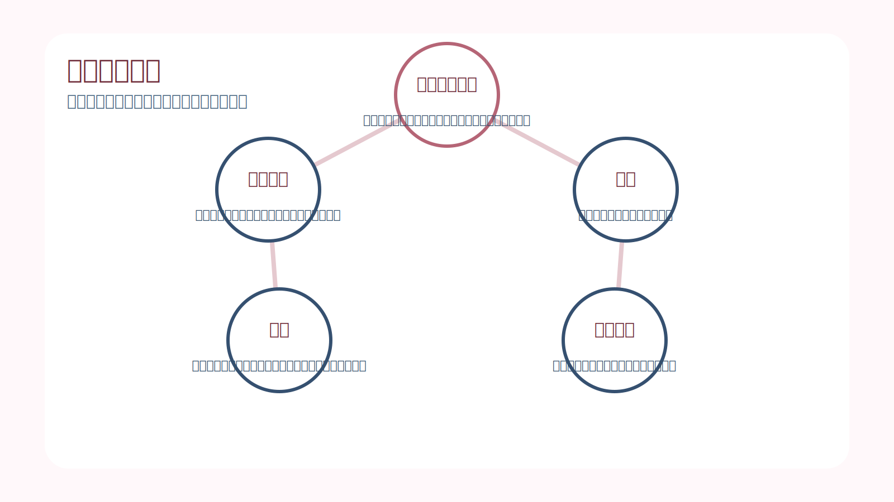
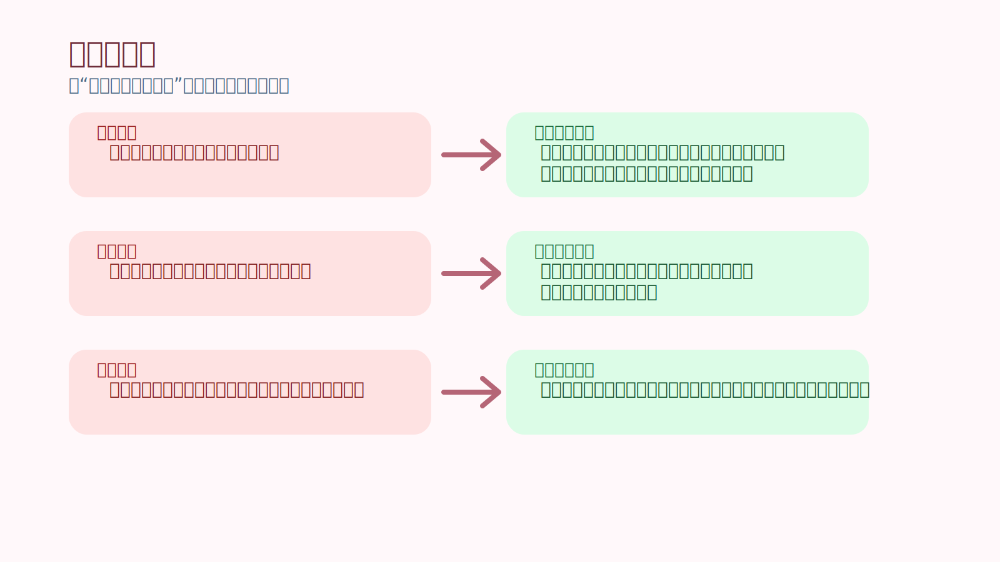
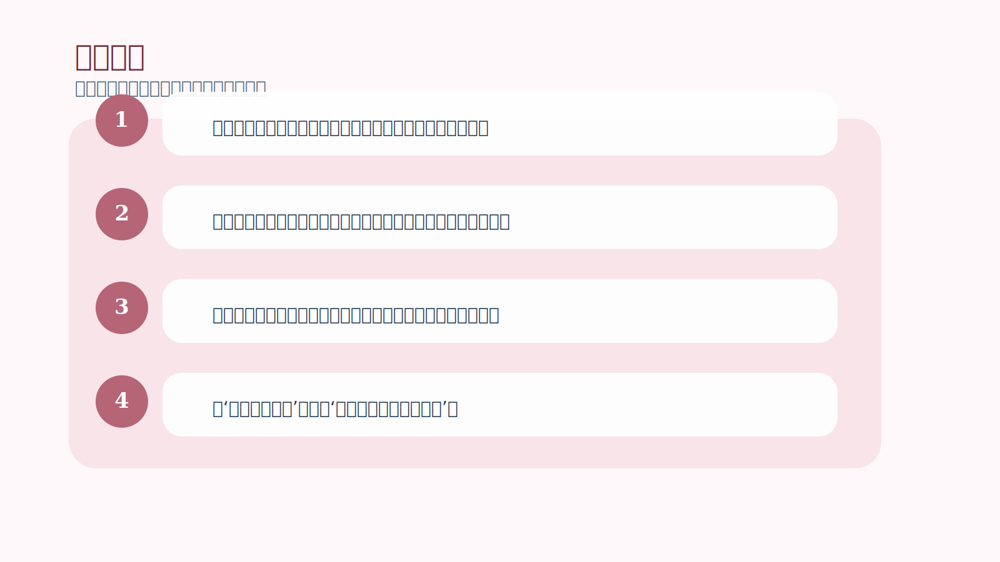

# 第 8 章｜和信念一起工作

## 一句话主旨

第 8 章开始从原理走向安装。作者不再只是讲‘应该怎么想’，而是说明交易者究竟要把哪些基本事实放进自己的信念结构里，并把这些事实转成可运作的技巧与状态。

## 这章到底在解决什么问题

知道概率思维很重要以后，怎样把它真正装进自己的信念系统里？

为什么这章重要：
如果前面只是让你点头，这一章开始要求你重建内在系统。它让抽象概念第一次变得可训练、可重复、可落地。

## 关键知识点

- **五个基本事实**：关于风险、独特时刻、随机结果与优势的基础真相。
- **安装信念**：让新观点不只是懂了，而是真的能自动工作。
- **技巧**：把信念变成行动习惯的桥梁。
- **状态**：当新信念开始稳定运行时出现的轻松、专注与流动感。
- **冲突解除**：清掉旧信念与新原则之间的内在拉扯。

## 按章节内容展开

### 1. 定义问题

作者先重新定义问题：交易者不是单纯缺知识，而是缺一套和市场特性相匹配的信念。只要信念系统还在要求确定、要求每次都对、要求亏损不能发生，任何技巧都会被拖后腿。

孩子也能懂的说法：
就像你想学滑冰，却穿着只能在草地上走路的鞋。不是你不努力，而是底层装备不对。

放回交易里看：
这意味着修正交易，不该只修表层动作，还要修底层认知框架，尤其是你对不确定、风险和自我价值的解释方式。

### 2. 定义术语

接着作者把关键概念讲清楚：什么叫优势，什么叫风险，什么叫接受，什么叫状态。很多交易者之所以反复混乱，是因为他们用口号式理解代替了可操作定义。

孩子也能懂的说法：
像你说‘我要认真学习’，可如果不知道认真具体是坐多久、做什么、怎么检查，最后这句话就只是空气。

放回交易里看：
明确定义术语的作用，是让交易从模糊情绪转成可执行流程。概念越清楚，行为越不容易被临场感觉带偏。

### 3. 五个基本事实与技巧的关系

本章核心在于把五个基本事实连接到执行技巧上。事实告诉你市场本质是什么样，技巧负责把这些事实变成入场、持仓、止损、止盈和复盘时的实际动作。

孩子也能懂的说法：
这像先明白雨天路滑是事实，再学会雨天应该慢走、穿防滑鞋、扶好栏杆。知道事实是一层，会根据事实行动是下一层。

放回交易里看：
作者想让读者明白：技巧不是和信念分开的。真正有用的技巧，必须建立在正确事实观之上，否则动作很快就会被旧习惯吞掉。

### 4. 走向状态

所谓‘状态’，在作者这里不是神秘体验，而是当你真的接受了市场的基本事实后，大脑不再和现实打架，于是出现的一种专注、轻松、清晰、没有多余内耗的工作状态。

孩子也能懂的说法：
像你终于学会骑自行车以后，不再一边骑一边想着会不会摔，而是身体自然知道怎么平衡，路感也变得更清楚。

放回交易里看：
这不是放空，而是一种高质量在场。你能看见机会，也能接受没有机会；能执行，也能停手，不再靠情绪推动自己。

## 孩子也能记住的类比

**更新游戏规则**

一个孩子玩桌游总输，不是因为他不聪明，而是因为他一直用旧规则理解新游戏。等有人把规则重新讲清楚，并陪他玩几轮，他忽然就知道什么时候该进攻、什么时候该防守了。

这个类比想说明：
交易信念的改造也是这样。先更新规则，再重复练习，新的行动方式才会真正变成你的默认反应。

## 常见错误

- 误区：信念很抽象，交易主要还是看技巧。
- 修正：技巧能不能稳定运行，取决于信念系统是否支持它。底层冲突不解决，技巧就会在关键时刻失效。
- 误区：状态是一种天赋，来了就有，不来就没有。
- 修正：状态更多是正确信念长期运行后的自然结果，不是靠激情召唤出来的。
- 误区：我已经同意这些道理，所以它们已经变成我的信念了。
- 修正：同意不等于安装。真正安装好的信念，会在压力时自动保护你的行为。

## 记忆卡片

- 信念不是你说什么，而是压力来时你自动怎么做。
- 概念不清，动作必乱；定义清楚，执行才有抓手。
- 状态不是魔法，是信念与现实不再互相打架后的自然结果。

## 行动清单

- 把五个基本事实写成自己的语言，确认自己真的懂每一条。
- 检查常用规则背后是否有对应事实支撑，而不是只靠习惯复制。
- 当你出现明显内耗时，先找是哪个旧信念在和当前原则冲突。
- 把‘我要进入状态’改写成‘我要先把事实接受清楚’。
