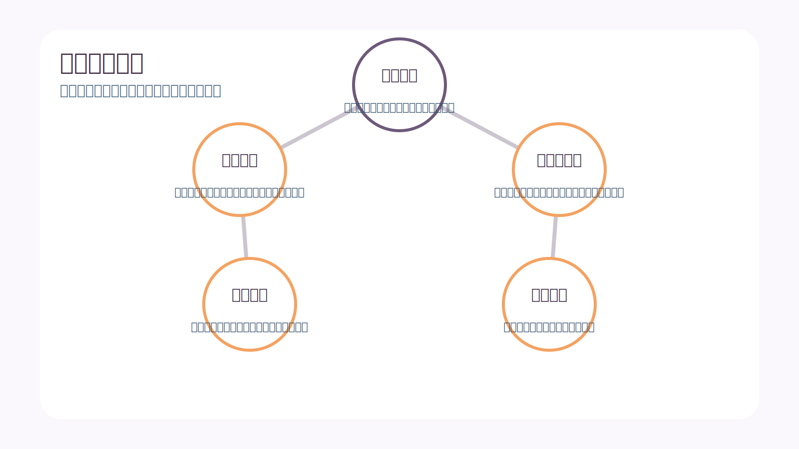
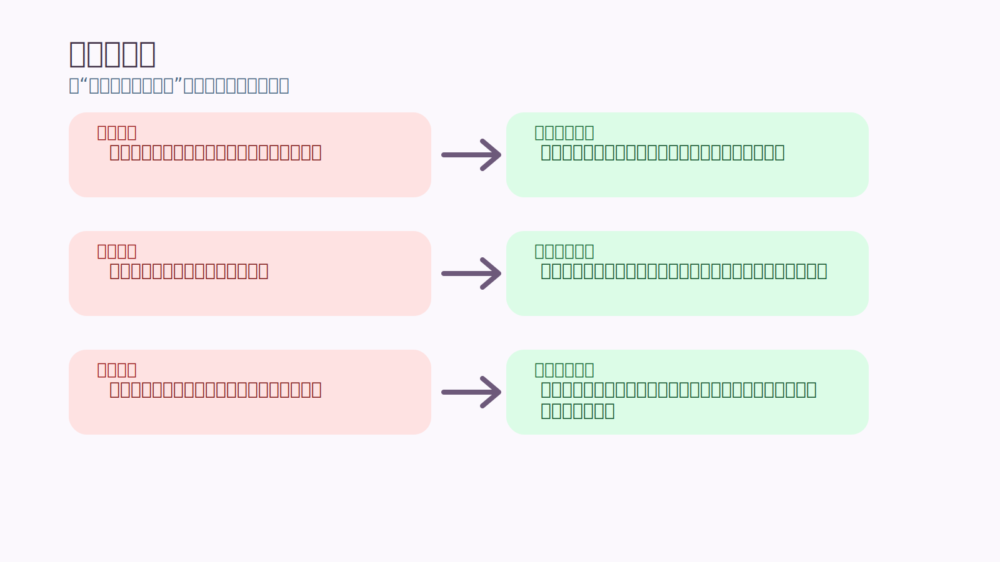
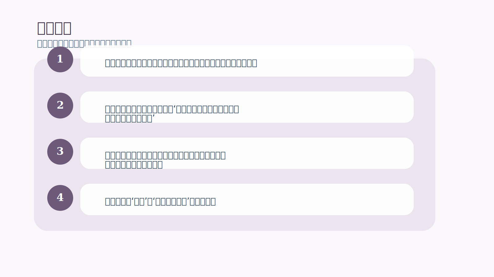

# 第 9 章｜信念的天性

## 一句话主旨

第 9 章向下挖到信念本身。作者解释信念怎么形成、怎么在生活里影响选择，以及为什么‘信念不等于真相’这个结论对交易者至关重要。

## 这章到底在解决什么问题

信念为什么会这么强大，甚至比新事实还更能左右人的行为？

为什么这章重要：
这一章让人真正明白，为什么成年人最难改变的不是技能，而是解释世界的方式。交易者若不研究信念，就很难理解自己为何总在同一类错误上打转。

## 关键知识点

- **信念起源**：来自成长经历、重复体验和情绪强化。
- **信念作用**：决定你注意什么、忽略什么、怎样解释结果。
- **信念与真相**：相信某件事，并不代表那件事就是客观真理。
- **能量投入**：越被反复强化的信念，越稳定、越自动。
- **可重塑性**：信念很强，但不是天生不可改。

## 按章节内容展开

### 1. 信念的起源

作者认为信念的形成，常常来自重复的经历与情绪浓度高的事件。小时候被夸一次、被羞辱一次、在某种行情里重伤一次，都可能把一句解释写进大脑，慢慢变成‘这就是世界的样子’。

孩子也能懂的说法：
像一条草地小路，第一天只是有人踩过，踩的人多了以后，小路就越来越明显，后来大家都默认从那里走。

放回交易里看：
交易里的很多信念也这样形成：比如‘亏损很可怕’‘我只要再等一下就会回来’‘大行情一定不能错过’。它们往往不是逻辑推导出来的，而是经历写出来的。

### 2. 信念对生活的影响

一旦形成，信念会决定你看见什么、记住什么、怎么行动。它像过滤器一样工作，让符合它的证据更容易进入，让不符合它的证据被忽略、曲解或推开。

孩子也能懂的说法：
如果一个孩子总觉得‘同学都不喜欢我’，那别人哪怕只是没听见他讲话，他也可能理解成‘果然讨厌我’。

放回交易里看：
交易者如果坚信‘止损总是把我洗出去’，他就会特别记住止损后反转的案例，却忽略更多止损保护了他的时刻。

### 3. 信念与真相

本章最重要的提醒，是信念和真相不是一回事。信念会给人一种强烈的真实感，好像它本来就等于事实。但作者要交易者学会怀疑这种自然感，因为许多痛苦并不是来自市场本身，而是来自你信念解释出来的市场。

孩子也能懂的说法：
像你一直以为某种蔬菜很难吃，后来有一天换了做法才发现其实不错。原来难吃的不是蔬菜本身，而是你过去吃到的那一次体验。

放回交易里看：
这让交易者第一次有空间对自己说：我现在很确信，并不代表我现在就一定在接近真相。这个缝隙，就是改变的起点。

## 孩子也能记住的类比

**草地上的旧小路**

大家走一条路走久了，草地上自然会出现一条明显的小道。后来哪怕旁边其实有更近、更平的新路，大家还是会下意识走旧路，因为脚已经习惯了。

这个类比想说明：
信念就是脑中的旧小路。要改路，不是喊口号说‘我要走新路’，而是一次次真的把脚迈到新的方向上。

## 常见错误

- 误区：我都这么多年这样想了，说明它一定是事实。
- 修正：持续时间能强化信念，但不能自动把它升级成真相。
- 误区：我就是这种性格，所以没法改变。
- 修正：很多你以为是性格的东西，其实是被重复强化过的信念模式。
- 误区：只要听懂一个新道理，旧信念就会自动让路。
- 修正：旧信念有轨道效应，需要被观察、拆解、重写和反复练习，才会慢慢松动。

## 记忆卡片

- 信念不是空气，它会决定你看见什么、忽略什么、怎么行动。
- 感觉特别真实，不等于就是事实。
- 能怀疑自己的旧解释，才有机会学会新的交易方式。

## 行动清单

- 写下自己最常说的三句交易口头禅，看看它们背后藏着什么信念。
- 遇到强烈确定感时，补一句：‘这可能只是我现在的信念，不一定是全部真相。’
- 找出一种你多年坚持、后来被事实推翻的生活经验，提醒自己信念可以改变。
- 在复盘里把‘事实’和‘我当时的解释’分开记录。
