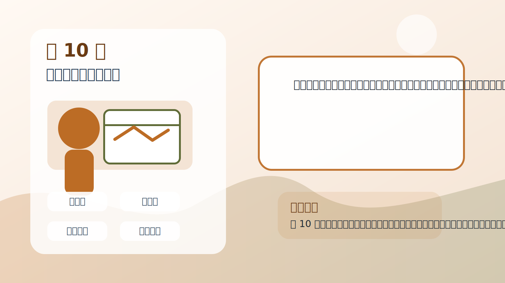
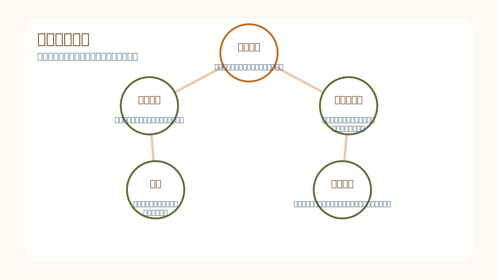
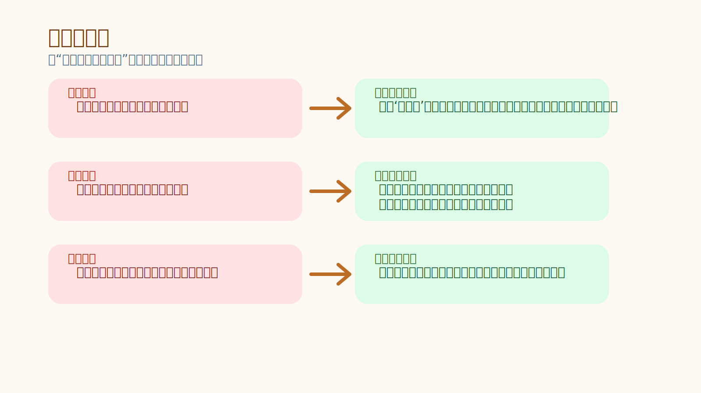
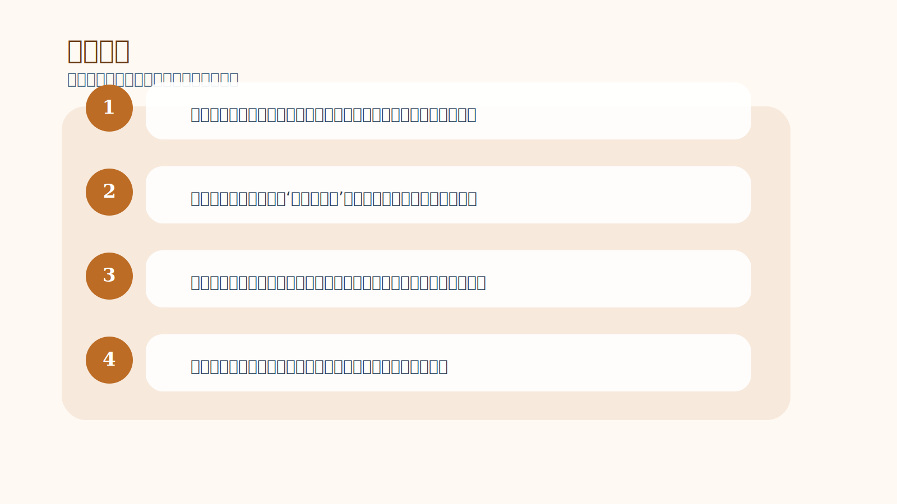

# 第 10 章｜信念对交易的影响

## 一句话主旨

第 10 章继续往实战推进：信念不仅影响感受，更直接影响交易行为。它会塑造你如何解读图表、如何评价自己、如何面对盈亏，甚至决定你会不会看见原本就在那里的机会。

## 这章到底在解决什么问题

信念一旦进入交易，究竟会怎样改变你看到的信号、承受的压力和最后的动作？

为什么这章重要：
这章像是第 9 章的实战版。作者把抽象的信念问题重新落回交易桌，让读者看见信念不是哲学话题，而是每一笔买卖里的具体力量。

## 关键知识点

- **信念特征**：一旦形成，就会自动组织感知和行为。
- **自我评估**：你怎样评价自己，会影响你怎样交易。
- **机会可见性**：只有符合你心智结构的信息，才容易被你看见。
- **冲突**：旧信念与新规则打架时，行为会走样。
- **行为扭曲**：提前平仓、拖延止损、放大仓位等都可能是信念产物。

## 按章节内容展开

### 1. 信念的主要特征

作者强调，信念一旦形成，会像自带电流一样驱动知觉和行为。它不会每次都先征求你同意，而是自动替你选择信息、解释信息，然后把你推向某种熟悉动作。

孩子也能懂的说法：
像自动门感应器，有人一走近它就开。信念也是这样，只要某个情景一出现，旧程序就会先反应。

放回交易里看：
在交易里，这意味着你不是每次都在自由选择。有时你只是被一个早已植入的解释系统带着走，所以第一步是看见它。

### 2. 自我评估与交易

作者特别提醒，自我评估会深刻影响交易表现。如果你把每一次盈亏都和自我价值绑在一起，交易就会从管理样本变成守护面子。那时你最在意的就不再是优势，而是自己看起来是不是聪明、是不是厉害、是不是没犯错。

孩子也能懂的说法：
像一个小朋友画画时一直担心别人会不会夸自己，一旦有人说不像，他就不想继续画了。注意力从画本身，跑到了别人怎么评价他。

放回交易里看：
交易里最危险的自我评估，不只是自卑，也包括‘我应该很厉害’的自我形象。正面的自我故事一旦过强，也会让人无法平静接受错误和调整。

## 孩子也能记住的类比

**拿着会自动偏向一边的遥控车**

一辆遥控车表面看起来没问题，但方向设置其实已经有一点偏。你每次直线前进，它都会慢慢往右跑。如果你只盯着路面，不检查车本身，就会一直怪路不好。

这个类比想说明：
交易里的信念就像那个看不见的偏向设置。先校正内部偏差，外部动作才会真的走直。

## 常见错误

- 误区：我下错单只是因为一时没看清图。
- 修正：很多‘没看清’，其实是某个信念先决定了你想看见什么、不想看见什么。
- 误区：对自己评价高一点，总归是好事。
- 修正：健康自信有帮助，但过度绑定自我形象，会让你更难承认错误、也更难接受亏损。
- 误区：只要把规则贴在屏幕旁边，我就会照着做。
- 修正：如果规则和内在信念冲突，真正做决定的往往还是后者。

## 记忆卡片

- 信念会自动组织你的注意力，所以行为偏差往往早在行为之前就开始了。
- 自我评估一旦绑得太紧，交易就会变成自尊保卫战。
- 真正的改变，既要修规则，也要修那个看规则的人。

## 行动清单

- 每次交易后分开写：这笔交易表现如何，我这个人并不因此被定义。
- 注意自己是否特别害怕‘看起来很蠢’；这常是止损拖延的隐形原因。
- 当某类机会总是被你忽视时，检查是不是某种信念让你根本不愿看它。
- 把屏幕上的规则和脑中的解释对照起来，找出它们的冲突点。
