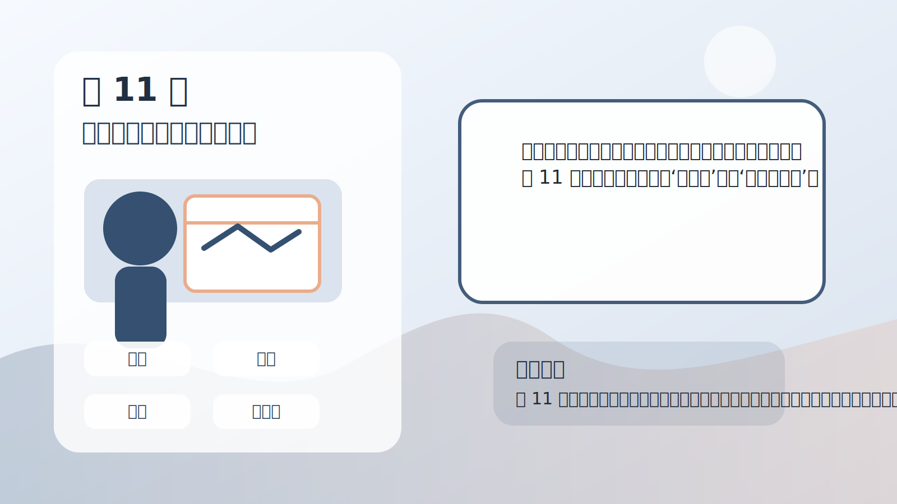
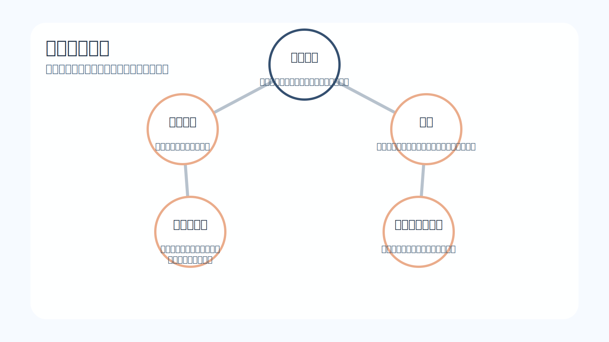
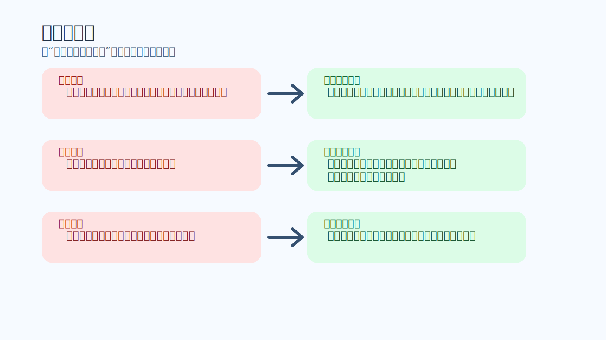
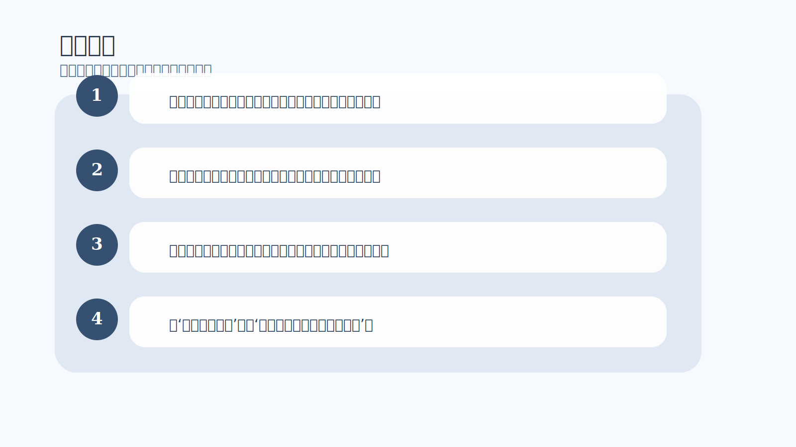

# 第 11 章｜像交易者一样思考

## 一句话主旨

第 11 章是整本书的收束，也是操作层最强的一章。作者把前面的概念重新压缩成一套交易者思维：识别模式、定义风险、接受单次随机、坚持执行优势，并通过机械化练习把这种思维真正安装到自己身上。

## 这章到底在解决什么问题

一本书读到最后，作者究竟希望你把什么样的思维方式真正装进日常交易里？

为什么这章重要：
前十章像在重建心智地基，第 11 章则把新房子真正住进去。它告诉读者：理解还不够，你需要通过有设计的练习，让新的思维方式在压力中也能自动工作。

## 关键知识点

- **机械阶段**：先减少主观干扰，按清晰规则重复执行。
- **观察自己**：把自己也当成复盘对象。
- **自律**：在还没自然化之前，为新信念争取生长空间。
- **一致性信念**：相信自己能稳定执行优势，而非预测所有结果。
- **像赌场一样交易**：让样本说话，而不是让情绪裁判。

## 按章节内容展开

### 1. 机械阶段

作者认为，新的交易心态在早期需要一个机械阶段。所谓机械，并不是变得僵硬，而是先把主观冲动降到最低，让自己在清晰的条件下重复执行优势，好让大脑重新学习‘这样做也是安全的’。

孩子也能懂的说法：
像刚学钢琴时先练指法和节拍，不急着加很多即兴变化。先把手和脑子训练到会自动走正确路线。

放回交易里看：
机械阶段的意义，是帮交易者从旧习惯里脱身。没有这个阶段，很多人会一边说要改变，一边继续按旧感觉做事。

### 2. 观察自己

作者要求交易者像观察市场一样观察自己。你要看到自己的兴奋点、恐惧点、拖延点、报复点，看到在什么样的情境下自己最容易偏离规则。观察不是批判，而是收集行为数据。

孩子也能懂的说法：
像体育老师让学生看自己的跑步录像，不是为了笑他跑姿奇怪，而是为了知道哪里该改。

放回交易里看：
很多成长停住，不是因为人不努力，而是因为他只看行情，不看自己。结果市场每天都在学，自己却没有学。

### 3. 自律的作用

自律在本章里被重新定义：它不是压迫自己，而是在新信念还没长稳之前，给它搭一个支架。你不是永远靠硬撑活着，而是先用纪律保护正确行为，直到它慢慢自然化。

孩子也能懂的说法：
像小树刚种下时会绑支架。支架不是为了束缚它，而是为了防止它在风里长歪。

放回交易里看：
交易者如果讨厌自律，常常是因为把它理解成自我惩罚。其实更准确的理解应该是：自律是帮新系统活下来。

### 4. 建立持续一致性的信念

作者最终想安装的，不是‘我每次都能看对’，而是‘我可以长期稳定地执行一个有优势的过程’。这是一种更成熟、更职业也更轻盈的自我定义，它把价值感从单笔结果上挪开。

孩子也能懂的说法：
像一个会长期练球的人，不再用某一天投进几个球定义自己，而是相信自己能持续把训练做好，成绩会慢慢跟上。

放回交易里看：
一旦这个信念被建立，交易就不再像不断参加审判，而更像持续经营一套系统。压力会明显下降，稳定性会上升。

### 5. 练习：像赌场一样交易优势

作者给出的练习，本质上是在训练大脑对单次随机与长期优势的接受度。你要选定一个清晰优势，在有限、明确、可复盘的规则下，持续执行一组样本，让自己亲眼看到：不需要每一笔都赢，系统也能工作。

孩子也能懂的说法：
像做一个科学实验。你不是只看一次结果，而是照同样的方法做很多次，看整体趋势到底怎样。

放回交易里看：
这是全书最落地的部分。练习不是为了立刻暴利，而是为了把正确的交易思维从‘听懂’变成‘身体相信’。

### 6. 最后的说明

作者在最后提醒读者，改变不会因为读完一本书就自动完成。真正的挑战在于，当你再次面对真实资金、真实波动、真实痛感时，能否继续把这些原则带上场。于是，练习与重复变得必不可少。

孩子也能懂的说法：
像学会一个新动作后，回家还是要每天练，不然身体会慢慢滑回旧习惯。

放回交易里看：
这也意味着，交易成长不是灵感型项目，而是长期训练项目。真正稳定的人，往往愿意接受这个慢过程。

### 7. 态度调查

书末的态度调查并不是考试，而是一面镜子。它帮助读者识别自己当前的交易思维究竟更靠近恐惧、控制、冲动，还是更靠近概率、接受与一致性。调查的意义，在于让你知道自己接下来该练什么。

孩子也能懂的说法：
像体检不是为了给你贴好坏标签，而是让你知道哪里需要多运动、哪里需要休息。

放回交易里看：
真正成熟的交易者，会把这些问题当成长期自查工具，而不是一次性打分表。因为心智建设从来不是一劳永逸的。

## 孩子也能记住的类比

**先扶着学骑，再自己稳住**

学骑自行车时，前几天可能需要大人扶着，也要一遍遍练起步、刹车和转弯。等这些动作被身体学会后，你才会开始觉得轻松。不是某一瞬间突然开窍，而是很多次重复把新平衡变成了默认。

这个类比想说明：
交易者思维的建立也是如此。先靠规则、自律和观察扶着走，走多了，新的平衡才会真的属于你。

## 常见错误

- 误区：像交易者一样思考，就是把自己训练成没有感觉的机器。
- 修正：作者追求的不是麻木，而是让正确原则在有感觉时也能继续工作。
- 误区：机械阶段太死板，会让我失去灵活性。
- 修正：机械阶段是过渡训练，目的是先校正旧习惯，之后灵活性才有健康基础。
- 误区：读懂这些道理以后，我应该很快就完全改变。
- 修正：真正改变靠重复、练习和自我观察，不靠单次领悟。

## 记忆卡片

- 像交易者一样思考，核心是接受随机、经营优势、稳定执行。
- 机械阶段不是终点，而是让新思维扎根的训练营。
- 一本书能打开门，但真正让你换脑子的，是之后反复而诚实的练习。

## 行动清单

- 为自己的优势写出一份简洁、可检验、可重复的规则单。
- 做一组连续样本练习，中途不因单笔结果随意修改规则。
- 每周至少复盘一次自己的心理偏差，而不只复盘市场走势。
- 把‘我要证明自己’改成‘我要让系统和自己都更稳定’。
